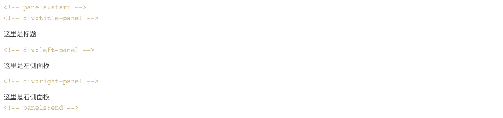

# 开阳随笔集

> 开阳(Mizar)是大熊座的一颗恒星，位在北斗的斗柄尾端第二颗星，是北斗七星之一。

- 与地球的距离： 82.84 光年
- 星等： 2.04
- 星座： 大熊座
- 坐标： 赤经 13h 23m 56s | 赤纬 +54° 55′ 31″

> 心茫然 - 拔剑四顾心茫然

生命本是一场漂泊的漫旅，遇见了谁都是一个美丽的意外。我珍惜着每一个可以让我称做朋友的人，因为那是可以让漂泊的心驻足的地方。有时候会被一句话感动，因为真诚；有时候会为一首歌流泪，因为自然。要快乐，不止此时，而是一生！


# 文档插件使用示例

## docsify-plugin-flexible-alerts

https://github.com/fzankl/docsify-plugin-flexible-alerts

> [!NOTE|label:信息]
> 这里是修改标题的示例.

> [!TIP]
> An alert of type 'tip' using global style 'callout'.

> [!WARNING]
> An alert of type 'warning' using global style 'callout'.

> [!ATTENTION]
> An alert of type 'attention' using global style 'callout'.

> [!TIP|style:flat|label:My own heading|iconVisibility:hidden]
> An alert of type 'tip' using alert specific style 'flat' which overrides global style 'callout'.
> In addition, this alert uses an own heading and hides specific icon.


## docsify-example-panels

https://vagnerdomingues.github.io/docsify-example-panels/#/

<!-- panels:start -->
<!-- div:title-panel -->
这里是标题

<!-- div:left-panel -->
这里是左侧面板

<!-- div:right-panel -->
这里是右侧面板

<!-- panels:end -->


### 参考示例 




## 内嵌示例

* iframe .html, .htm
* markdown .markdown, .md
* audio .mp3
* video .mp4, .ogg
* code other file extension

```
[filename](_media/example.md ':include :type=code')
[cinwell website](https://cinwell.com ':include :type=iframe width=100% height=400px')
[内嵌文件](_media/example.js ':include :type=code :fragment=demo')
```

<iframe frameborder="no" border="0" marginwidth="0" marginheight="0" width=381 height=86 src="//music.163.com/outchain/player?type=2&id=2147408164&auto=1&height=66"></iframe>

<!-- ### iframe示例 -->
<!-- [测试](https://music.163.com/outchain/player?type=2&id=2147408164&auto=1&height=66 ':include :type=iframe width=330 height=86') -->

<!-- ### 内嵌文件
[内嵌文件](./js/toc.js ':include :type=code :fragment=demo')
[coverpage](coverpage.md ':include :type=file')

[gist: content.md](https://gist.githubusercontent.com/anikethsaha/f88893bb563bb7229d6e575db53a8c15/raw/content.md ':include')

[gist: script.js](https://gist.githubusercontent.com/anikethsaha/f88893bb563bb7229d6e575db53a8c15/raw/script.js ':include :type=code') -->