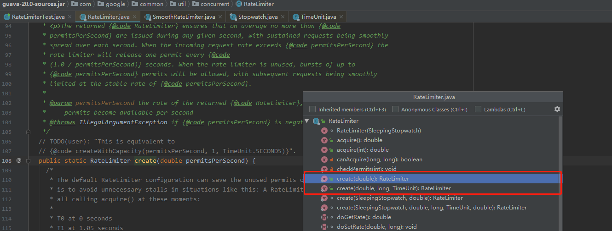
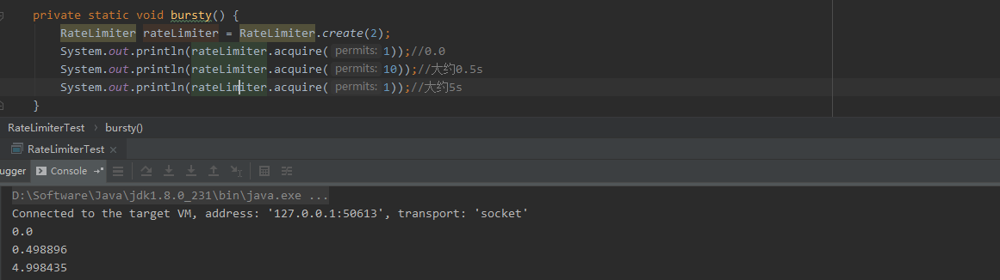

# Guava-RateLimiter

>  高并发系统三利器：缓存、降级(熔断)和限流

今天来谈谈Google提供的基于令牌桶算法的限流 - **RateLimiter**

基于`SmoothBursty`模式的，`SmoothWarmingUp`模式以后再说

**令牌桶算法描述**

1. 一个桶（存放固定容量令牌），比如固定容量10，最多放10个令牌
2. 按固定速率往桶中放入令牌，比如1/QPS，假设QPS=100，即1/100秒(10ms)每隔10ms放入令牌，桶放满之后就不再继续放置
3. 当请求抵达，从桶中获取令牌。获取不到则阻塞或者拒绝服务


**TIPS: 令牌桶(Token Bucket)算法优势在于方便的改变速度，提高速率**



```java
public static RateLimiter create(double permitsPerSecond)
public static RateLimiter create(double permitsPerSecond, long warmupPeriod, TimeUnit unit)
```



```java
RateLimiter rateLimiter = RateLimiter.create(2); (1)
System.out.println(rateLimiter.acquire(1));//0.0 (2)
System.out.println(rateLimiter.acquire(10));//大约0.5s (3)
System.out.println(rateLimiter.acquire(1));//大约5s (4)
```

// 创建限流器，每秒生成2个令牌

> (1) RateLimiter rateLimiter = RateLimiter.create(2);

//获取一个令牌，因为guava设计者`优先执行，后续等待`操作的理念执行的，所以第一次获取不消耗时间

> (2) rateLimiter.acquire(1)

//获取10个令牌，因为每秒产生2个令牌，之前获取一个令牌，所以延迟0.5s执行，并计算下次获取令牌需要等待的时间为：10/2=5 大约需要等待5s时间

> (3) rateLimiter.acquire(10)

//再次获取一个令牌，因为上次获取令牌计算得出延迟时间为5s，所以需要阻塞等待5s左右才可以进行获取

> (4) rateLimiter.acquire(1)

## RateLimiter.create(double permitsPerSecond)源码分析

1. 调用create方法生成限流器实例
2. `SleepingStopwatch.createFromSystemTimer()` 创建`SleepingStopwatch`对象，作用于阻塞一定的时长，直到下一次获取令牌；`SleepingStopwatch.readMicros`获取当前时间，为` nextFreeTicketMicros `初始化时间

```java
public static RateLimiter create(double permitsPerSecond) {
    return create(SleepingStopwatch.createFromSystemTimer(), permitsPerSecond);
}
```

1. `SmoothBursty`应对突发性请求实现类，同时设置速率

```java
static RateLimiter create(SleepingStopwatch stopwatch, double permitsPerSecond) {
    RateLimiter rateLimiter = new SmoothBursty(stopwatch, 1.0 /* maxBurstSeconds */);
    rateLimiter.setRate(permitsPerSecond);
    return rateLimiter;
 }
```

 1. setRate实现如下

    (1) `checkArgument` 参数校验： `permitsPerSecond`必须大于0

    (2)  `mutex()` 同步method，防止高并发场景资源竞争

    (3) `doSetRate`见下文

```java
public final void setRate(double permitsPerSecond) {
    checkArgument(
        permitsPerSecond > 0.0 && !Double.isNaN(permitsPerSecond), "rate must be positive");
    synchronized (mutex()) {
      doSetRate(permitsPerSecond, stopwatch.readMicros());
    }
 }
```

1. doSetRate实现如下

   (1) `resync` 曲向处理不停将令牌放入令牌桶的处理

   (2) `stableIntervalMicros` 获取标准间隔微秒。

   ​		比如创建限流器`create(100)` 

   ​			1秒内生成100个令牌，则相当于每隔10ms生成1个令牌; 

   ​			`stableIntervalMicros=10ms * 1000 = 10000μs`

```java
final void doSetRate(double permitsPerSecond, long nowMicros) {
    resync(nowMicros);
    double stableIntervalMicros = SECONDS.toMicros(1L) / permitsPerSecond;
    this.stableIntervalMicros = stableIntervalMicros;
    doSetRate(permitsPerSecond, stableIntervalMicros);
 }
```

1. resync实现如下

   (1) `nowMicros = stopwatch.readMicros()` 限流器初始化时候的操作时间(`微秒`)

   (2) `nextFreeTicketMicros = 0L` 默认初始化为0

   (3) `coolDownIntervalMicros()`针对`SmoothBursty`实现则返回标准间隔时间(`stableIntervalMicros`)

   (4) `newPermits`则可以通过(1)(2)(3)计算出可以获取多少新的令牌(许可证)

   (5) `storedPermits` 在`maxPermits`和`storedPermits + newPermits`取最小值

   ​			RateLimiter rateLimiter = new SmoothBursty(stopwatch, 1.0 /* maxBurstSeconds */)

   ​			maxPermits = maxBurstSeconds * permitsPerSecond 

   ​			maxPermits = 1 * permitsPerSecond  = 1 * create(permitsPerSecond)

   ​			所以maxPermits就是用户设置的每秒生成的令牌数

   ​	例如：

   ​			RateLimiter rateLimiter = RateLimiter.create(2);

   ​			maxPermits  = 2；

   ​		    所以`storedPermits`存储的最大值就是2个令牌						

   (6) ` nextFreeTicketMicros `的值变更为`nowMicros`的值

```java
void resync(long nowMicros) {
    // if nextFreeTicket is in the past, resync to now
    if (nowMicros > nextFreeTicketMicros) {
      double newPermits = (nowMicros - nextFreeTicketMicros) / coolDownIntervalMicros();
      storedPermits = min(maxPermits, storedPermits + newPermits);
      nextFreeTicketMicros = nowMicros;
    }
}
```

## RateLimiter.acquire(int permits)源码分析

1. `reserve(permits)`解析

   (1) 校验参数，确保permits（许可证）不能为空

   (2) 同步对象，防止资源竞争

   (3) `reserveAndGetWaitLength(permits, stopwatch.readMicros())` 返回获取下一次可用令牌的阻塞时间 

   ```java
   final long reserve(int permits) {
       checkPermits(permits);
       synchronized (mutex()) {
           return reserveAndGetWaitLength(permits, stopwatch.readMicros());
       }
   }
   
   final long reserveAndGetWaitLength(int permits, long nowMicros) {
       long momentAvailable = reserveEarliestAvailable(permits, nowMicros);
       return max(momentAvailable - nowMicros, 0);
   }

   final long reserveEarliestAvailable(int requiredPermits, long nowMicros) {
        //刷新nextFreeTicketMicros、storedPermits，重新计算获取所需凭证需要等待的时间
        resync(nowMicros);
        //返回阻塞时间
        long returnValue = nextFreeTicketMicros;
        //计算等待时间，判断带获取凭证数是否大于存储数，大于，需要根据每个凭证生成间隔时间计算等待时间
        double storedPermitsToSpend = min(requiredPermits, this.storedPermits);
        double freshPermits = requiredPermits - storedPermitsToSpend;
        long waitMicros =
            storedPermitsToWaitTime(this.storedPermits, storedPermitsToSpend)
            + (long) (freshPermits * stableIntervalMicros);
   	 //下次可以获取凭证（令牌）所需要等待的时间 
        this.nextFreeTicketMicros = LongMath.saturatedAdd(nextFreeTicketMicros, waitMicros);
        //去除存储的凭证数(桶中所能存放的令牌总数)
        this.storedPermits -= storedPermitsToSpend;
        return returnValue;
    }
   ```

   

2. `stopwatch.sleepMicrosUninterruptibly(microsToWait)`阻塞等待`microsToWait`时间，知道可以进行下一次令牌获取

```java
public double acquire(int permits) {
    long microsToWait = reserve(permits);
    stopwatch.sleepMicrosUninterruptibly(microsToWait);
    return 1.0 * microsToWait / SECONDS.toMicros(1L);
}
```

