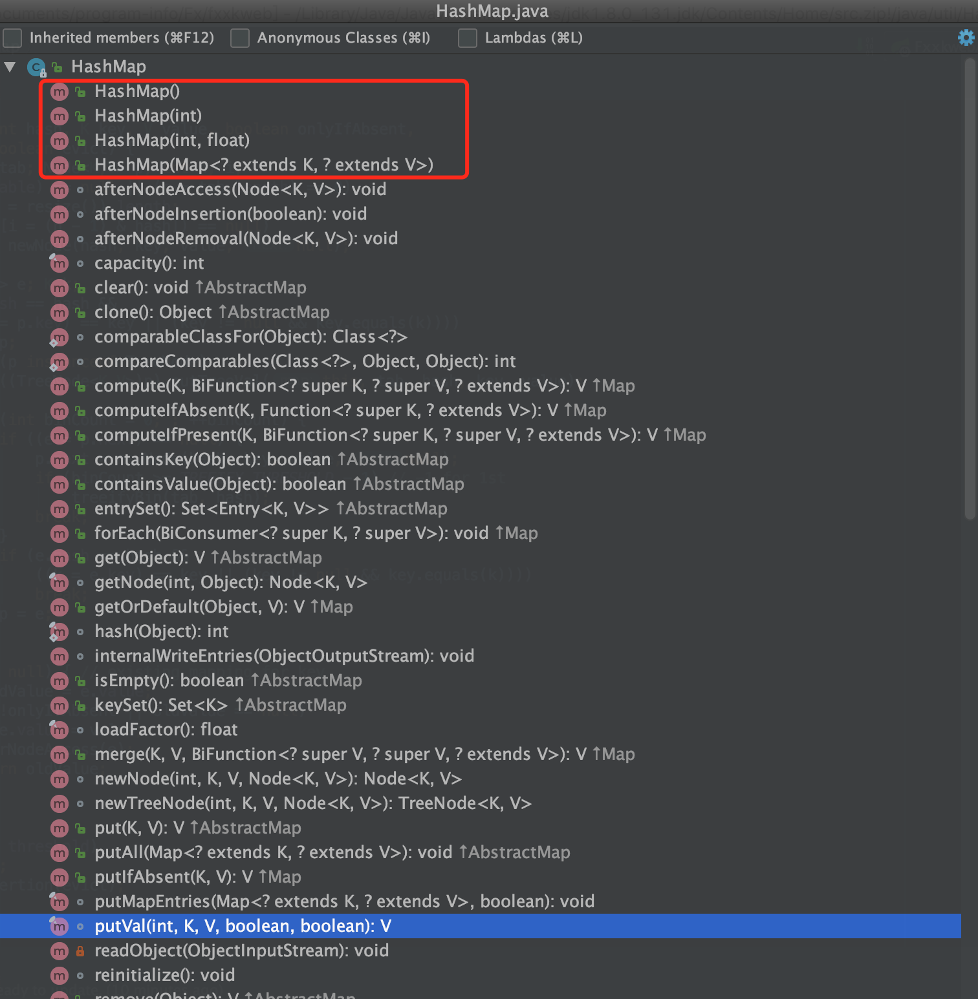

# Java-java8HashMap解析

## HashMap(非线程安全的)

```java
public class HashMap<K,V> extends AbstractMap<K,V> implements Map<K,V>, Cloneable, Serializable {
  
}
```

HashMap实现了Map接口，Cloneable接口，Serializable接口，继承了AbstractMap

Serializable接口： 支持jdk自带序列化机制

Map接口：map核心功能接口

Cloneable接口：支持clone，实现实例拷贝[java.lang.Object#clone()]

## Map接口

```java
public interface Map<K,V> {
    int size(); // 获取map大小
    boolean isEmpty(); // 判读map是否为空
    boolean containsKey(Object key); // 判断map是否存在key
    boolean containsValue(Object value);// 判断map是否存在值=value
    V get(Object key);// 根据key返回对应value
    V put(K key, V value);// 增加元素
    V remove(Object key); // 根据key移除元素
    void putAll(Map<? extends K, ? extends V> m); // 批量添加元素
    void clear(); // 清空map
    Set<K> keySet(); // 返回所有key信息
    Collection<V> values();// 返回所有value信息
    Set<Map.Entry<K, V>> entrySet(); // 返回map所有元素信息
    interface Entry<K,V> {
        K getKey();
        V getValue();
        V setValue(V value);
        boolean equals(Object o);
        int hashCode();
        public static <K extends Comparable<? super K>, V> Comparator<Map.Entry<K,V>> comparingByKey() {
            return (Comparator<Map.Entry<K, V>> & Serializable)
                (c1, c2) -> c1.getKey().compareTo(c2.getKey());
        }
        public static <K, V extends Comparable<? super V>> Comparator<Map.Entry<K,V>> comparingByValue() {
            return (Comparator<Map.Entry<K, V>> & Serializable)
                (c1, c2) -> c1.getValue().compareTo(c2.getValue());
        }
        public static <K, V> Comparator<Map.Entry<K, V>> comparingByKey(Comparator<? super K> cmp) {
            Objects.requireNonNull(cmp);
            return (Comparator<Map.Entry<K, V>> & Serializable)
                (c1, c2) -> cmp.compare(c1.getKey(), c2.getKey());
        }
        public static <K, V> Comparator<Map.Entry<K, V>> comparingByValue(Comparator<? super V> cmp) {
            Objects.requireNonNull(cmp);
            return (Comparator<Map.Entry<K, V>> & Serializable)
                (c1, c2) -> cmp.compare(c1.getValue(), c2.getValue());
        }
    }
  	// 以下方法用于比较
    boolean equals(Object o);
    int hashCode();
    // Defaultable methods
    default V getOrDefault(Object key, V defaultValue) {
        V v;
        return (((v = get(key)) != null) || containsKey(key))
            ? v
            : defaultValue;
    }
    default void forEach(BiConsumer<? super K, ? super V> action) {
        Objects.requireNonNull(action);
        for (Map.Entry<K, V> entry : entrySet()) {
            K k;
            V v;
            try {
                k = entry.getKey();
                v = entry.getValue();
            } catch(IllegalStateException ise) {
                // this usually means the entry is no longer in the map.
                throw new ConcurrentModificationException(ise);
            }
            action.accept(k, v);
        }
    }
    default void replaceAll(BiFunction<? super K, ? super V, ? extends V> function) {
        Objects.requireNonNull(function);
        for (Map.Entry<K, V> entry : entrySet()) {
            K k;
            V v;
            try {
                k = entry.getKey();
                v = entry.getValue();
            } catch(IllegalStateException ise) {
                // this usually means the entry is no longer in the map.
                throw new ConcurrentModificationException(ise);
            }

            // ise thrown from function is not a cme.
            v = function.apply(k, v);

            try {
                entry.setValue(v);
            } catch(IllegalStateException ise) {
                // this usually means the entry is no longer in the map.
                throw new ConcurrentModificationException(ise);
            }
        }
    }
    default V putIfAbsent(K key, V value) {
        V v = get(key);
        if (v == null) {
            v = put(key, value);
        }

        return v;
    }
    default boolean remove(Object key, Object value) {
        Object curValue = get(key);
        if (!Objects.equals(curValue, value) ||
            (curValue == null && !containsKey(key))) {
            return false;
        }
        remove(key);
        return true;
    }
    default boolean replace(K key, V oldValue, V newValue) {
        Object curValue = get(key);
        if (!Objects.equals(curValue, oldValue) ||
            (curValue == null && !containsKey(key))) {
            return false;
        }
        put(key, newValue);
        return true;
    }
    default V replace(K key, V value) {
        V curValue;
        if (((curValue = get(key)) != null) || containsKey(key)) {
            curValue = put(key, value);
        }
        return curValue;
    }
    default V computeIfAbsent(K key,
            Function<? super K, ? extends V> mappingFunction) {
        Objects.requireNonNull(mappingFunction);
        V v;
        if ((v = get(key)) == null) {
            V newValue;
            if ((newValue = mappingFunction.apply(key)) != null) {
                put(key, newValue);
                return newValue;
            }
        }

        return v;
    }
    default V computeIfPresent(K key,
            BiFunction<? super K, ? super V, ? extends V> remappingFunction) {
        Objects.requireNonNull(remappingFunction);
        V oldValue;
        if ((oldValue = get(key)) != null) {
            V newValue = remappingFunction.apply(key, oldValue);
            if (newValue != null) {
                put(key, newValue);
                return newValue;
            } else {
                remove(key);
                return null;
            }
        } else {
            return null;
        }
    }
    default V compute(K key,
            BiFunction<? super K, ? super V, ? extends V> remappingFunction) {
        Objects.requireNonNull(remappingFunction);
        V oldValue = get(key);

        V newValue = remappingFunction.apply(key, oldValue);
        if (newValue == null) {
            // delete mapping
            if (oldValue != null || containsKey(key)) {
                // something to remove
                remove(key);
                return null;
            } else {
                // nothing to do. Leave things as they were.
                return null;
            }
        } else {
            // add or replace old mapping
            put(key, newValue);
            return newValue;
        }
    }
    default V merge(K key, V value,
            BiFunction<? super V, ? super V, ? extends V> remappingFunction) {
        Objects.requireNonNull(remappingFunction);
        Objects.requireNonNull(value);
        V oldValue = get(key);
        V newValue = (oldValue == null) ? value :
                   remappingFunction.apply(oldValue, value);
        if(newValue == null) {
            remove(key);
        } else {
            put(key, newValue);
        }
        return newValue;
    }
}
```

## HashMap方法部分




本文主要关注`构造方法`，`put`和`get`方法

### 构造方法

**实现源码(优化过后的、基于jdk1.8)**

```java
public HashMap(int initialCapacity, float loadFactor) {
  // 判断传入的初始容量是否小于0，如果小于则报错提示
  if (initialCapacity < 0) {
    throw new IllegalArgumentException("Illegal initial capacity: " + initialCapacity);
  }
  // 判断传入的初始容量是否大于最大值，如果大于则报错提示
  // static final int MAXIMUM_CAPACITY = 1 << 30; 
  if (initialCapacity > MAXIMUM_CAPACITY){
    initialCapacity = MAXIMUM_CAPACITY;
  }
  // 判断加载因子是否小于等于0，并且加载因子是否是合法数字
  if (loadFactor <= 0 || Float.isNaN(loadFactor)) {
    throw new IllegalArgumentException("Illegal load factor: " + loadFactor);
  }
  this.loadFactor = loadFactor;
  // tableSizeFor的功能（不考虑大于最大容量的情况）是返回大于输入参数且最近的2的整数次幂的数。比如10，则返回16
  this.threshold = tableSizeFor(initialCapacity);
}
```

如果默认使用无参数构造，则加载因子是0.75，默认容量是16；

这里的加载因子设置和数组容量后续扩容有关

### put方法

**实现源码(优化过后的、基于jdk1.8)**

> **按位& (n应为2的倍数)**
>
> i = (n - 1) & hash  ==> hash所属范围[0, n-1]
>
> **为什么链表转树结构阈值是8，参考泊松分布(对随机数建模分析)**

```java
public V put(K key, V value) {
  return putVal(hash(key), key, value, false, true);
}
final V putVal(int hash, K key, V value, boolean onlyIfAbsent, boolean evict) {
    Node<K,V>[] tab = table; // 存储Node的数组 
    Node<K,V> p; 
    int n = tab.length; // length is always a power of two(2的倍数)
    int i;
    if (tab == null || n == 0) // 如果非法初始化，则纠正
        tab = resize();
    n = tab.length; 
    i = (n - 1) & hash // 确保得出来的i在数组合法长度内
        p = tab[i] // 获取hash对应位置节点
        if (p == null) // 如果为空，则表示数组内没有对应节点，则新增节点
            tab[i] = newNode(hash, key, value, null);
    else {
        // 不为空，说明存在hash碰撞情况，则要分情况考虑
        Node<K,V> e; 
        K k = p.key;
        if (p.hash == hash && (k == key || (key != null && key.equals(k))))  // hash一致，并且key一致， 则节点一致，直接覆盖更新
            e = p;
        else if (p instanceof TreeNode) 
            // 如果取出来的节点是tree节点，则直接往tree里添加，因为hash碰撞后，会以链表存储，如果超过一定阈值，
            // 则会将链表转变成红黑树结构
            e = ((TreeNode<K,V>)p).putTreeVal(this, tab, hash, key, value);
        else {
            // 往链表里添加新节点, binCount属于[0,TREEIFY_THRESHOLD-1] ===> [0,7]， 所以链表长度为8
            // 为什么为8呢？参考泊松分布... 
            for (int binCount = 0; ; ++binCount) {
                e = p.next // 获取当前节点下一个节点，判断下一个节点是否可以存储  
                    if (e == null) { // 如果下一个节点为空，则表示有可能可以存储
                        p.next = newNode(hash, key, value, null);

                        // 当时如果binCount超过阈值，这里可以变相的理解（数组+链表+红黑树）中链表部分长度为8
                        // 超过阈值8，则转换为空红黑树存储
                        if (binCount >= TREEIFY_THRESHOLD - 1) // -1 for 1st  TREEIFY_THRESHOLD=8
                            treeifyBin(tab, hash);  // 链表转红黑树
                        break;
                    }
                // 如果不为空，则再次判断链表上是否存在相同hash，如果有则表明已经存储过，则不存储
                k = e.key
                    if (e.hash == hash && (k == key || (key != null && key.equals(k))))
                        break;
                // 如果没有，则获取下一个节点node
                p = e;
            }
        }
        // 如果e不为空，如果没有特殊设定，且旧值为空的情况下，则更新节点数据
        if (e != null) { // existing mapping for key
            V oldValue = e.value;
            if (!onlyIfAbsent || oldValue == null)
                e.value = value;
            afterNodeAccess(e); // 后置操作，hashmap中为空实现
            return oldValue;
        }
    }
    ++modCount; // 表示map操作次数, 并发情况下会有问题，抛出异常
    if (++size > threshold) // 判断是否需要扩容
        resize();
    afterNodeInsertion(evict); // 后置操作，hashmap中为空实现
    return null;
}
```

### get方法

**实现源码(优化过后的、基于jdk1.8)**

```java
public V get(Object key) {
  Node<K,V> e;
  e = getNode(hash(key), key)  
  // 不为空，表明此时是数组存储，没有形成链，直接返回节点信息
  return e == null ? null : e.value;
}
// 链上获取节点+树上获取节点
final Node<K,V> getNode(int hash, Object key) {
  Node<K,V>[] tab; 
  Node<K,V> first, e; 
  int n; K k;
  tab = table;
  n = tab.length;
  first = tab[(n - 1) & hash]; // hash即是数组下标，hash根据key计算出来的
  if (tab != null && n > 0 && first != null) {
    // 判断节点是否存在（这里用first表示，其实是表示链表的第一个节点）
    if (first.hash == hash && ((k = first.key) == key || (key != null && key.equals(k)))) {
      return first;
    }
    // 获取链表的下一个节点
    e = first.next;
    if (e != null) {
      // 如果节点是treeNode，表明已经转换成红黑树了；如果是红黑树，直接通过getTreeNode获取对应元素值
      if (first instanceof TreeNode) {
        return ((TreeNode<K,V>)first).getTreeNode(hash, key);
      }
      // 如果不是红黑树，是链表直接循环遍历查找
      do {
        if (e.hash == hash && ((k = e.key) == key || (key != null && key.equals(k)))) {
          return e;
        }
      } while ((e = e.next) != null);
    }
  }
  return null;
}
```

**ConcurrentHashMap中put部分源码释义(源码经部分结构改动，便于可读性)**

```java
final V putVal(K key, V value, boolean onlyIfAbsent) {
	if (key == null || value == null) throw new NullPointerException();
	// 计算hash ==> (h ^ (h >>> 16)) & 0x7fffffff
	// 无符号右移16位，高位全部变成0；按位异或增加随机性；与0x7fffffff进行按位&，确保取最后31位信息
	int hash = spread(key.hashCode()); 
	int binCount = 0;
	// 循环数组
	for (Node<K,V>[] tab = table;;) {
		Node<K,V> f; 
		int n = tab.length, i, fh;
		if (tab == null || n == 0) // 兜底初始化数组
			tab = initTable();
		i = (n - 1) & hash // 确保i的范围在[0,n-1]之中，不会越界 
		f = tabAt(tab, i) // 从数组 tab 获取元素, 线程安全的
		else if (f == null) {
			// 通过Unsafe的compareAndSwapObject方法将k，v写入内存中(无锁化添加)
			if (casTabAt(tab, i, null, new Node<K,V>(hash, key, value, null)))
				break;                   // no lock when adding to empty bin
		}
		else if ((fh = f.hash) == MOVED) // 当前获取的node移动了，则重新设置tab
			tab = helpTransfer(tab, f);
		else {
			V oldVal = null;
			synchronized (f) { // 对当前对象加锁（对象锁）
				if (tabAt(tab, i) == f) { // 获取第i个元素，判断是否==f， 类似于 double check
					if (fh >= 0) { // 重新获取tab数组后操作
						binCount = 1;
						for (Node<K,V> e = f;; ++binCount) {
							K ek = e.key;
							if (e.hash == hash && (ek == key || (ek != null && key.equals(ek)))) {
								oldVal = e.val;
								if (!onlyIfAbsent)
									e.val = value;
								break;
							}
							Node<K,V> pred = e = e.next;
							if (e == null) {
								pred.next = new Node<K,V>(hash, key, value, null);
								break;
							}
						}
					}
					else if (f instanceof TreeBin) { // 如果节点返回的tree
						Node<K,V> p;
						binCount = 2;
						p = ((TreeBin<K,V>)f
						// 放进对应的tree里 
						// putTreeVal ==> Returns: null if added， 所以添加的时候不会进if语句
						if (p.putTreeVal(hash, key,value)) != null) { 
							oldVal = p.val;
							if (!onlyIfAbsent)
								p.val = value;
						}
					}
				}
			}
			// 根据binCount判断是否超阈值，超出则转换红黑树, 转换之后如果存在值则返回，否则结束循环
			if (binCount != 0) {
				if (binCount >= TREEIFY_THRESHOLD)
					treeifyBin(tab, i); // 红黑树转换
				if (oldVal != null)
					return oldVal;
				break;
			}
		}
	}
	// 增加数量，如果容量不够也需要扩容(线程安全)
	addCount(1L, binCount);
	return null;
}
```

