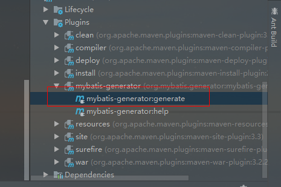
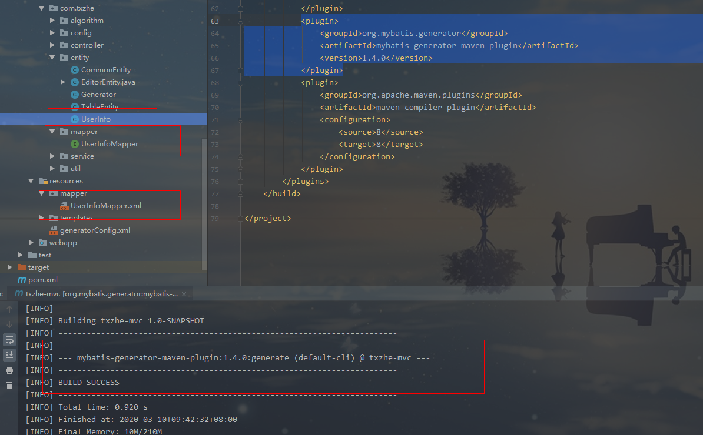

# Mybatis之代码自动生成使用

1. mysql-connector-java-5.1.40.jar

​	  准备jar包，生成文件时需要加载数据库驱动，获取数据库连接，拿到数据库元信息，进行逆向工程

2. generatorConfig.xml

   相关配置信息

   ```xml
   <?xml version="1.0" encoding="UTF-8"?>
   <!DOCTYPE generatorConfiguration
           PUBLIC "-//mybatis.org//DTD MyBatis Generator Configuration 1.0//EN"
           "http://mybatis.org/dtd/mybatis-generator-config_1_0.dtd">
   <generatorConfiguration>
       <classPathEntry location="F:\maven\repository\mysql\mysql-connector-java\5.1.40\mysql-connector-java-5.1.40.jar"/>
       <context id="mysqlSimple" targetRuntime="MyBatis3">
           <!--字段带``-->
           <property name="beginningDelimiter" value="`"/>
           <property name="endingDelimiter" value="`"/>
           <commentGenerator>
               <property name="suppressAllComments" value="true"/>
           </commentGenerator>
           <jdbcConnection driverClass="com.mysql.jdbc.Driver"
                           connectionURL="jdbc:mysql://118.190.91.127:3306/user?useUnicode=true&amp;characterEncoding=UTF-8&amp;useSSL=false"
                           userId="root"
                           password="root">
           </jdbcConnection>
           <javaTypeResolver>
               <property name="forceBigDecimals" value="false"/>
           </javaTypeResolver>
           <javaModelGenerator targetPackage="com.txzhe.entity" targetProject="src/main/java">
               <property name="enableSubPackages" value="true"/>
               <property name="trimStrings" value="true"/>
           </javaModelGenerator>
           <sqlMapGenerator targetPackage="mapper" targetProject="src/main/resources">
               <property name="enableSubPackages" value="true"/>
           </sqlMapGenerator>
           <javaClientGenerator type="XMLMAPPER" targetPackage="com.txzhe.mapper" targetProject="src/main/java">
               <property name="enableSubPackages" value="true"/>
           </javaClientGenerator>
           <table schema="user" tableName="user_info" domainObjectName="UserInfo"
                  enableSelectByExample="false"
                  enableDeleteByExample="false" enableCountByExample="false" enableUpdateByExample="false"
                  delimitAllColumns="true">
           </table>
       </context>
   </generatorConfiguration>
   ```

   其中`javaModelGenerator`,`sqlMapGenerator`,`javaClientGenerator`要确保对应的包都存在

3. pom安装运行插件

   ```xml
   <build>
   	<plugins>
       	<plugin>
               <groupId>org.mybatis.generator</groupId>
               <artifactId>mybatis-generator-maven-plugin</artifactId>
               <version>1.4.0</version>
           </plugin>
       </plugins>
   </build>
   ```

   执行：

   

