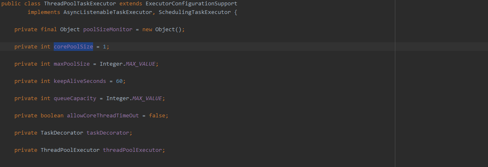
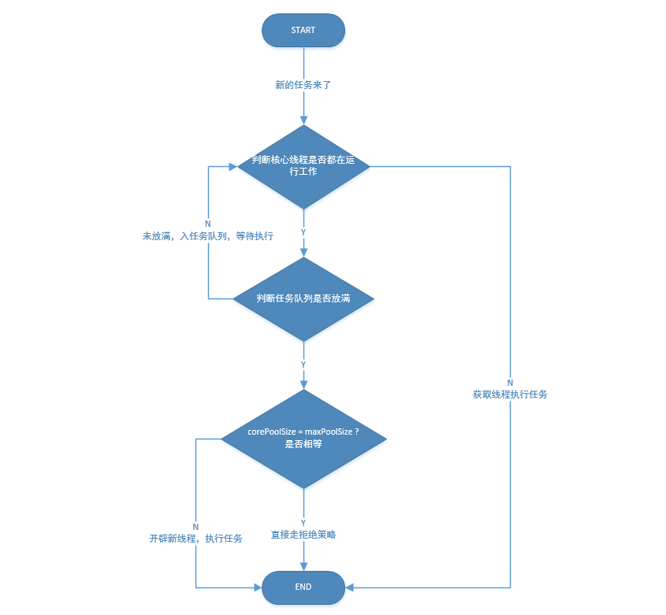
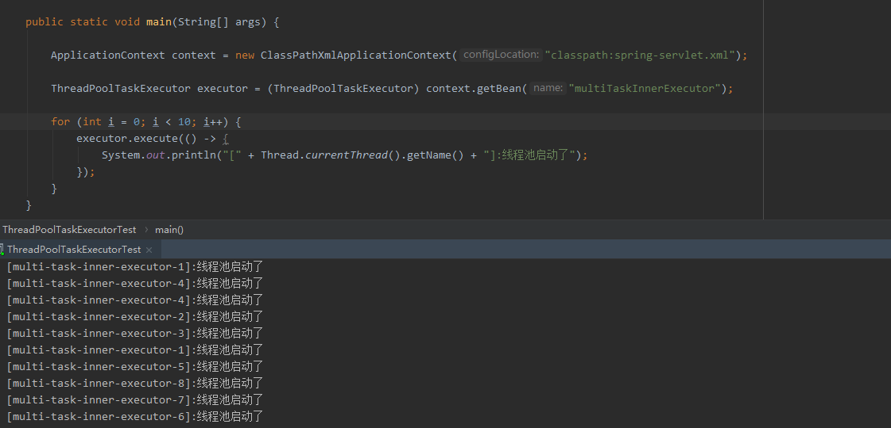
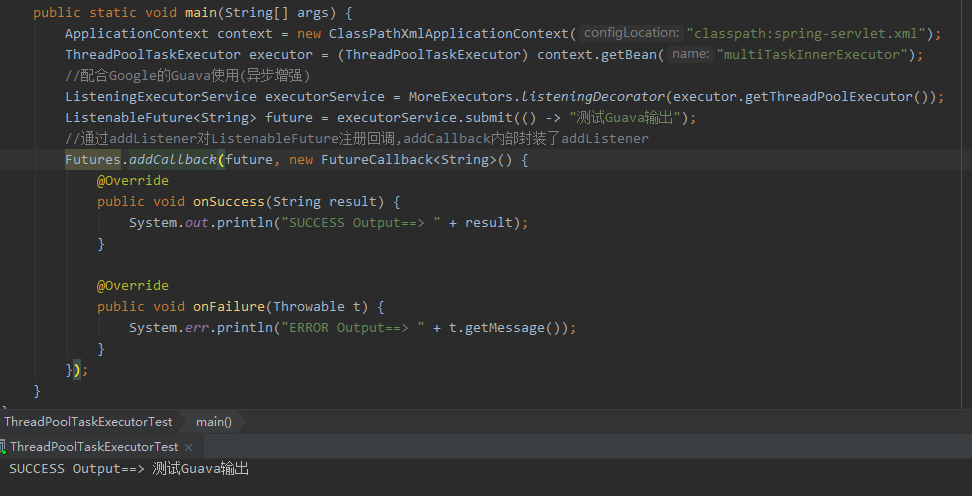

# Spring-ThreadPoolTaskExecutor了解及使用

## xml配置介绍

```xml
<bean id="multiTaskInnerExecutor" class="org.springframework.scheduling.concurrent.ThreadPoolTaskExecutor">
    <property name="threadNamePrefix" value="multi-task-inner-executor-"/>
    <property name="corePoolSize" value="5"/>
    <property name="keepAliveSeconds" value="100"/>
    <property name="maxPoolSize" value="10"/>
    <property name="queueCapacity" value="2"/>
    <property name="rejectedExecutionHandler">
        <!--
             AbortPolicy:直接抛出java.util.concurrent.RejectedExecutionException异常
             CallerRunsPolicy:若已达到待处理队列长度，将由主线程直接处理请求
             DiscardOldestPolicy:抛弃旧的任务；会导致被丢弃的任务无法再次被执行
             DiscardPolicy:抛弃当前任务；会导致被丢弃的任务无法再次被执行
        -->
        <bean class="java.util.concurrent.ThreadPoolExecutor$CallerRunsPolicy"/>
    </property>
</bean>
```

Spring对ThreadPoolExecutor封装的参数(Ioc注入):



1. 字段解释：

   (1) `threadNamePrefix：`线程名前缀，方便问题排查

   (2) `corePoolSize:` 核心线程数，默认始终运行的线程数量  

   ​								  **defaultValue: 1**

   (3) `maxPoolSize:` 最大线程数，当任务队列满的时候，会增加核心线程数至最大线程数,

   ​								**defaultValue: 2^31-1**

   (4) `queueCapacity:` 任务队列容量，任务优先放入队列，等待获取线程执行

   ​									 **defaultValue: 2^31-1**

   (5) `keepAliveSeconds:` 线程空闲时间，当 maxPoolSize > corePoolSize时，某线程超过 keepAliveSeconds 										   时间，则会自动销毁，从而动态实现扩容与销毁。

   ​										   **defaultValue: 60s**											

   (6) `rejectedExecutionHandler:` 当**(总任务数 - 最大线程数 - 任务队列数) > 0**，则拒绝处理，拒绝有四种策															略：**defaultVale: AbortPolicy策略**

   ​																（a) AbortPolicy: 直接抛出RejectedExecutionException异常

   ​																（b) CallerRunsPolicy: 由调用方线程运行，比如main线程

   ​																（c) DiscardOldestPolicy: 丢弃最老的任务

   ​																（d) DiscardPolicy: 直接丢弃任务

   ​                      



## 初始化源码分析

```java
protected ExecutorService initializeExecutor(ThreadFactory threadFactory, 	RejectedExecutionHandler rejectedExecutionHandler) {
	//创建有节阻塞队列
	BlockingQueue<Runnable> queue = createQueue(this.queueCapacity);

    //利用jdk自带的线程池进行构建
	ThreadPoolExecutor executor;
	if (this.taskDecorator != null) { //装饰器？
		executor = new ThreadPoolExecutor(
				this.corePoolSize, this.maxPoolSize, this.keepAliveSeconds, TimeUnit.SECONDS,
				queue, threadFactory, rejectedExecutionHandler) {
			@Override
			public void execute(Runnable command) {
				super.execute(taskDecorator.decorate(command));
			}
		};
	}
	else {
		executor = new ThreadPoolExecutor(
				this.corePoolSize, this.maxPoolSize, this.keepAliveSeconds, TimeUnit.SECONDS,
				queue, threadFactory, rejectedExecutionHandler);

	}

	if (this.allowCoreThreadTimeOut) {
		executor.allowCoreThreadTimeOut(true);
	}
	//赋值给当前类变量
	this.threadPoolExecutor = executor;
	return executor;
}
```

`createQueue`如果容量大于0，创建`LinkedBlockingQueue`，其是一个链表结构的有界队列,否则创建`SynchronousQueue`,其内部容量为0，阻塞是进行，直接将任务交付下一环。

```java
protected BlockingQueue<Runnable> createQueue(int queueCapacity) {
    if (queueCapacity > 0) {
        return new LinkedBlockingQueue<Runnable>(queueCapacity);
    }
    else {
        return new SynchronousQueue<Runnable>();
    }
}
```

## main方法测试

```java
public static void main(String[] args) {

    ApplicationContext context = new ClassPathXmlApplicationContext("classpath:spring-servlet.xml");

    ThreadPoolTaskExecutor executor = (ThreadPoolTaskExecutor) context.getBean("multiTaskInnerExecutor");

    for (int i = 0; i < 100; i++) {
        executor.execute(() -> {
            System.out.println("[" + Thread.currentThread().getName() + "]:线程池启动了");
        });
    }
}
```

Console Output




## 拓展提升

1. 配合google-guava联合使用，增强异步功能

   ```java
   public static void main(String[] args) {
       ApplicationContext context = new ClassPathXmlApplicationContext("classpath:spring-servlet.xml");
       ThreadPoolTaskExecutor executor = (ThreadPoolTaskExecutor) context.getBean("multiTaskInnerExecutor");
       //配合Google的Guava使用(异步增强)
       ListeningExecutorService executorService = MoreExecutors.listeningDecorator(executor.getThreadPoolExecutor());
       ListenableFuture<String> future = executorService.submit(() -> "测试Guava输出");
       //通过addListener对ListenableFuture注册回调,addCallback内部封装了addListener
       Futures.addCallback(future, new FutureCallback<String>() {
           @Override
           public void onSuccess(String result) {
               System.out.println("SUCCESS Output==> " + result);
           }
   
           @Override
           public void onFailure(Throwable t) {
               System.err.println("ERROR Output==> " + t.getMessage());
           }
       });
   }
   ```

   Console Output:

   