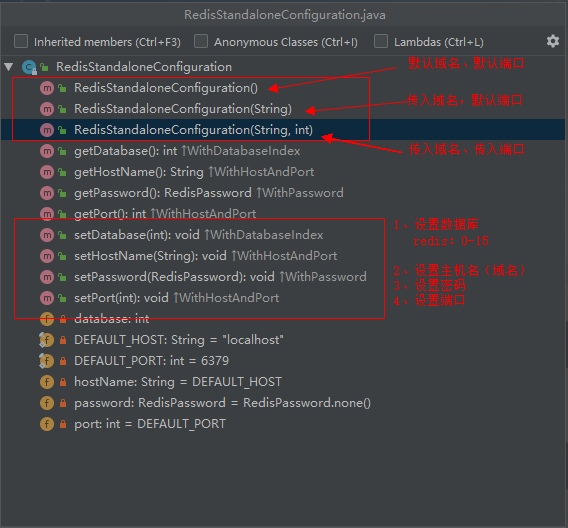

# SpringBoot-Redis集成

## 依赖

```xml
<dependencies>
    <dependency>
        <groupId>org.springframework.boot</groupId>
        <artifactId>spring-boot-starter-web</artifactId>
    </dependency>
    <dependency>
        <groupId>org.springframework.boot</groupId>
        <artifactId>spring-boot-starter-data-redis</artifactId>
    </dependency>
    <dependency>
        <groupId>redis.clients</groupId>
        <artifactId>jedis</artifactId>
    </dependency>
</dependencies>
```

分析：

```text
Redis
	org.springframework.data.redis.connection.RedisConfiguration
		Jedis:
			org.springframework.data.redis.connection.RedisStandaloneConfiguration(单机模式)
			org.springframework.data.redis.connection.RedisClusterConfiguration(主从模式)
			org.springframework.data.redis.connection.RedisSentinelConfiguration(哨兵模式)
		Lettuce:
			org.springframework.data.redis.connection.RedisSocketConfiguration(使用本地unix域套接字连接到单个Redis)3
			org.springframework.data.redis.connection.RedisStaticMasterReplicaConfiguration
	
	org.springframework.data.redis.connection.jedis.JedisClientConfiguration
	(功能配置：是否使用ssl。。) 建造者模式
```

## RedisStandaloneConfiguration （单机配置)



### JavaConfig配置Redis

```java
@Bean
public RedisTemplate redisTemplate() {
    // 注意这里使用的是StringRedisTempalte
    StringRedisTemplate template = new StringRedisTemplate(redisConnectionFactory());
    GenericJackson2JsonRedisSerializer jackson2JsonRedisSerializer = new GenericJackson2JsonRedisSerializer();
    // 设置值的序列化器
    template.setValueSerializer(jackson2JsonRedisSerializer);
    return template;
}

@Bean
public JedisConnectionFactory redisConnectionFactory() {
    return new JedisConnectionFactory(redisStandaloneConfiguration(), clientConfiguration());
}

@Bean
public JedisClientConfiguration clientConfiguration() {
    return JedisClientConfiguration.builder().usePooling()
        .poolConfig(poolConfig())
        .build();
}

@Bean
public RedisStandaloneConfiguration redisStandaloneConfiguration() {
    //RedisStandaloneConfiguration configuration = new RedisStandaloneConfiguration();
    //configuration.setHostName("127.0.0.1"); //默认localhost
    //configuration.setPort(6379);//默认6379
    //configuration.setDatabase(0);//默认第一个库(0-15)
    return new RedisStandaloneConfiguration();
}

@Bean
public JedisPoolConfig poolConfig() {
    JedisPoolConfig poolConfig = new JedisPoolConfig();
    poolConfig.setMaxTotal(100); //最大连接数
    poolConfig.setMaxWaitMillis(30 * 1000); //最大等待时间
    poolConfig.setMinIdle(20);// 最小空闲
    poolConfig.setMaxIdle(40);// 最大空心
    poolConfig.setTestWhileIdle(true);// 测试是否空闲
    return poolConfig;
}
```

使用：

```java
@Autowired
private RedisTemplate redisTemplate;

// 1) 
redisTemplate.opsForValue().set(key, value);
// 2)
redisTemplate.opsForHash().put(key, "username", value);
// ...
```

