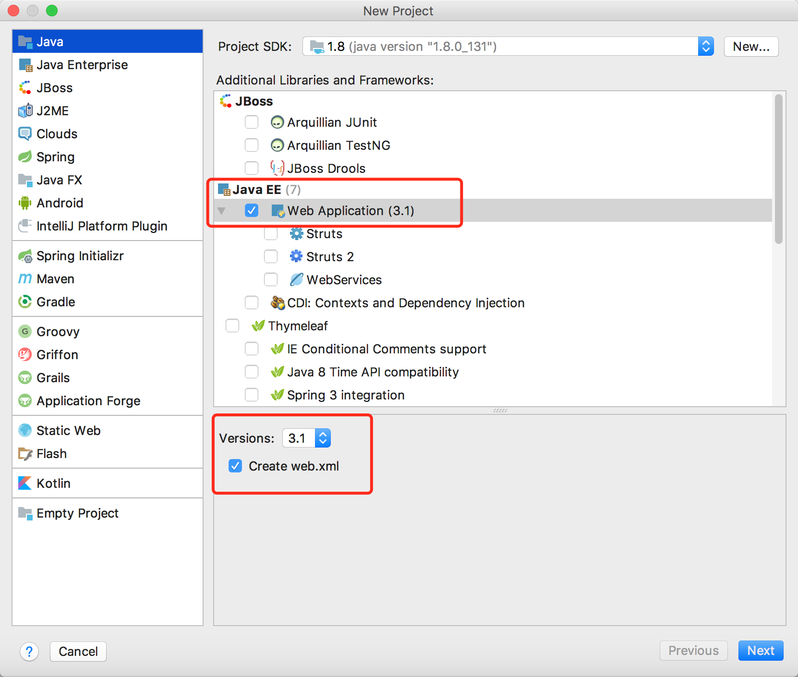
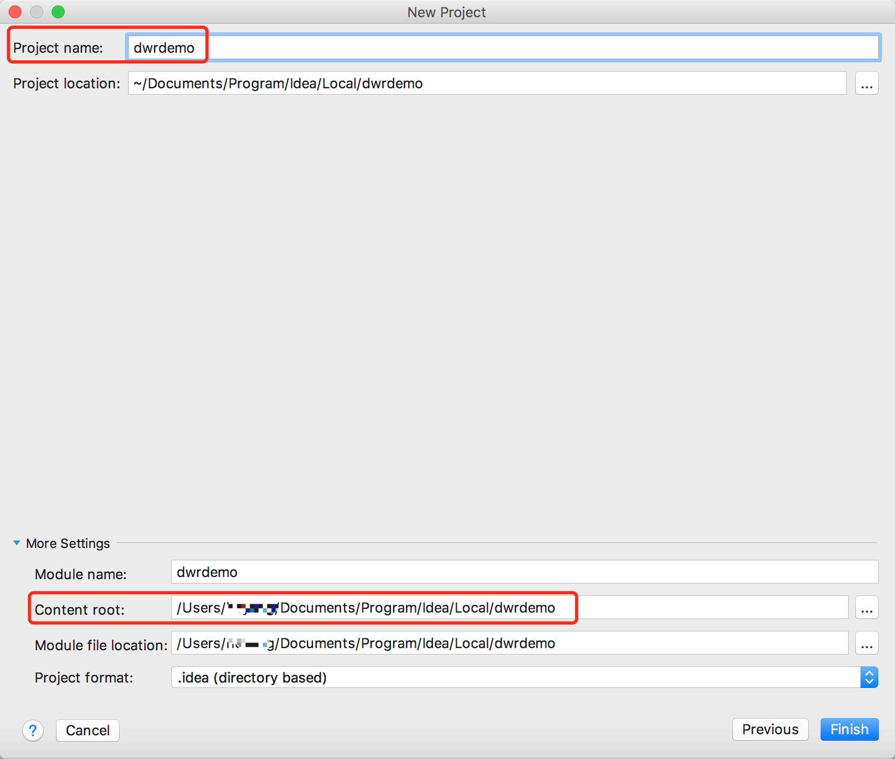

# 打通Javascript调用Java方法

## 简介

>DWR (Direct Web Remoting)
	是一个用于改善web页面与Java类交互的远程服务器端Ajax开源框架，可以帮助开发人员开发包含AJAX技术的网站。它可以允许在浏览器里的代码使用运行在WEB服务器上的JAVA函数，就像它就在浏览器里一样。

## 开发环境

1、macOS 10.12.4 (16E195)
2、IntelliJ IDEA ultimate 2017.2
3、Jdk 1.8

## 开发步骤
	
### 第一步：jar包下载 or Maven配置引入依赖

#### Jar包方式：

	1、下载地址：[DWR下载](http://directwebremoting.org/dwr/downloads/index.html)

	2、需要下载dwr.jar和commons-logging-1.2.jar两个包，因为dwr依赖commons-logging包

#### Maven方式：

在pom.xml添加如下配置：
```
	 <dependency>
	    <groupId>org.directwebremoting</groupId>
	    <artifactId>dwr</artifactId>
	    <version>3.0.2-RELEASE</version>
	 </dependency>
```
dwr官网说明：配置dwr依赖需要配置[Sonatype's OSS repository](https://oss.sonatype.org/content/repositories/snapshots/org/directwebremoting/dwr/)，需修改maven核心配置setting.xml，详细配置如下：
```
<dependency>
    <groupId>org.directwebremoting</groupId>
    <artifactId>dwr</artifactId>
    <version>3.0.2-SNAPSHOT</version>
  </dependency>

  <dependency>
    <!-- Optional non-CLA components see DWR documentation for details -->
    <groupId>org.directwebremoting</groupId>
    <artifactId>dwr</artifactId>
    <classifier>noncla</classifier>
    <version>3.0.3-SNAPSHOT</version>
  </dependency>

  <repositories>
    <repository>
      <!-- Please consider setting up your own on-site repository proxy 
      such as with Nexus and pointing the url element below at that instead -->
      <id>oss-sonatype-snapshots</id>
      <name>OSS Sonatype Snapshots Repository</name>
	  <url>http://oss.sonatype.org/content/repositories/snapshots</url>
      <releases><enabled>false</enabled></releases>
      <snapshots><enabled>true</enabled></snapshots>
    </repository>
  </repositories>
```

### 第二步：创建工程

1、打开IDEA，选择Java -> JavaEE -> `Web Application (3.1)` -> Version (3.1) -> `Create web.xml`



然后点击`Next`

2、工程命名+路径选择



### 第三步：引入Jar包+配置工程访问路径+新建Java类+dwr.xml文件配置

1、引入Jar包

	a.将`dwr.jar`和`commons-logging-x-x-x.jar`放到WEB-INF下的lib目录下，如果没有lib目录，则新建一个。

	b.右键lib，选择`Add as Library`，大致如下：
			Create Library
		Name: lib
		Level: Project Library
		Add to module: dwrdemo

2、配置dwr访问映射Servlet

打开WEB-INFO目录下的web.xml文件，将下述配置复制放入。
```
    <servlet>
        <servlet-name>dwr-invoker</servlet-name>
        <servlet-class>org.directwebremoting.servlet.DwrServlet</servlet-class>
        <init-param>
            <param-name>debug</param-name>
            <param-value>true</param-value>
        </init-param>
        <!-- 是否开启反响ajax，类似于邮箱收信通知应用 -->
        <init-param>
            <param-name>activeReverseAjaxEnabled</param-name>
            <param-value>true</param-value>
        </init-param>
    </servlet>
    
    <servlet-mapping>
        <servlet-name>dwr-invoker</servlet-name>
        <url-pattern>/dwr/*</url-pattern>
    </servlet-mapping>

```

3、新建JavaScript将要调用的Java类

a. 在src目录下新建Package:`com.txzhe`，在包下新建Java文件，文件名：`ExecutorScript.java`,内容如下：	
```
package com.txzhe;

import java.util.Date;

public class ExecutorScript {

    public String getName(String name)
    {
        System.out.println(new Date().toLocaleString()+" JavaScript调用Java类ExecutorScript的getName方法,参数是：" +name);
        return "Hello "+name;
    }
}

```

b.在WEB-INF目录下新建`dwr.xml`配置文件，内容如下：
```
<?xml version="1.0" encoding="UTF-8" ?>
<!DOCTYPE dwr PUBLIC
        "-//GetAhead Limited//DTD Direct Web Remoting 3.0//EN"
        "http://getahead.org/dwr/dwr30.dtd">

<dwr>
    <allow>
        <create creator="new" javascript="ExecutorScript">
            <param name="class" value="com.txzhe.ExecutorScript"/>
        </create>
    </allow>
</dwr>
```
## 注意：`dwr.xml`文件中javascript配置的名称将要在js中使用，切记！！！

### 第四步：js调用Java类方法

1、打开默认创建的index.jsp页面，布局如下：
```
<%@ page contentType="text/html;charset=UTF-8" language="java" %>
<html>
  <head>
    <title>DWR DEMO</title>
    <!-- http://localhost:8080/dwr/test/ExecutorScript -->
    <script type='text/javascript' src='/dwr/engine.js'></script>
    <script type='text/javascript' src='/dwr/interface/ExecutorScript.js'></script>
  </head>
  <body>
    <input type="text" id="name">
    <br>
    <input type="button" onclick="callJavaMethod();" value="Click">
    <br>
    <div id="result">

    </div>
  
    <script type="text/javascript">
        function callJavaMethod() {
           var txtValue =  document.getElementById("name").value;
            ExecutorScript.getName(txtValue,function (data) {
                alert(data);
            });
        }
    </script>
  </body>
</html>


```

注意：页面头部`Script`标签引入标准为：
`YOUR-WEBAPP-CONTEXT`：一般指：web.xml中配置的url映射
```
<script src='/[YOUR-WEBAPP-CONTEXT]/dwr/interface/[YOUR-SCRIPT].js'></script>
<script src='/[YOUR-WEBAPP-CONTEXT]/dwr/engine.js'></script>
```

### 第五步：实现效果


#### 总结
	
	更过功能需要通过官网文档继续深入了解。。。。


