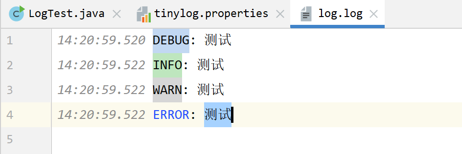

### 轻量日志框架使用

> 我们通常使用slf4j进行日志记录，如果不想引入该日志工具，本章节适合你。
>
> 一款轻量的日志

#### 引入jar

```xml
<dependency>
    <groupId>org.tinylog</groupId>
    <artifactId>tinylog-api</artifactId>
    <version>2.6.0</version>
</dependency>
<dependency>
    <groupId>org.tinylog</groupId>
    <artifactId>tinylog-impl</artifactId>
    <version>2.6.0</version>
</dependency>
```

#### 使用

```java
import org.tinylog.Logger;
public class LogTest {
    public static void main(String[] args) {
        Logger.debug("测试");
        Logger.info("测试");
        Logger.warn("测试");
        Logger.error("测试");
    }
}
```


可以看出日志已经输出了，分别表示：`时间信息` `函数信息` `路径信息` `日志信息`

#### 自定义配置

当然如果你想要设置一些信息，也可以，在资源目录下新建文件`tinylog.properties` 

```properties
# console
writer=console
writer.level=debug
writer.format={date: HH:mm:ss.SSS} {level}: {message}
# file
writer1=file
writer1.level=debug
writer1.file=log.log
writer1.format={date: HH:mm:ss.SSS} {level}: {message}
```

这个[配置](https://tinylog.org/v2/configuration/)类似slf4j，所以看下基本就可以。也可以参考[官网](https://tinylog.org/v2/configuration/), 配置的意思就是将debug级别的日志输出到控制台，同时输出到文件`log.log`中

经过上述配置后，运行结果就变成了


**log.log**内容




Ok.