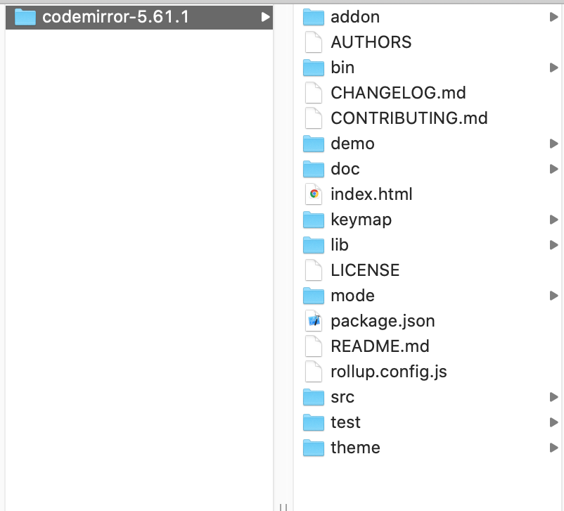

# CodeMirror使用说明

```html
<!DOCTYPE html>
<html>
<head>
	<title>CodeMirror</title>
	<link rel="stylesheet" type="text/css" href="codemirror-5.52.0/lib/codemirror.css">
	<link rel="stylesheet" href="js/layui/css/layui.css">
	<script type="text/javascript" src="codemirror-5.52.0/lib/codemirror.js"></script>
	<script src="codemirror-5.52.0/mode/sql/sql.js"></script>
	<link rel="stylesheet" href="codemirror-5.52.0/addon/hint/show-hint.css" />
	<script src="codemirror-5.52.0/addon/hint/show-hint.js"></script>
	<script src="codemirror-5.52.0/addon/hint/sql-hint.js"></script>
	<script src="layui/layui.all.js"></script>
</head>
<body>

<div class="layui-container">
	<div class="layui-row tools">
        <button class="layui-btn layui-btn-primary  layui-btn-xs" id="save">
            
            保存
        </button>
        <button class="layui-btn layui-btn-primary  layui-btn-xs" id='format'>
            
            美化SQL
        </button>
        <button class="layui-btn layui-btn-primary  layui-btn-xs" id='execute'>
            
        	执行
        </button>
        <button class="layui-btn layui-btn-primary  layui-btn-xs" id='stop' onclick="stopLoadData()">
            
            停止
        </button>
    </div>
    <div class="layui-row" style="width: 100%;border: 1px solid #ccc;box-shadow: #eee 5px 5px 5px 5px;">
        <textarea id="code"></textarea>
    </div>
</div>	
<script>
	window.onload = function() {
	  var mime = 'text/x-mysql';
	  // get mime type
	  if (window.location.href.indexOf('mime=') > -1) {
	    mime = window.location.href.substr(window.location.href.indexOf('mime=') + 5);
	  }
	  window.editor = CodeMirror.fromTextArea(document.getElementById('code'), {
	    mode: mime,
	    indentWithTabs: true,
	    smartIndent: true,
	    lineNumbers: true,
	    matchBrackets : true,
	    autofocus: true,
	    extraKeys: {"Alt-/": "autocomplete"},
	    hintOptions: {tables: {
	      users: ["name", "score", "birthDate"],
	      countries: ["name", "population", "size"]
	    }}
	  });
	  //处理复制粘贴等事件黏连问题
	  let isCombom = false;
	  window.editor.on("keydown", function (cm, event) {
		if(event.ctrlKey) { 
		    isCombom = true;
	    }else {
	    	isCombom = false;
	    }
	  });

	  window.editor.on("keyup", function (cm, event) {
	    if(cm.state.completionActive){
	    	return;
	    }
	    //按下ctrl-c/ctrl-v/ctrl-x/ctrl-z
	    if(event.ctrlKey) { 
		    return
	    }
	    //所有的字母和'$','{','.'在键按下之后都将触发自动完成
	    if (!isCombom && ((event.keyCode >= 65 && event.keyCode <= 90 ) || event.keyCode == 52 || event.keyCode == 219 || event.keyCode == 190)) {
	        CodeMirror.commands.autocomplete(cm, null, {completeSingle: false});
	    }
	  });
	};
</script>
</body>
</html>
```


## WebIDE

​	为了通过在浏览器中编辑代码，webide应运而生。这篇章主要讲述[CodeMirror](https://codemirror.net/)的使用

## 下载CodeMirro

[5.61.1版本下载](https://codemirror.net/codemirror.zip)，解压如下图


