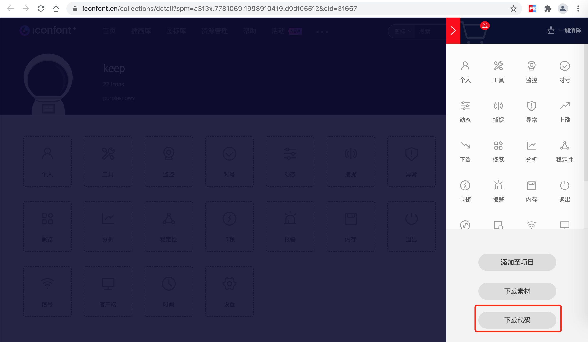
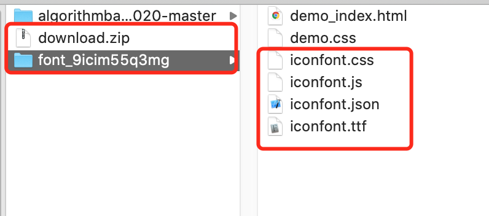
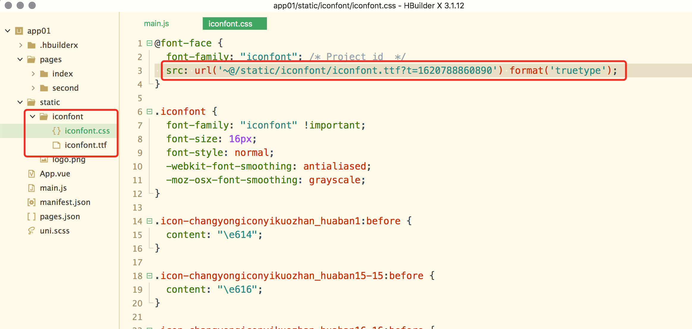
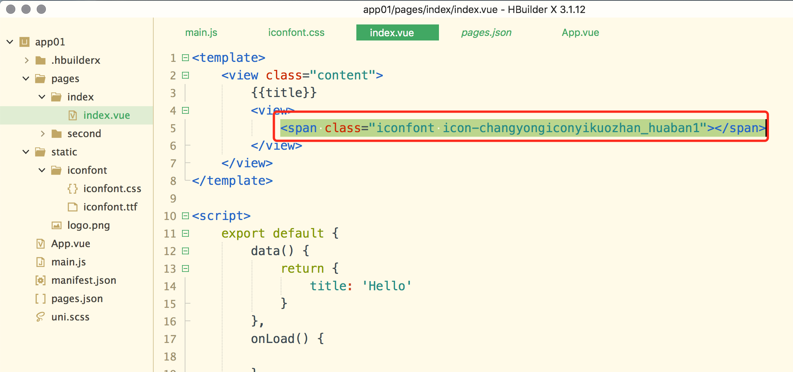
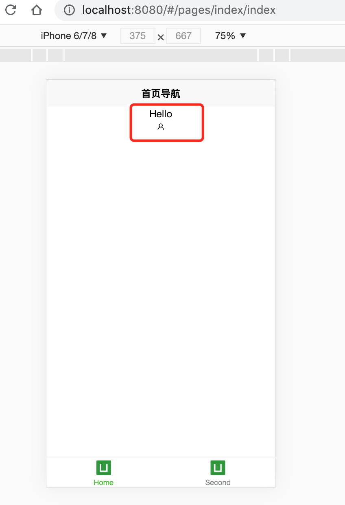

# UniApp-iconfont使用

## 登录iconfont官网

[iconfont官网传送门](https://www.iconfont.cn/)

选择合适图标，添加至购物车，最终选择下载代码，然后解压缩





将上述文件`iconfont.css`、`iconfont.ttf`文件复制到项目中的static文件目录`iconfont(没有则新建)`目录下,同时修改`iconfont.css`文件中src引入部分内容，改为正确的相对路径引入



## 使用方法

1.打开`App.vue`文件，然后在`<style></style>`标签内新增如下代码(此处路径非绝对)

```css
@import "@/static/iconfont/iconfont.css";
```

2.在需要使用iconfont图标的地方采用如下方法

```css
<span class="iconfont icon-changyongiconyikuozhan_huaban1"></span>
```



## 效果

参照如上配置并且使用，效果如下




至此引入`iconfont`图标结束！