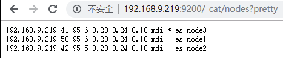
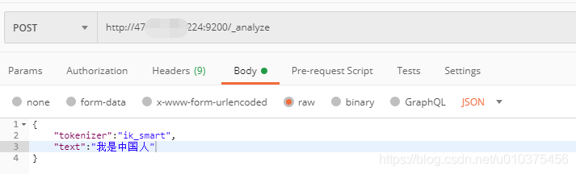
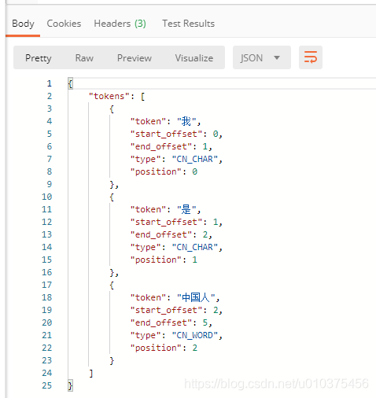

# 基于Docker的ElasticSearch集群部署

## 镜像拉取-7.14.2

```shell
docker pull elasticsearch:7.14.2
```

**es信息**

```
{
    "name": "33d5ac03a588",
    "cluster_name": "docker-cluster",
    "cluster_uuid": "2u_Vh_u4S3iCYmxEEbra1Q",
    "version": {
        "number": "7.14.2",
        "build_flavor": "default",
        "build_type": "docker",
        "build_hash": "6bc13727ce758c0e943c3c21653b3da82f627f75",
        "build_date": "2021-09-15T10:18:09.722761972Z",
        "build_snapshot": false,
        "lucene_version": "8.9.0",
        "minimum_wire_compatibility_version": "6.8.0",
        "minimum_index_compatibility_version": "6.0.0-beta1"
    },
    "tagline": "You Know, for Search"
}
```

## 创建挂载目录

前缀目录(可参照具体需求定)

**prefixDir = /opt/data/es**

### 创建数据挂载目录

```shell
mkdir $prefixDir/data
```

*注：需将data开启777权限=> chmod 777 data1*

### 创建插件目录

```shell
mkdir $prefixDir/plugins
```

*ik分词插件下载：https://github.com/medcl/elasticsearch-analysis-ik/releases，https://github.com/medcl/elasticsearch-analysis-ik/releases/download/v7.14.2/elasticsearch-analysis-ik-7.14.2.zip*

将文件解压复制到plugins下的ik

### 创建配置文件挂载目录

```shell
mkdir $prefixDir/config
```

#### 生成elastic-certificates.p12证书

任意通过docker启动一个es，进入es容器，执行以下命令

```shell
# 第一步：生成ca (密码自己确定，可为空，之后在当前目录下就会生成文件：elastic-stack-ca.p12)
[root@25dee1848942 elasticsearch]# ./bin/elasticsearch-certutil ca

# 第二步：通过elastic-stack-ca.p12生成elastic-certificates.p12(密码也可为空)
[root@25dee1848942 elasticsearch]# ./bin/elasticsearch-certutil cert --ca elastic-stack-ca.p12

# 第三步：退出容器，将elastic-certificates.p12拷贝出来，就可以删除当前es容器了。
```

#### 配置文件信息

**elasticsearch1.yml**

```shell
cluster.name: docker-cluster
# 节点名称
node.name: node_1
# ip地址
network.host: 0.0.0.0
network.publish_host: 192.168.215.98
# 是不是有资格主节点，是否作为数据计算的节点
node.master: true
node.data: true
http.port: 9200
transport.tcp.port: 9300
# head 插件需要这打开这两个配置
# http.cors.allow-origin: "*"
# http.cors.enabled: true
# http.max_content_length: 200mb
# es7.x 之后新增的配置，节点发现
discovery.seed_hosts: ["192.168.215.98:9300","192.168.215.99:9300","192.168.215.100:9300"]
# es7.x 之后新增的配置，初始化一个新的集群时需要此配置来选举master【有几个节点就写几个节点的IP地址】
cluster.initial_master_nodes: ["node_1","node_2","node_3"]
gateway.recover_after_nodes: 2
network.tcp.keep_alive: true
network.tcp.no_delay: true
transport.tcp.compress: true
# 集群内同时启动的数据任务个数，默认是2个
cluster.routing.allocation.cluster_concurrent_rebalance: 16
# 添加或删除节点及负载均衡时并发恢复的线程个数，默认4个
cluster.routing.allocation.node_concurrent_recoveries: 16
# 初始化数据恢复时，并发恢复线程的个数，默认4个
cluster.routing.allocation.node_initial_primaries_recoveries: 16
# 安全设置
xpack.security.enabled: true
xpack.security.transport.ssl.enabled: true
xpack.security.transport.ssl.keystore.type: PKCS12
xpack.security.transport.ssl.verification_mode: certificate
xpack.security.transport.ssl.keystore.path: elastic-certificates.p12
xpack.security.transport.ssl.truststore.path: elastic-certificates.p12
xpack.security.transport.ssl.truststore.type: PKCS12
xpack.security.audit.enabled: true
```

**elasticsearch2.yml(仅列出不同项)**

```
# 节点名称
node.name: node_2
# ip地址
network.publish_host: 192.168.215.99
```

**elasticsearch3.yml(仅列出不同项)**

```
# 节点名称
node.name: node_3
# ip地址
network.publish_host: 192.168.215.99
```

*注意node.name不同，network.publish_host修改，配置具体部署规划具体设置.*

**linux参数之max_map_count**

"This file contains the maximum number of memory map areas a process may have. Memory map areas are used as a side-effect of calling malloc, directly by mmap and mprotect, and also when loading shared libraries.

While most applications need less than a thousand maps, certain programs, particularly malloc debuggers, may consume lots of them, e.g., up to one or two maps per allocation.

The default value is 65536."

​    **max_map_count**文件包含限制一个进程可以拥有的VMA(虚拟内存区域)的数量。虚拟内存区域是一个连续的虚拟地址空间区域。在进程的生命周期中，每当程序尝试在内存中映射文件，链接到共享内存段，或者分配堆空间的时候，这些区域将被创建。调优这个值将限制进程可拥有VMA的数量。限制一个进程拥有VMA的总数可能导致应用程序出错，因为当进程达到了VMA上线但又只能释放少量的内存给其他的内核进程使用时，操作系统会抛出内存不足的错误。如果你的操作系统在NORMAL区域仅占用少量的内存，那么调低这个值可以帮助释放内存给内核用。

调高JVM线程数限制数量

```shell
# 修改操作系统，调整为默认的4倍
# /etc/sysctl.conf
vm.max_map_count = 262144
# 启用配置
sysctl -p 
```

*以上配置是防止错误：bootstrap checks failed max virtual memory areas vm.max_map_count [65530] likely too low, increase to at least [262144]*

```shell
 docker run  -d -p 9200:9200 -p 9300:9300 \
 -e ES_JAVA_OPTS="-Xms256m -Xmx256m" \
 -v $prefixDir/config/elasticsearch.yml:/usr/share/elasticsearch/config/elasticsearch.yml \
 -v $prefixDir/config/elastic-certificates.p12:/usr/share/elasticsearch/config/elastic-certificates.p12 \
 -v $prefixDir/plugins:/usr/share/elasticsearch/plugins \
 -v $prefixDir/data:/usr/share/elasticsearch/data \
 --name es elasticsearch:7.14.2
```

*注：设置-e ES_JAVA_OPTS="-Xms256m -Xmx256m" 是因为/etc/elasticsearch/jvm.options 默认jvm最大最小内存是2G，读者启动容器后 可用docker stats命令查看*

## 验证

### 集群验证

通过访问http://x.x.x.x:9200/_cat/nodes?pretty查看返回信息是否搭建成功



注：节点名称带*表示为主节点

```
查看集群节点：
http://x.x.x.x:9200/_cat/nodes?v

验证集群磁盘分配情况：
http://x.x.x.x:9200/_cat/allocation?v

验证集群健康状况：
http://x.x.x.x:9200/_cat/health?v

查看集群的索引数： 
http://x.x.x.x:9200/_cat/indices?v
```

### 分词插件验证

```text
POST http://x.x.x.x:9200/_analyze
{
	"tokenizer": "ik_smart",
	"text": "我是中国人"
}
```



搜索结果如下则表示插件安装正确.




# 假设忘记密码

创建临时超级用户

```shell
./bin/elasticsearch-users useradd kdev -r superuser
Enter new password: 
ERROR: Invalid password...passwords must be at least [6] characters long
[root@cfeeab4bb0eb elasticsearch]# ./bin/elasticsearch-users useradd ryan -r superuser
Enter new password: 
Retype new password: 
```

然后通过curl工具修改

```shell
curl -XPUT -u kdev:123456 http://localhost:9200/_xpack/security/user/elastic/_password -H "Content-Type: application/json" -d '
{
  "password": "q5f2qNfUJQyvZPIz57MZ"
}'
```

