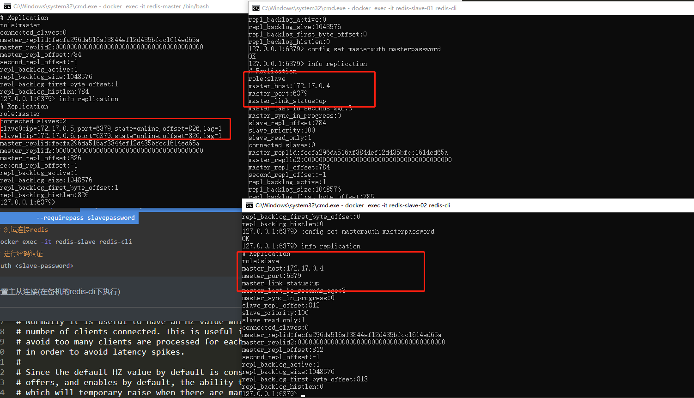
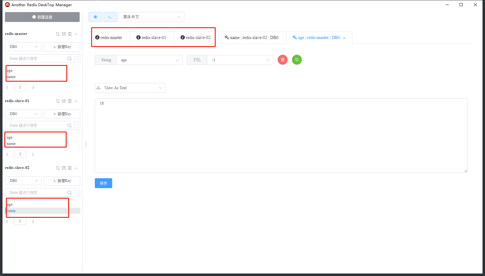
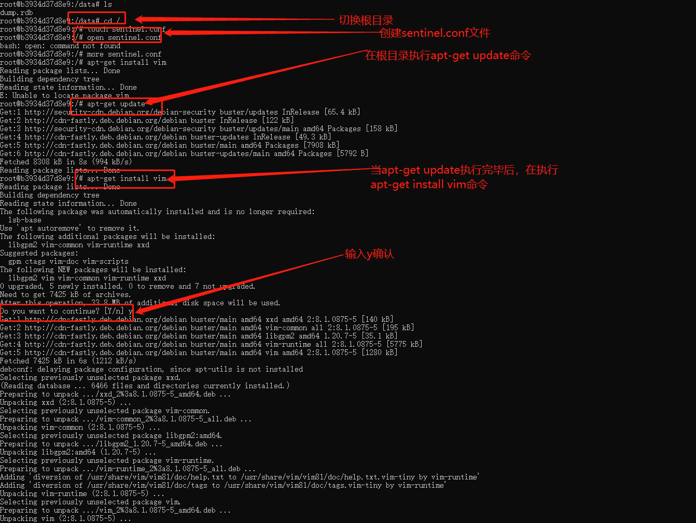
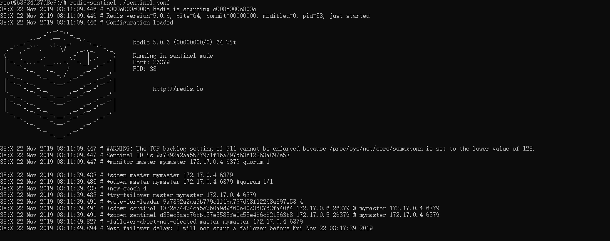
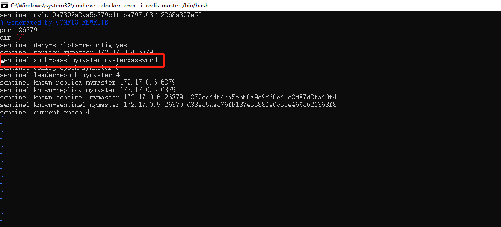
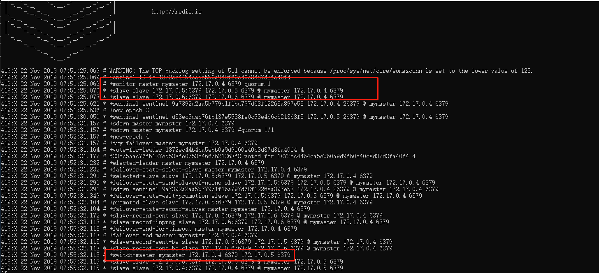

# Docker之Redis部署

## Redis主从部署

> docker inspect redis-master/redis-slave  #使用该命令查看redis容器在docker中虚拟出来的ip等信息

### 不指定redis.conf 配置主从

1.1 创建master 主库(docker中的一个容器) 

​	suggestion: `slave-password` 最好和  `master-password`相等

```bash
# 运行服务
docker run -it --name redis-master -d -p 6379:6379 [redis:5.0.6] redis-server
		  --requirepass masterpassword
# 测试连接redis
docker exec -it redis-master redis-cli -a <master-password>
```

1.2 创建slave 从库(docker中的一个容器)

```bash
# 运行服务 同时设定从库密码，可选
docker run -it --name redis-slave -d -p 6380:6379 [redis:5.0.6] redis-server 
		  --requirepass slavepassword 
# 测试连接redis
docker exec -it redis-slave redis-cli
# 进行密码认证
auth <slave-password>
```

1.3 设置主从连接(在备机的redis-cli下执行)

```bash
# 从库配置
slaveof <master-ip> <master-port>  # <master-ip>为主库服务ip，<master-port>表示主库所在端口，默认6379
# 密码认证
config set masterauth <master-password> # <master-password>即为主库访问密码 (如果主机有密码一定要设置)
# 测试命令
info / info replication / info sentinel
```

**tips**: 如果主机有密码，一定要设置，否则显示主机连接(`master_link_status`)状态为`down`; 这里的master-ip可以通过开篇命令`docker inspect redis`进行拿到

一主两从结果配置如下：



然后看下客户端工具连接情况：



到这，一主多从搭建完毕!!!

接下来开始Sentinel模式配置...


## Sentinel模式设置


1. 首先执行以下命令进入容器内控制台

   > docker exec -it redis-master /bin/bash

2. 进入根目录、创建`sentinel.conf`文件，执行`apt-get update`更新命令，然后`apt-get install vim`安装vim命令，等待`vim`安装完成

   

3. 在`sentinel.conf`文件中添加一下命令

   > sentinel monitor mymaster <master-ip> <master-port> 1
   >
   > ```bash
   > 规范： sentinel monitor <master-group-name> <ip> <port> <quorum>
   > ```

4. 然后启动命令

   	> redis-sentinel ./sentinel.conf

   如果出现一下日志，则表示启动失败，没有设置访问密码，需要在文件`sentinel.conf`中添加`sentinel auth-pass mymaster <masterpassowd>`

   

   设置访问master密码

   

5. 模拟master宕机，slave自动选举切换成master的角色

   