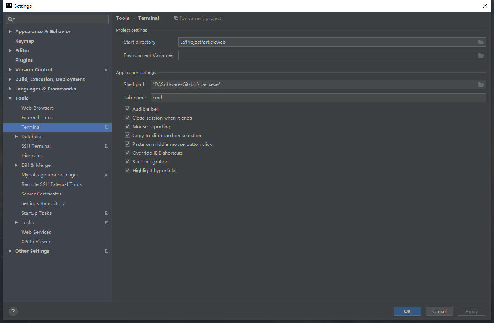

# Git知识综述

## IDEA集成git终端，git命令的简化

**基于windows下设置** 

在用户目录下`C:\Users\xxxx`添加如下文件

`.bash_profile`

```bash	
if [ -f ~/.bashrc ]; then . ~/.bashrc; fi
```

`.bashrc`

``` properties
alias ls='ls -F --color=auto --show-control-chars' # 使用ls命令的时候加上颜色
export LC_ALL=zh_CN.UTF-8 # 设置终端打开的编码
alias ll='ls -la -F --color=auto --show-control-chars'
alias cls='clear'
alias gs='git status'
alias gc='git checkout'
alias gcb='git checkout -b'
alias gpull='git pull'
alias gpush='git push'
alias gac='git add . && git commit -m'
alias gl='git log'
alias gb='git branch'
alias glp='git log --pretty=oneline'
alias gclone='git clone'
alias gm='git merge'
alias gr='git restore'
alias gignore='git update-index --assume-unchanged'
alias gunignore='git update-index --no-assume-unchanged'
```


IDEA终端设置git支持




