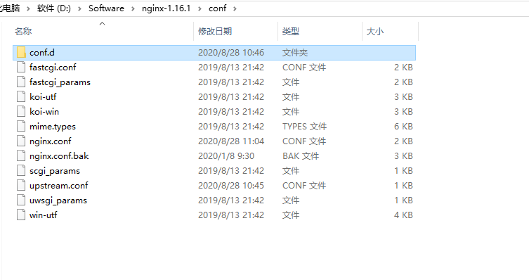

# Nginx知识综述

## 针对OPTIONS请求，提供两种处理思路：

1. 服务端在代码层面添加filter过滤器，拦截请求做到允许跨域处理（个人不推荐）

2. Nginx作为个业内比较出名的代理服务器，自然就成为了改造的首选目标

   针对OPTIONS请求可以如下配置:

   ```
   if ($request_method = ''OPTIONS'') {
   	 add_header ''Access-Control-Allow-Origin'' $http_origin;
   	 add_header ''Access-Control-Allow-Credentials'' ''true'';
   	 add_header ''Access-Control-Allow-Methods'' ''GET, POST, OPTIONS'';
   	 add_header ''Access-Control-Allow-Headers'' ''DNT,web-token,app-token,Authorization,Accept,Origin,Keep-Alive,User-Agent,X-Mx-ReqToken,X-Data-Type,X-Auth-Token,X-Requested-With,If-Modified-Since,Cache-Control,Content-Type,Range'';
   	 add_header ''Access-Control-Expose-Headers'' ''Content-Length,Content-Range'';
   	 return 200;
   }
   ```

在nginx做代理转发的时候，进行判断，若请求是OPTIONS预请求，则添加跨域设置并返回200

## nginx基础配置

当server过多，需要进行拆分

### nginxz最终目录如下（新增upstream.conf文件和新增conf.d目录）



### 更改nginx.conf配置如下(注意:下述配置文件，开启了访问日志)

```nginx
#user  nobody;
worker_processes  1;
error_log  logs/error.log;
error_log  logs/error.log  notice;
error_log  logs/error.log  info;
#pid        logs/nginx.pid;
events {
    worker_connections  1024;
}
http {
    include       mime.types;
    default_type  application/octet-stream;
    server_names_hash_bucket_size 64; # 主机名过长需要增加此处参数处理
    log_format  main  '$remote_addr - $remote_user [$time_local] "$request" '
                      '$status $body_bytes_sent "$http_referer" '
                      '"$http_user_agent" "$http_x_forwarded_for"';
    access_log  logs/access.log  main;
    sendfile        on;
    #tcp_nopush     on;
    #keepalive_timeout  0;
    keepalive_timeout  65;
    gzip  on;
    include D:/Software/nginx-1.16.1/conf/upstream.conf;
	  include D:/Software/nginx-1.16.1/conf/conf.d/*.conf;
}
```

### 查看upstream文件配置:

```nginx
upstream service1 {
	server 127.0.0.1:5001;
  server 127.0.0.1:5011;# 负载均衡
}
upstream service2 {
	server 127.0.0.1:5002;
}
```


### 其中conf.d目录内容如下：


文件内容类似，拿80.conf文件查看:

```nginx
server {
	listen       80;
	server_name  xxx.xxx.xxx.xx0;

	# 访问本地目录文件
	location / {
		root   [本地文件目录地址+];
		index  index.html index.htm;
	}

	error_page   500 502 503 504  /50x.html;
	location = /50x.html {
		root   html;
	}
}
server {
	listen       80;
	server_name  xxx.xxx.xxx.xx1;

	location / {
		proxy_pass   http://service1; # [upstream中配置名称]
	}
	
	error_page   500 502 503 504  /50x.html;
	location = /50x.html {
		root   html;
	}
}
server {
	listen       80;
	server_name  xxx.xxx.xxx.xx2;

	location / {
		proxy_pass   http://service2; # [upstream中配置名称]
	}
	
	error_page   500 502 503 504  /50x.html;
	location = /50x.html {
		root   html;
	}
}
```

