# RabbitMQ知识综述

## 核心思想

> The core idea in the messaging model in RabbitMQ is that the producer never sends any messages directly to a queue. Actually, quite often the producer doesn't even know if a message will be delivered to any queue at all.
RabbitMQ核心思想是生产者不直接将消息发送到队列中，实际上，生产者都不知道是否把消息传递到队列中了

## 概念解释

### Producer
消息生产者
### Broker
消息队列服务器实体
#### Exchange
交换机(RabbitMQ核心为了生产者和消费者解耦，故多了一层交换机概念)
#### Binding
绑定(交换机和队列根据路由规则绑定)
#### Queue
消息队列载体
### Consumer
消息消费者

## RabbitMQ主要功能

### 公共代码

**MQUtil.java**
```java
public static Connection getConn() throws IOException, TimeoutException {
    ConnectionFactory factory = new ConnectionFactory();
    factory.setHost("localhost");
    factory.setUsername("test");
    factory.setPassword("test");
    factory.setVirtualHost("/test");
    return factory.newConnection();
}
```
**MQConstants.java**
```java
public class MQConstants {
    public static final String SIMPLE_MQ_QUEUE_NAME = "test_simple_queue";
    public static final String WORKER_MQ_QUEUE_NAME = "test_worker_queue";
}
```

### 简单队列模式(一对一)
**Send.java**
```java
public class Send {
    public static void main(String[] args) throws IOException, TimeoutException {

        try (Connection connection = MQUtil.getConn(); Channel channel = connection.createChannel()) {
            // queueDeclare(String queue, boolean durable, boolean exclusive, boolean autoDelete, Map<String, Object> arguments)
            channel.queueDeclare(SIMPLE_MQ_QUEUE_NAME, false, false, false, null);

            String message = "hello rabbitmq!";
            // basicPublish(String exchange, String routingKey, BasicProperties props, byte[] body)
            channel.basicPublish("", SIMPLE_MQ_QUEUE_NAME, null, message.getBytes());
            System.out.println("[x] send success!");
        }
    }
}
```
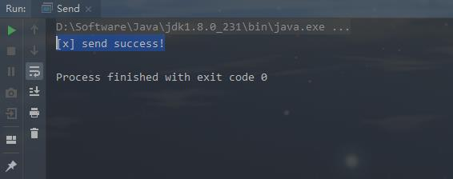

**Recv.java**
```java
public class Recv {
    public static void main(String[] args) throws IOException, TimeoutException {
            Connection connection = MQUtil.getConn(); Channel channel = connection.createChannel();
            // queueDeclare(String queue, boolean durable, boolean exclusive, boolean autoDelete, Map<String, Object> arguments)
            channel.queueDeclare(SIMPLE_MQ_QUEUE_NAME, false, false, false, null);
            System.out.println(" [*] Waiting for messages. To exit press CTRL+C");
            DeliverCallback deliverCallback = (consumerTag, delivery) -> {
                String message = new String(delivery.getBody(), "UTF-8");
                System.out.println(" [x] Received '" + message + "'");
            };
            // String basicConsume(String queue, boolean autoAck, DeliverCallback deliverCallback, CancelCallback cancelCallback)
            channel.basicConsume(SIMPLE_MQ_QUEUE_NAME, true, deliverCallback, consumerTag -> {});
    }
}
```
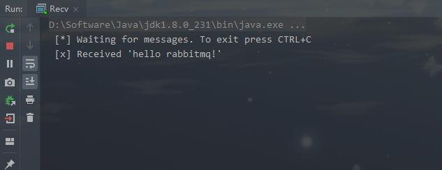
可以看出消费者进程一直没有退出，一直在等待消费

### 竞争消费模式(一对多)

**场景:** 该队列将用于在多个工作人员之间分配耗时的任务

**Send.java**
```java
public class Send {
    public static void main(String[] args) throws IOException, TimeoutException {
        try (Connection connection = MQUtil.getConn(); Channel channel = connection.createChannel()) {
            // queueDeclare(String queue, boolean durable, boolean exclusive, boolean autoDelete, Map<String, Object> arguments)
            channel.queueDeclare(WORKER_MQ_QUEUE_NAME, false, false, false, null);
            for (int i = 0; i < 10; i++) {
                String message = "hello rabbitmq " + i;
                // basicPublish(String exchange, String routingKey, BasicProperties props, byte[] body)
                channel.basicPublish("", WORKER_MQ_QUEUE_NAME, null, message.getBytes());
                System.out.println("[x] send success!");
            }
        }
    }
}
```
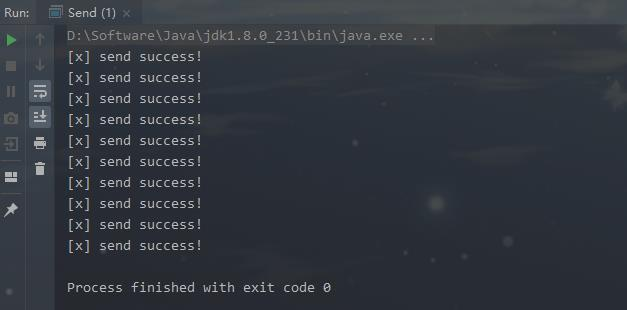

**Recv1.java**
```java
public class Recv1 {
    public static void main(String[] args) throws IOException, TimeoutException {
        Connection connection = MQUtil.getConn();
        Channel channel = connection.createChannel();
        // queueDeclare(String queue, boolean durable, boolean exclusive, boolean autoDelete, Map<String, Object> arguments)
        channel.queueDeclare(WORKER_MQ_QUEUE_NAME, false, false, false, null);
        System.out.println(" [*] Waiting for messages. To exit press CTRL+C");
        DeliverCallback deliverCallback = (consumerTag, delivery) -> {
            String message = new String(delivery.getBody(), "UTF-8");
            System.out.println(" [x] 1 Received '" + message + "'");
        };
        // String basicConsume(String queue, boolean autoAck, DeliverCallback deliverCallback, CancelCallback cancelCallback)
        channel.basicConsume(WORKER_MQ_QUEUE_NAME, true, deliverCallback, consumerTag -> {
        });
    }
}
```
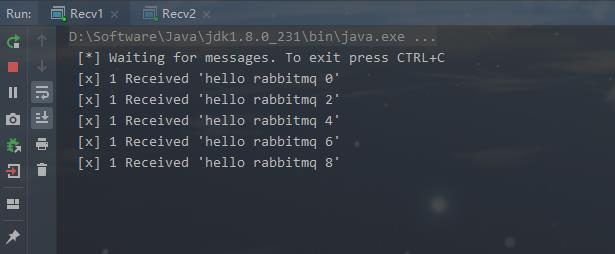

**Recv2.java**
```java
public class Recv2 {
    public static void main(String[] args) throws IOException, TimeoutException {
        Connection connection = MQUtil.getConn();
        Channel channel = connection.createChannel();
        // autoDelete: 如果设置为true，当连接断开，将会自动删除队列
        // queueDeclare(String queue, boolean durable, boolean exclusive, boolean autoDelete, Map<String, Object> arguments)
        channel.queueDeclare(WORKER_MQ_QUEUE_NAME, false, false, false, null);
        System.out.println(" [*] Waiting for messages. To exit press CTRL+C");
        DeliverCallback deliverCallback = (consumerTag, delivery) -> {
            String message = new String(delivery.getBody(), "UTF-8");
            System.out.println(" [x] 2 Received '" + message + "'");
        };
        // String basicConsume(String queue, boolean autoAck, DeliverCallback deliverCallback, CancelCallback cancelCallback)
        channel.basicConsume(WORKER_MQ_QUEUE_NAME, true, deliverCallback, consumerTag -> {
        });
    }
}
```
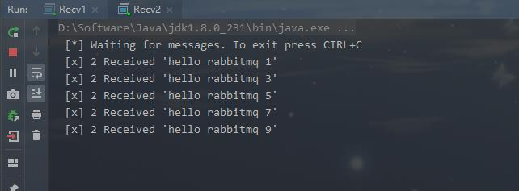

可以看出`recv1`和`recv2`公平接受消息(轮询处理)

#### Q: 如何消费手动确认并进行公平分发?
修改消费代码如下：
```java
public class Recv2 {
    public static void main(String[] args) throws IOException, TimeoutException {
        Connection connection = MQUtil.getConn();
        Channel channel = connection.createChannel();
        channel.queueDeclare(WORKER_MQ_QUEUE_NAME, false, false, false, null);
        System.out.println(" [*] Waiting for messages. To exit press CTRL+C");

        channel.basicQos(1); // (2) 设置每次接受一条数据(消息未确认前，不在分配消息)

        DeliverCallback deliverCallback = (consumerTag, delivery) -> {
            try {
                String message = new String(delivery.getBody(), "UTF-8");
                System.out.println(" [x] 2 Received '" + message + "'");
            } finally {
                System.out.println(" [x] Done");
                channel.basicAck(delivery.getEnvelope().getDeliveryTag(), false); // (3) 任务完成设置ack响应
            }
        };
        boolean autoAck = false; // (1) 设置非自动ack
        channel.basicConsume(WORKER_MQ_QUEUE_NAME, autoAck, deliverCallback, consumerTag -> {
        });
    }
}
```
修改步骤如下：
1. 设置非自动ack
2. 设置每次接受一条数据
3. 任务完成设置ack响应
4. 生产消息端设置消息持久化可以应对RabbitMQ重启

##### tips: 如果所有消费者处理消息都慢，会导致消息积压在消息队列中

#### Q: 消息如何持久化呢并且确保消息不丢失?
生产消息代码如下：
```java
public class Send {
    public static void main(String[] args) throws IOException, TimeoutException {
        try (Connection connection = MQUtil.getConn(); Channel channel = connection.createChannel()) {
            boolean durable = true; // (1) 队列持久化
            channel.queueDeclare(WORKER_MQ_QUEUE_NAME, durable, false, false, null);
            for (int i = 0; i < 50; i++) {
                String message = "hello rabbitmq " + i;
                // basicPublish(String exchange, String routingKey, BasicProperties props, byte[] body)
                channel.basicPublish("", WORKER_MQ_QUEUE_NAME, MessageProperties.PERSISTENT_TEXT_PLAIN, message.getBytes()); // (2) 消息持久化
                System.out.println("[x] send success!");
            }
        }
    }
}
```
修改步骤如下：
1. 设置队列持久化
2. 设置消息持久化
3. 设置消费端ack为手动ack

### 交换机类型

交换机的类型通常有：`direct`, `topic`, `headers` and `fanout`

### Fanout Exchange 广播模式

定义一个`fanout`类型的交换机，名字是`logs`
```java
channel.exchangeDeclare("logs", "fanout");
```
调用发布消息时，指定exchange为`logs`
```java
channel.basicPublish( "logs", "", null, message.getBytes());
```
生成一个临时队列，并且绑定我们的`logs`交换机
```java
/**
 * we create a non-durable, exclusive, autodelete queue with a generated name:
 * 1. 临时队列，名字随机，类似amq.gen-JzTY20BRgKO-HjmUJj0wLg.
 * 2. 非持久化队列
 * 3. 队列排他性，连接断开，自动删除队列
 */
String queueName = channel.queueDeclare().getQueue();
channel.queueBind(queueName, "logs", "");
```
完整代码:
```java
// 生产代码
public class SendLogs {
    private static final String LOGS_EXCHANGE_NAME = "logs";
    public static void main(String[] args) throws IOException, TimeoutException {
        try (Connection connection = MQUtil.getConn(); Channel channel = connection.createChannel()) {
            channel.exchangeDeclare(LOGS_EXCHANGE_NAME, "fanout"); // (1) 定义交换机
            String message = "hello rabbitmq!";
            channel.basicPublish(LOGS_EXCHANGE_NAME, "", null, message.getBytes()); // (2) 声明指定的logs交换机
            System.out.println("[x] send success!");
        }
    }
}
// 消费代码
public class RecvLogs {
    private static final String LOGS_EXCHANGE_NAME = "logs";
    public static void main(String[] args) throws IOException, TimeoutException {
        Connection connection = MQUtil.getConn();
        Channel channel = connection.createChannel();
        channel.exchangeDeclare(LOGS_EXCHANGE_NAME, "fanout"); // (1) 定义交换机
        String queueName = channel.queueDeclare().getQueue(); // create a non-durable, exclusive, autodelete queue with a generated name
        channel.queueBind(queueName, LOGS_EXCHANGE_NAME, ""); // (2) 交换机和队列进行绑定
        System.out.println(" [*] Waiting for messages. To exit press CTRL+C");
        DeliverCallback deliverCallback = (consumerTag, delivery) -> {
            String message = new String(delivery.getBody(), "UTF-8");
            System.out.println(" [x] Received '" + message + "'");
        };
        channel.basicConsume(queueName, true, deliverCallback, consumerTag -> {
        });// (2) 声明指定的logs交换机
    }
}
```
生产消息输出：
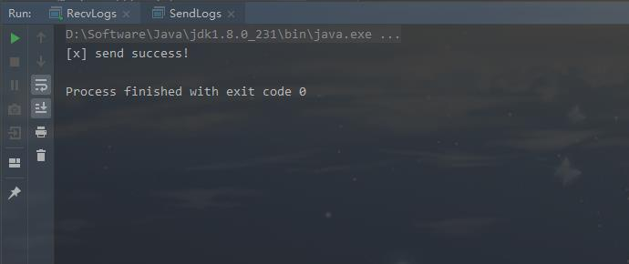
消费debug消息输出
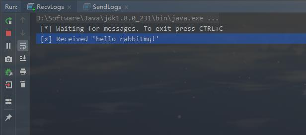

### Direct Exchange 路由模式(精确匹配)
> the queue is interested in messages from this exchange
绑定：队列对该交换机的消息感兴趣，所以要进行交换机和队列绑定
当交换机类型指定为`fanout`时，routingKey字段无意义

设置交换机类型为`direct`,并且分别以routingKey=info、routingKey=warning、routingKey=error 发送一条消息
```java
channel.exchangeDeclare(EXCHANGE_NAME, "direct");
channel.basicPublish(EXCHANGE_NAME, "info", null, message.getBytes());
channel.basicPublish(EXCHANGE_NAME, "warning", null, message.getBytes());
channel.basicPublish(EXCHANGE_NAME, "error", null, message.getBytes());
```

完整代码：
```java
// 生产消息
public class SendLogs {
    private static final String LOGS_EXCHANGE_NAME = "logs";
    public static void main(String[] args) throws IOException, TimeoutException {
        try (Connection connection = MQUtil.getConn(); Channel channel = connection.createChannel()) {
            channel.exchangeDeclare(LOGS_EXCHANGE_NAME, "direct"); // (1) 定义type=direct的交换机
            String queueName = channel.queueDeclare().getQueue(); // create a non-durable, exclusive, autodelete queue with a generated name
            channel.queueBind(queueName, LOGS_EXCHANGE_NAME, "info"); // (2) 交换机和队列进行绑定,routingKey=info
            channel.queueBind(queueName, LOGS_EXCHANGE_NAME, "error"); // (2) 交换机和队列进行绑定,routingKey=error
            channel.queueBind(queueName, LOGS_EXCHANGE_NAME, "warning"); // (2) 交换机和队列进行绑定,routingKey=warning
            channel.basicPublish(LOGS_EXCHANGE_NAME, "info", null, "info:hello rabbitmq!".getBytes()); // (2) 声明指定的logs交换机,routingKey=info
            System.out.println("[x] send info success!");
            channel.basicPublish(LOGS_EXCHANGE_NAME, "error", null, "error:hello rabbitmq!".getBytes()); // (2) 声明指定的logs交换机,routingKey=error
            System.out.println("[x] send error success!");
            channel.basicPublish(LOGS_EXCHANGE_NAME, "warning", null, "wanring:hello rabbitmq!".getBytes()); // (2) 声明指定的logs交换机,routingKey=warning
            System.out.println("[x] send warning success!");
        }

        try (Connection connection = MQUtil.getConn(); Channel channel = connection.createChannel()) {
            channel.exchangeDeclare(LOGS_EXCHANGE_NAME, "direct"); // (1) 定义type=direct的交换机
            String queueName = channel.queueDeclare().getQueue(); // create a non-durable, exclusive, autodelete queue with a generated name
            channel.queueBind(queueName, LOGS_EXCHANGE_NAME, "debug"); // (2) 交换机和队列进行绑定,routingKey=debug
            channel.basicPublish(LOGS_EXCHANGE_NAME, "debug", null, "debug:hello rabbitmq!".getBytes()); // (2) 声明指定的logs交换机,routingKey=debug
            System.out.println("[x] send debug success!");
        }
    }
}
// 消费debug消息
public class RecvDebugLogs {
    private static final String LOGS_EXCHANGE_NAME = "logs";
    public static void main(String[] args) throws IOException, TimeoutException {
        Connection connection = MQUtil.getConn();
        Channel channel = connection.createChannel();
        channel.exchangeDeclare(LOGS_EXCHANGE_NAME, "direct"); // (1) 定义type=direct的交换机
        String queueName = channel.queueDeclare().getQueue(); // create a non-durable, exclusive, autodelete queue with a generated name
        channel.queueBind(queueName, LOGS_EXCHANGE_NAME, "debug"); // (2) 交换机和队列进行绑定,routingKey=debug
        System.out.println(" [*] Waiting for messages. To exit press CTRL+C");
        DeliverCallback deliverCallback = (consumerTag, delivery) -> {
            String message = new String(delivery.getBody(), "UTF-8");
            System.out.println(" [x] Received '" + message + "'");
        };
        channel.basicConsume(queueName, true, deliverCallback, consumerTag -> {
        });// (2) 声明指定的logs交换机
    }
}
// 消费info、warning、error消息
public class RecvInfoWarningErrorLogs {
    private static final String LOGS_EXCHANGE_NAME = "logs";

    public static void main(String[] args) throws IOException, TimeoutException {
        Connection connection = MQUtil.getConn();
        Channel channel = connection.createChannel();
        channel.exchangeDeclare(LOGS_EXCHANGE_NAME, "direct"); // (1) 定义type=direct的交换机
        String queueName = channel.queueDeclare().getQueue(); // create a non-durable, exclusive, autodelete queue with a generated name
        channel.queueBind(queueName, LOGS_EXCHANGE_NAME, "info"); // (2) 交换机和队列进行绑定,routingKey=info
        channel.queueBind(queueName, LOGS_EXCHANGE_NAME, "error"); // (2) 交换机和队列进行绑定,routingKey=error
        channel.queueBind(queueName, LOGS_EXCHANGE_NAME, "warning"); // (2) 交换机和队列进行绑定,routingKey=warning
        System.out.println(" [*] Waiting for messages. To exit press CTRL+C");
        DeliverCallback deliverCallback = (consumerTag, delivery) -> {
            String message = new String(delivery.getBody(), "UTF-8");
            System.out.println(" [x] Received '" + delivery.getEnvelope().getRoutingKey() + "' : '" + message + "'");
        };
        channel.basicConsume(queueName, true, deliverCallback, consumerTag -> {
        });// (2) 声明指定的logs交换机
    }
}
```
生产消息输出：
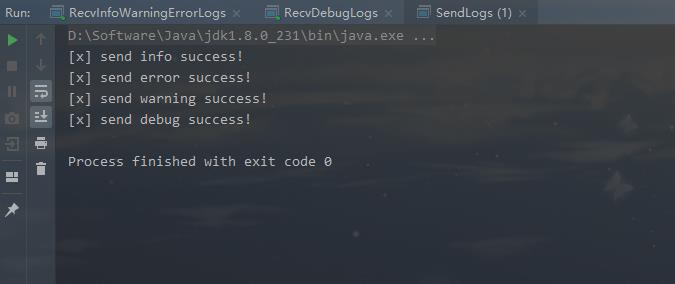
消费debug消息输出
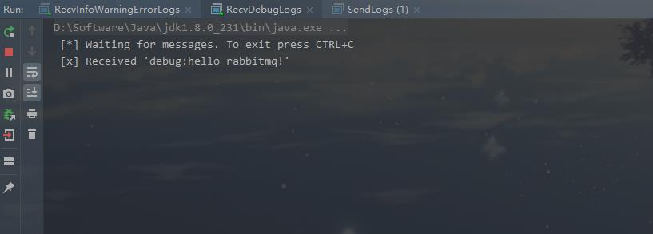
消费info、warning、error消息输出
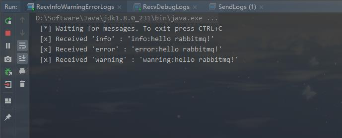
绑定info、warning、error的关系图
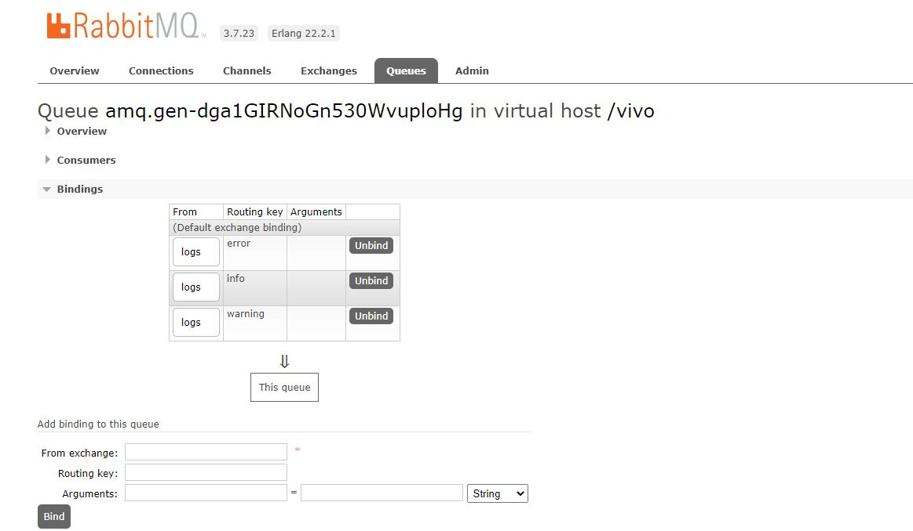
绑定debug的关系图
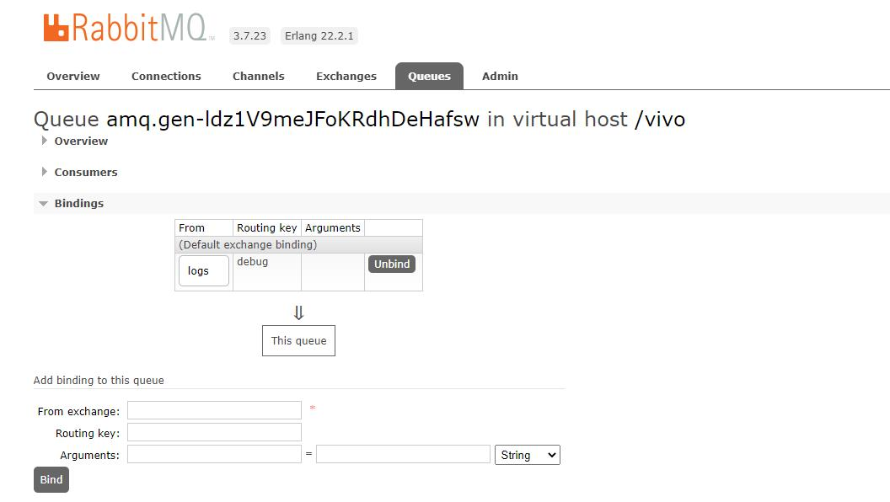

### Exchange: type=direct缺点
Although using the direct exchange improved our system, it still has limitations - it can't do routing based on multiple criteria.
不支持多个条件路径，还是固定路由key

### Topic Exchange 主题模式(支持*和#通配符)

> A few valid routing key examples: "stock.usd.nyse", "nyse.vmw", "quick.orange.rabbit". There can be as many words in the routing key as you like, up to the limit of 255 bytes.
当交换机类型为`topic`时，routingKey的长度限制为`255个字节`

topic主题特性：
1. `*` (star): can substitute for exactly one word. (可以替代额外的一个单词)
2. `#` (hash): can substitute for zero or more words.(可以替代0个或多个单词)

极端情况：
1. 当routingKey使用`#`的时候，此时功能类似`type=fanout`
2. 当routingKey中不使用`*`和`#`，此时交换机功能类似`type=direct`

全部代码：
```java
// 生产消息
public class SendLogs {
    private static final String LOGS_EXCHANGE_NAME = "topic_logs";
    public static void main(String[] args) throws IOException, TimeoutException {
        // routingKey=#
        try (Connection connection = MQUtil.getConn(); Channel channel = connection.createChannel()) {
            channel.exchangeDeclare(LOGS_EXCHANGE_NAME, "topic"); // (1) 定义type=topic的交换机
            String queueName = channel.queueDeclare().getQueue(); // create a non-durable, exclusive, autodelete queue with a generated name
            channel.queueBind(queueName, LOGS_EXCHANGE_NAME, "#"); // (2) 交换机和队列进行绑定,routingKey=# 类似广播
            channel.basicPublish(LOGS_EXCHANGE_NAME, "#", null, "#:hello rabbitmq!".getBytes()); // (2) 声明指定的logs交换机,routingKey=info
            System.out.println("[x] send # info success!");
        }
        // routingKey=*.orange.*
        try (Connection connection = MQUtil.getConn(); Channel channel = connection.createChannel()) {
            channel.exchangeDeclare(LOGS_EXCHANGE_NAME, "topic"); // (1) 定义type=topic的交换机
            String queueName = channel.queueDeclare().getQueue(); // create a non-durable, exclusive, autodelete queue with a generated name
            channel.queueBind(queueName, LOGS_EXCHANGE_NAME, "*.orange.*"); // (2) 交换机和队列进行绑定,routingKey=*.orange.*
            channel.basicPublish(LOGS_EXCHANGE_NAME, "fast.orange.fox", null, "fast.orange.fox:hello rabbitmq!".getBytes()); // (2) 声明指定的logs交换机,routingKey=fast.orange.fox
            System.out.println("[x] send fast.orange.fox success!");
        }
        // routingKey=*.*.rabbit And routingKey=lazy.#
        try (Connection connection = MQUtil.getConn(); Channel channel = connection.createChannel()) {
            channel.exchangeDeclare(LOGS_EXCHANGE_NAME, "topic"); // (1) 定义type=topic的交换机
            String queueName = channel.queueDeclare().getQueue(); // create a non-durable, exclusive, autodelete queue with a generated name
            channel.queueBind(queueName, LOGS_EXCHANGE_NAME, "*.*.rabbit"); // (2) 交换机和队列进行绑定,routingKey=*.*.rabbit
            channel.queueBind(queueName, LOGS_EXCHANGE_NAME, "lazy.#"); // (2) 交换机和队列进行绑定,routingKey=lazy.#
            channel.basicPublish(LOGS_EXCHANGE_NAME, "fast.orange.rabbit", null, "fast.orange.rabbit:hello rabbitmq!".getBytes()); // (2) 声明指定的logs交换机,routingKey=fast.orange.rabbit
            System.out.println("[x] send fast.orange.rabbit success!");
            channel.basicPublish(LOGS_EXCHANGE_NAME, "lazy.black.cat", null, "lazy.black.cat:hello rabbitmq!".getBytes()); // (2) 声明指定的logs交换机,routingKey=lazy.black.cat
            System.out.println("[x] send lazy.black.cat success!");
            channel.basicPublish(LOGS_EXCHANGE_NAME, "lazy.black.dog", null, "lazy.black.dog:hello rabbitmq!".getBytes()); // (2) 声明指定的logs交换机,routingKey=lazy.black.dog
            System.out.println("[x] send lazy.black.dog success!");
        }
    }
}
// 接受所有消息
public class RecvAllLogs {
    private static final String LOGS_EXCHANGE_NAME = "topic_logs";
    public static void main(String[] args) throws IOException, TimeoutException {
        Connection connection = MQUtil.getConn();
        Channel channel = connection.createChannel();
        channel.exchangeDeclare(LOGS_EXCHANGE_NAME, "topic"); // (1) 定义type=topic的交换机
        String queueName = channel.queueDeclare().getQueue(); // create a non-durable, exclusive, autodelete queue with a generated name
        channel.queueBind(queueName, LOGS_EXCHANGE_NAME, "#"); // (2) 交换机和队列进行绑定,routingKey=#
        System.out.println(" [*] Waiting for messages. To exit press CTRL+C");
        DeliverCallback deliverCallback = (consumerTag, delivery) -> {
            String message = new String(delivery.getBody(), "UTF-8");
            System.out.println(" [x] Received '" + message + "'");
        };
        channel.basicConsume(queueName, true, deliverCallback, consumerTag -> {
        });// (2) 声明指定的logs交换机
    }
}
// 接受 *.orange.* 消息
public class RecvOrangeLogs {
    private static final String LOGS_EXCHANGE_NAME = "topic_logs";
    public static void main(String[] args) throws IOException, TimeoutException {
        Connection connection = MQUtil.getConn();
        Channel channel = connection.createChannel();
        channel.exchangeDeclare(LOGS_EXCHANGE_NAME, "topic"); // (1) 定义type=topic的交换机
        String queueName = channel.queueDeclare().getQueue(); // create a non-durable, exclusive, autodelete queue with a generated name
        channel.queueBind(queueName, LOGS_EXCHANGE_NAME, "*.orange.*"); // (2) 交换机和队列进行绑定,routingKey=*.orange.*
        System.out.println(" [*] Waiting for messages. To exit press CTRL+C");
        DeliverCallback deliverCallback = (consumerTag, delivery) -> {
            String message = new String(delivery.getBody(), "UTF-8");
            System.out.println(" [x] Received '" + message + "'");
        };
        channel.basicConsume(queueName, true, deliverCallback, consumerTag -> {
        });// (2) 声明指定的logs交换机
    }
}
// 接受 lazy.# 消息
public class RecvLazyAllLogs {
    private static final String LOGS_EXCHANGE_NAME = "topic_logs";
    public static void main(String[] args) throws IOException, TimeoutException {
        Connection connection = MQUtil.getConn();
        Channel channel = connection.createChannel();
        channel.exchangeDeclare(LOGS_EXCHANGE_NAME, "topic"); // (1) 定义type=topic的交换机
        String queueName = channel.queueDeclare().getQueue(); // create a non-durable, exclusive, autodelete queue with a generated name
        channel.queueBind(queueName, LOGS_EXCHANGE_NAME, "lazy.#"); // (2) 交换机和队列进行绑定,routingKey=lazy.#
        System.out.println(" [*] Waiting for messages. To exit press CTRL+C");
        DeliverCallback deliverCallback = (consumerTag, delivery) -> {
            String message = new String(delivery.getBody(), "UTF-8");
            System.out.println(" [x] Received '" + message + "'");
        };
        channel.basicConsume(queueName, true, deliverCallback, consumerTag -> {
        });// (2) 声明指定的logs交换机
    }
}
```

生产消息输出
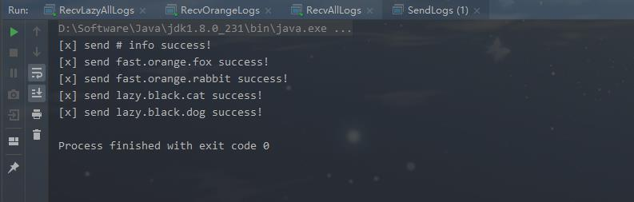
接受所有消息输出(第一条是之前测试，忽略)
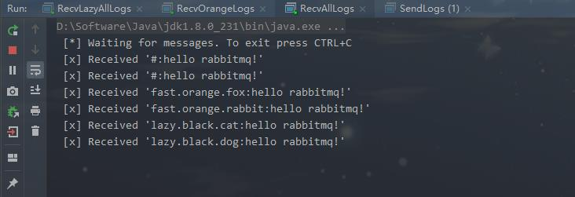
接受*.orange.*消息输出
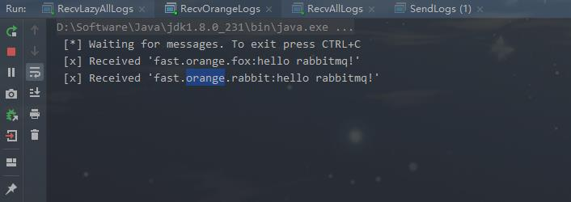
接受lazy.#消息输出
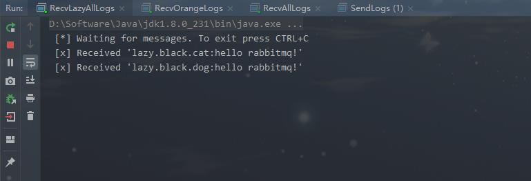
topic_logs绑定关系图
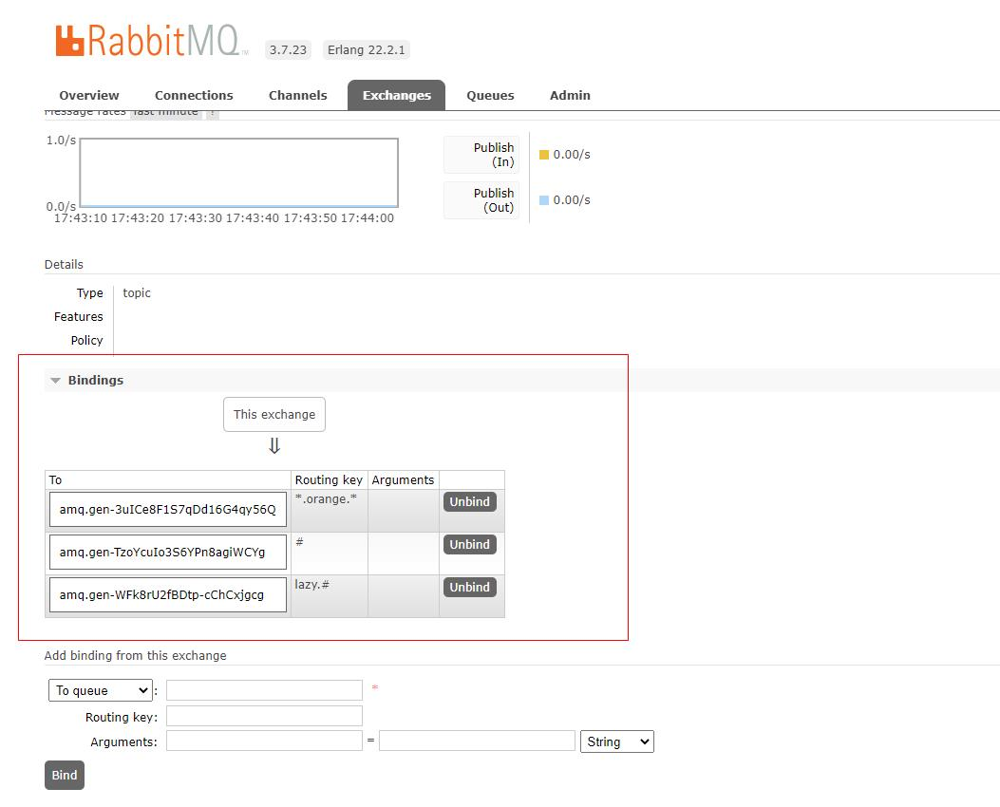

### 额外交换机
#### Headers Exchange 性能较差，使用type=direct交换机代替

>A headers exchange is designed for routing on multiple attributes that are more easily expressed as message headers than a routing key. Headers exchanges ignore the routing key attribute. Instead, the attributes used for routing are taken from the headers attribute. A message is considered matching if the value of the header equals the value specified upon binding.
It is possible to bind a queue to a headers exchange using more than one header for matching. In this case, the broker needs one more piece of information from the application developer, namely, should it consider messages with any of the headers matching, or all of them? This is what the "x-match" binding argument is for. When the "x-match" argument is set to "any", just one matching header value is sufficient. Alternatively, setting "x-match" to "all" mandates that all the values must match.
Headers exchanges can be looked upon as "direct exchanges on steroids". Because they route based on header values, they can be used as direct exchanges where the routing key does not have to be a string; it could be an integer or a hash (dictionary) for example.
Note that headers beginning with the string x- will not be used to evaluate matches.

Headers Exchange 会忽略 RoutingKey 而根据消息中的 Headers 和创建绑定关系时指定的 Arguments 来匹配决定路由到哪些 Queue。
Headers Exchange 的性能比较差，而且 Direct Exchange 完全可以代替它，所以不建议使用。

#### Default Exchange 适合简单应用
>The default exchange is a direct exchange with no name (empty string) pre-declared by the broker. It has one special property that makes it very useful for simple applications: every queue that is created is automatically bound to it with a routing key which is the same as the queue name.
For example, when you declare a queue with the name of "search-indexing-online", the AMQP 0-9-1 broker will bind it to the default exchange using "search-indexing-online" as the routing key (in this context sometimes referred to as the binding key). Therefore, a message published to the default exchange with the routing key "search-indexing-online" will be routed to the queue "search-indexing-online". In other words, the default exchange makes it seem like it is possible to deliver messages directly to queues, even though that is not technically what is happening.

参考简单队列模式

## Spring集成RabbitMQ实现


## 消息队列高可用实现方案分析


## 消息队列优缺点
### 优点
1. 应用异步
2. 应用解耦
3. 流量削峰

### 缺点
1. 系统可用性降低 - 如果MQ挂掉，容易导致整套系统奔溃
2. 系统复杂度升高 - 保证消息重复消费问题、消息传递顺序性问题、消息丢失问题比较困难
3. 数据一致性问题 - 部分系统处理成功，部分系统处理失败

## RabbitMQ优缺点

