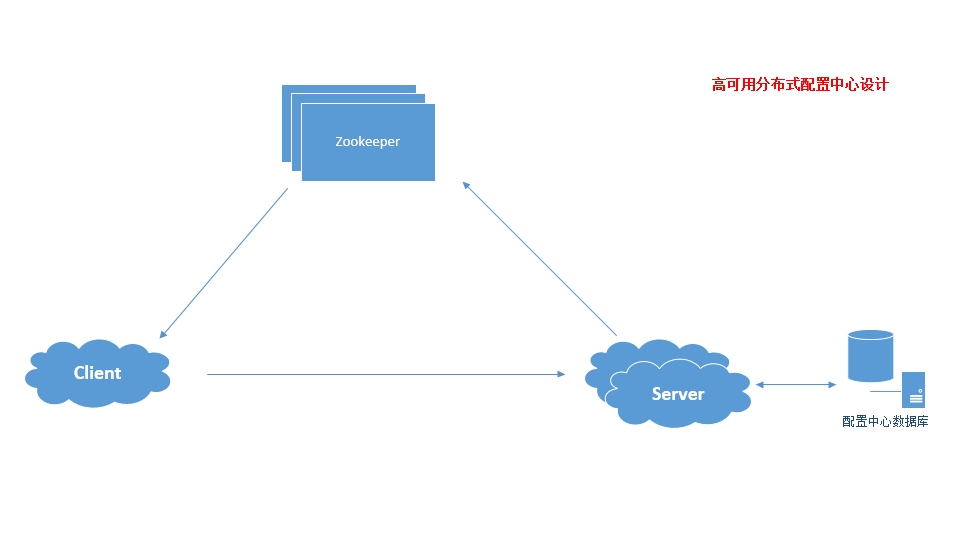
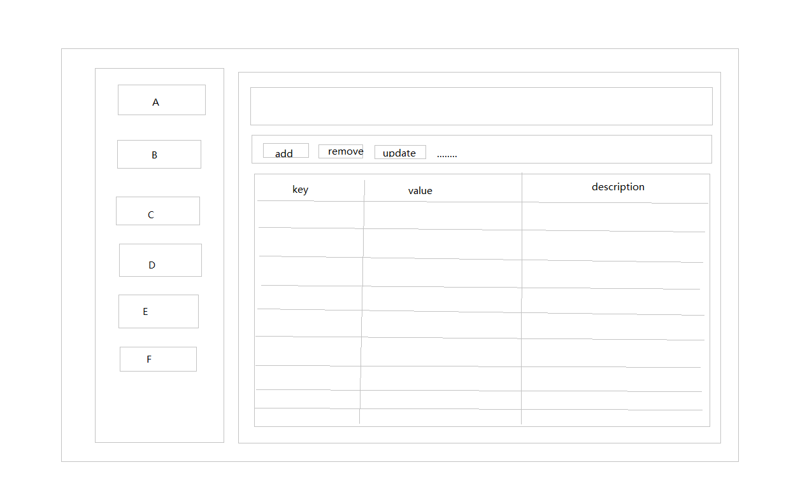

# 高可用分布式配置中心设计

## 参与角色

 ### Server（后台配置服务，集群保证服务高可用)

1. 提供对外访问页面，供开发人员进行配置新增、更新、删除等操作
2. 将开发人员操作数据入库，同时写入Zookeeper，作为永久节点存在
3. 提供对外接口供各服务进行调用

### Zookeeper (数据存储节点)

1. 高可用部署

### Client(调用服务)

1. 服务初始化调用Server接口获取配置信息
2. 同时初始化Zookeeper节点监听(TreeCache)
3. 服务运行过程中，支持动态更新

