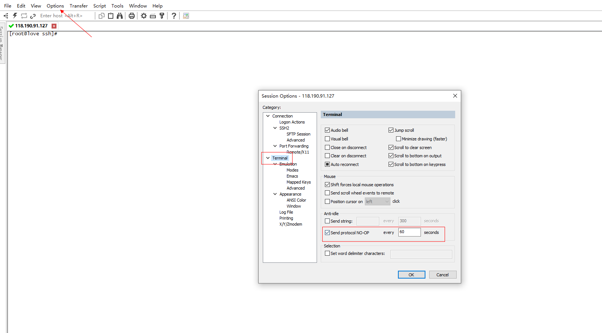

# CentOS之SSH超时无响应处理

## 服务端

### 1. 编辑配置文件

> vim /etc/ssh/sshd_config
>
> 设置下列参数：
>
> ClientAliveInterval 60  表示每隔多少秒，服务器端向客户端发送心跳
>
> ClientAliveCountMax 3 表示上述多少次心跳无响应之后，会认为Client已经断开

### 2. 执行命令，配置生效

> systemctl reload sshd.service

## 客户端

### 1. 修改connection参数 (Secure)

