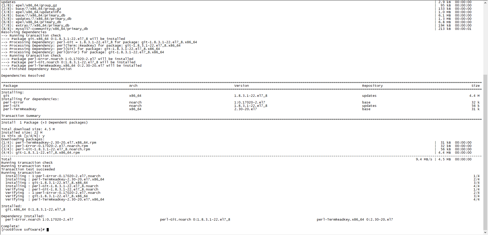

# CentOS安装系列之Git私服搭建

1. 使用root用户安装
```bash
su root
```
2. 使用yum源安装git
```bash
yum install git
```


3. git版本检查

```bash
git --version
```
4. 添加git管理的账户并设置密码
```bash
adduser git
passwd git
```

git主目录：

> /home/git