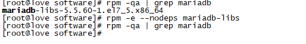
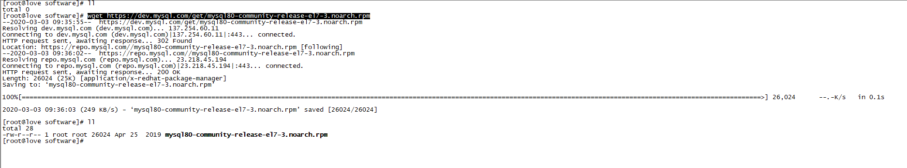
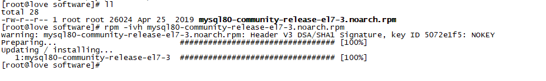
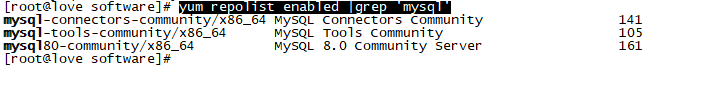
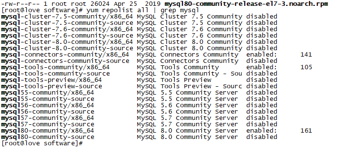
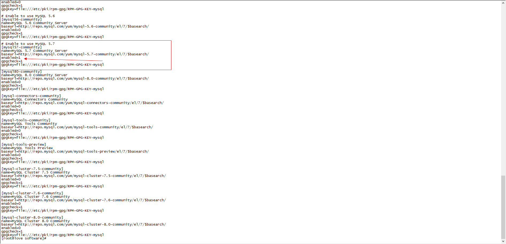
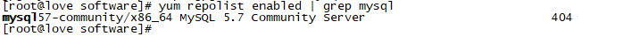
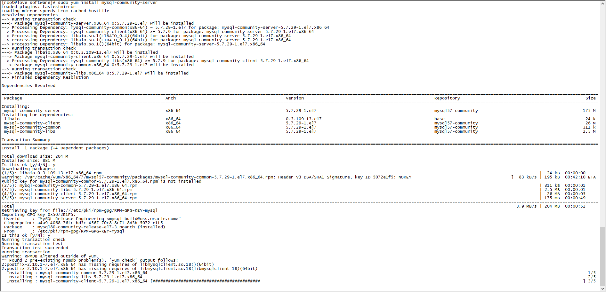
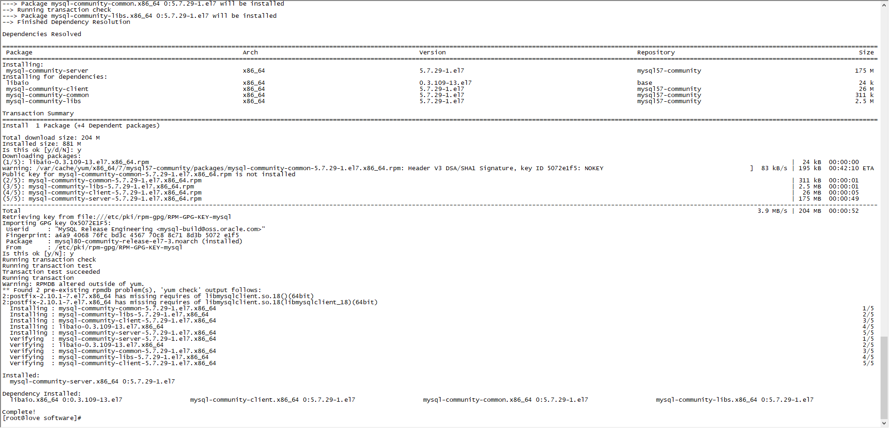

# CentOS安装系列之MySQL

Linux 安装软件方式：

- 源码编译
- 压缩包解压（一般为tar.gz）
- 编译好的安装包（RPM、DPKG等）
- 在线安装（YUM、APT等）

便捷性：

​	源码编译 <  压缩包解压（一般为tar.gz）<  编译好的安装包（RPM、DPKG等）< 在线安装（YUM、APT等）

通用性：

​	源码编译 > 压缩包解压（一般为tar.gz）>  编译好的安装包（RPM、DPKG等）> 在线安装（YUM、APT等）


CentOS安装MySQL步骤：

## 删除已经安装的mysql(如确认没安装过，可跳过)

## 1.检查MariaDB

	> rpm -qa|grep mariadb


### 1.2.删除mariadb(如果不存在，上面命令执行结果返回空)

> rpm -e --nodeps mariadb-libs



#### tips：*其实yum方式安装是可以不用删除mariadb的，安装MySQL会覆盖掉之前已存在的mariadb*

### 2.检查MySQL

> rpm -qa | grep mysql (检测是否安装mysql)
>
> rpm -e --nodeps xxx （删除xxx)

### 3.安装MySQL的Yum源（官网)

#### 3.1 官网下载Yum源

> wget https://dev.mysql.com/get/mysql80-community-release-el7-3.noarch.rpm



#### 3.2 安装执行rpm

> sudo rpm -ivh mysql80-community-release-el7-3.noarch.rpm



3.3 检查安装Yum是否成功

> yum repolist enabled |grep 'mysql'



### 4. 安装指定版本MySQL

	###### 4.1 查看rpm中所有mysql版本

> yum repolist all | grep mysql



#### 4.2 切换指定版本mysql

> 编辑 /etc/yum.repos.d/mysql-community.repo
>
> enabled=0 禁用
>
> enabled=1 启用



#### 4.3 检查当前启用的MySQL仓库

> yum repolist enabled | grep mysql



### 5. 安装MySQL

> sudo yum install mysql-community-server





### 6. 启动MySQL(CentOS)

#### 6.1 启动命令

> sudo systemctl start mysqld.service

#### 6.2 状态命令

> sudo systemctl status mysqld.service

#### 6.3 停止命令

> sudo systemctl stop mysqld.service

#### 6.4 重启命令

> sudo systemctl restart mysqld.service

### 7. MySQL相关操作

#### 7.1 查看默认密码

> sudo grep 'temporary password' /var/log/mysqld.log （初始密码从日志中查看)

#### 7.2 修改默认密码

> mysql -uroot -p
>
> ALTER USER 'root'@'localhost' IDENTIFIED BY '密码';


### 8. 远程访问

#### 8.1 阿里云ECS安装MySQL远程连接

> ```
> 使用mysql库
> use mysql
> ```
>
> ```
> 更新用户'root'对应的host为'%'
> update user set host='%' where user='root' and host='localhost';
> ```
>
> ```
> 刷新权限
> flush privileges;
> ```
>
> ```
> 检查安全组配置 3306是否开放
> 检查服务器防火墙设置
> ```


### 相关命令:

> cat /etc/redhat-release （查看当前CentOS系统版本信息)
>
> set global validate_password_policy=0; (进入mysql界面，设置密码强度要求)
>
> set global validate_password_length=4; (进入mysql界面，设置密码长度要求)
>
> #防火墙规则设置
>
> #添加3306到防火墙规则 （--permanent永久生效）
>
> firewall-cmd --permanent --zone=public --add-port=3306/tcp
>
> firewall-cmd --permanent --zone=public --remove-port=<port>/<protocol> #移除端口/协议 
>
> #协议
>
> firewall-cmd --permanent --zone=public --add-service=<protocol> # 允许协议 (例：icmp，即允许ping) 
>
> firewall-cmd --remove-protocol=<protocol> # 取消协议 
>
> firewall-cmd --list-protocols # 查看允许的协议
>
> sudo systemctl enable xxx(添加开机自启xxx服务)
>
> sudo systemctl disable xxx(删除开机自启xxx服务)