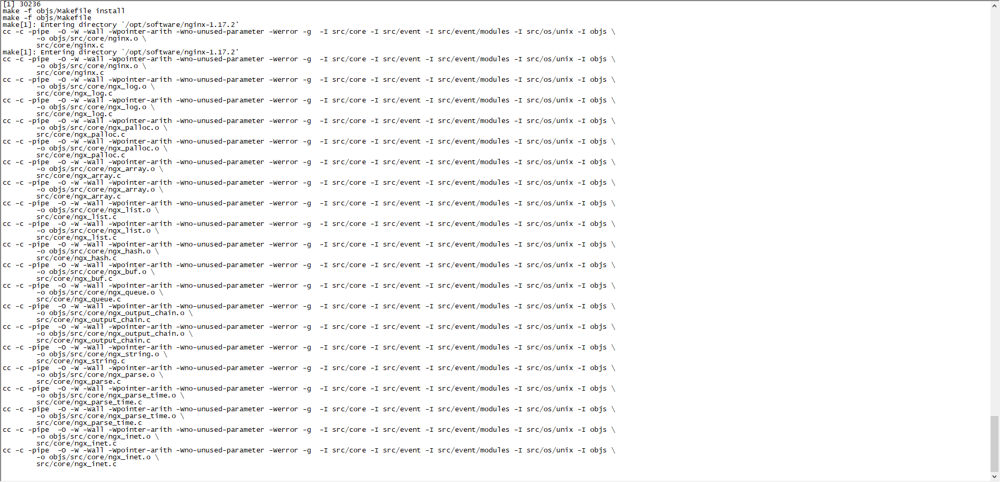
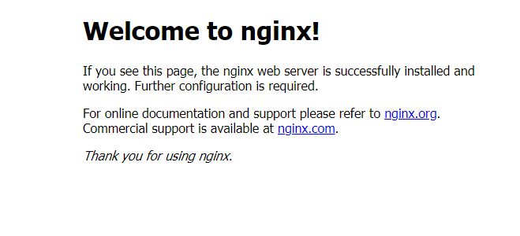

# CentOS安装系列之Nginx

## 1. 安装Nginx依赖(依次执行，安装过不会重复安装)

>yum install gcc-c++ 
>
>yum install -y pcre pcre-devel 
>
>yum install -y zlib zlib-devel 
>
>yum install -y openssl openssl-devel

## 2. 下载Nginx压缩包  & 解压

> wget http://nginx.org/download/nginx-1.17.2.tar.gz
>
> tar -zxvf  nginx-1.17.2.tar.gz

## 3. 配置初始化 & 编译 & 安装 (默认安装到/usr/local/nginx目录下)

>cd nginx-1.17.2 (进入nginx-1.17.2目录)
>
>./configure --prefix=/usr/local/nginx （配置初始化)
>
>make & make install (编译 & 安装)

## 4. 设置systemctl管理

> vi /usr/lib/systemd/system/nginx.service   新建nginx.service文件，然后输入下述内容： 
>
> BEGIN: (此行不复制)======================================================
>
> [Unit]
> Description=nginx - high performance web server
> After=network.target remote-fs.target nss-lookup.target
>
> [Service]
> Type=forking
> ExecStart=/usr/local/nginx/sbin/nginx -c /usr/local/nginx/conf/nginx.conf
> ExecReload=/usr/local/nginx/sbin/nginx -s reload
> ExecStop=/usr/local/nginx/sbin/nginx -s stop
>
> [Install]
> WantedBy=multi-user.target
>
> END: (此行不复制)======================================================

## 5. systemctl 启动、停止、重启、设置开机启动、移除开机启动、重新加载

>systemctl start nginx.service
>
>systemctl stop nginx.service
>
>systemctl restart nginx.service
>
>systemctl enable nginx.service
>
>systemctl disable nginx.service
>
>systemctl daemon-reload

## 6. 访问80端口

## 相关命令:

> cat /etc/redhat-release （查看当前CentOS系统版本信息)
>