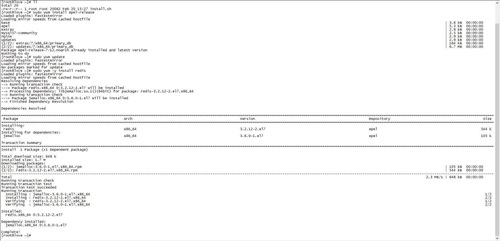

# CentOS安装系列之Redis

## 1. 在CentOS和Red Hat系统中，首先添加EPEL仓库，然后更新yum源

>sudo yum install epel-release
>sudo yum update

## 2. 安装Redis

> sudo yum -y install redis

## 3. Reids配置文件

### 3.1 路径

>/etc/redis.conf

### 3.2 配置描述

> daemonize no 是否设置后台启动

## 4. 启动、停止、重启、开机启动、移除开机启动

> systemctl start redis
>
> systemctl stop redis
>
> systemctl restart redis
>
> systemctl enable redis
>
> systemctl disable redis

## 5. 卸载

> rm -rf /usr/local/bin/redis*