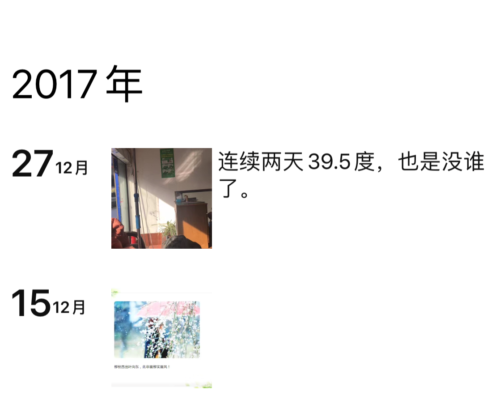
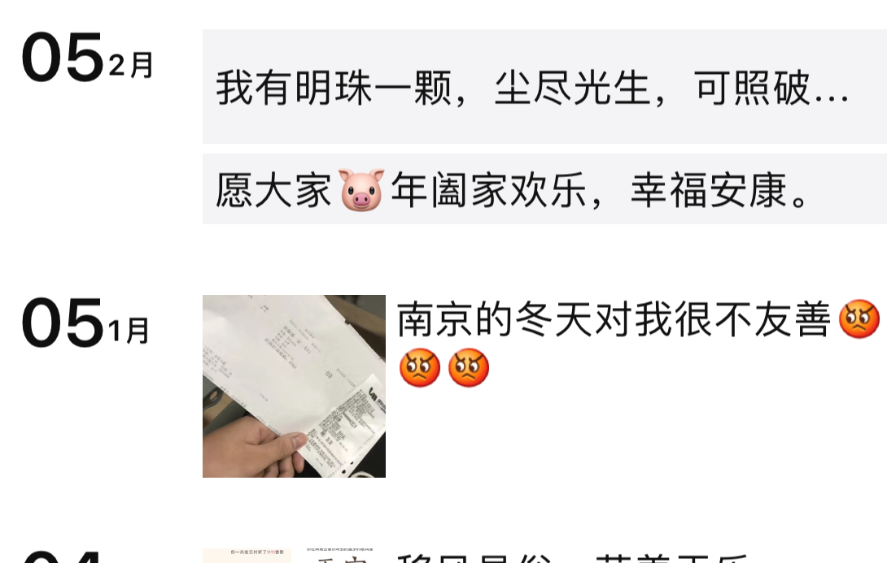
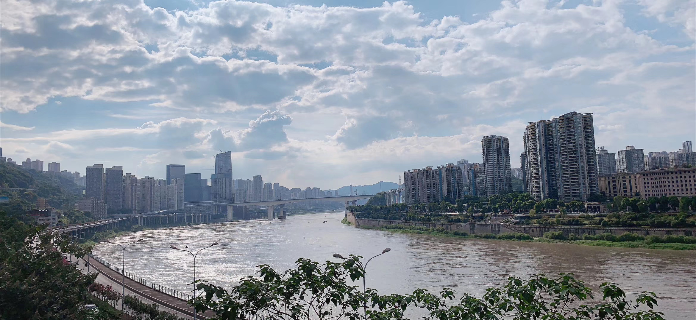
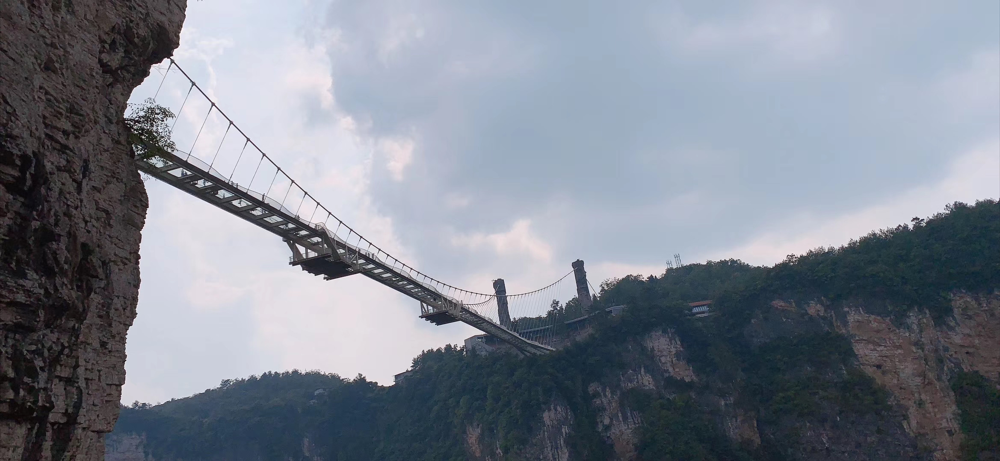
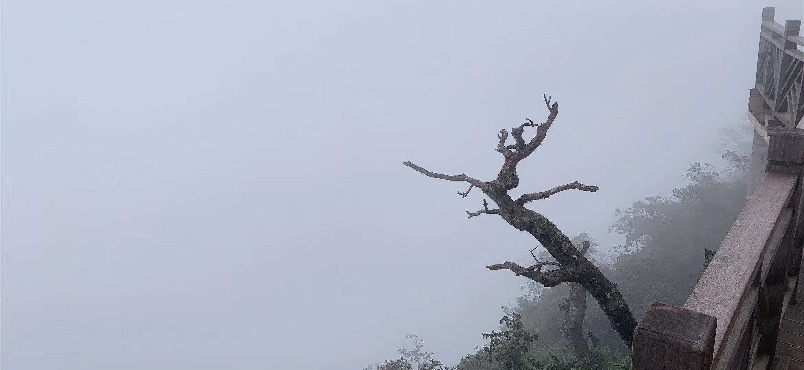

# 个人生活小计一

​		今年8月的时候，在经历了多次的思想斗争后，我还是决定离职了。离开了我带了差几个月就满两年的地方，期间承载着许多事情，包括个人的成长。

​		依稀记得17年11月左右来的南京，当是和朋友住在中华门的一栋小房子里面，虽小但也开心。那时候家里有点事，从`徐州-南京`我记得往返了两次。对了，说到这个不得不被自己的智商蠢哭了-_-。 记得那时候决定第二天要回去，火车是第二天凌晨一点多的，谁知和朋友聊天到深夜。在买票的时候买成第三日的了，一直到火车站验票的时候才发现这件事情。哈哈啊哈。。。

​		不知道是我身体没有适应南京呢，还是南京比较克我。在南京呆了两个冬天了，每个冬天都发烧感冒，而且总是反复发作。我也感到很无奈啊，啊啊啊啊啊。不过从这里看出，不要一个人呆着。因为在你发烧生病的时候，你的朋友至少能陪你去医院，即使平常总是聊天打屁表现出不靠谱的样子。这里给他们手动点赞！！！为此每次都要发一次动态，以作为南京对我不友好的`强烈证明`

​	 

​		工作的话，入职一家以ERP起家的小型科技公司，当时团队是单独抽出来，为老板布局新零售业务做`护航`的。具体工作内容就不多说了，无非就是写写代码、改改bug、忙的时候加加班。不过我这里要重点说下我当时的团队，就给人一种很充实、很自在的感觉。当你融入的时候，你会发现。他们是一群可爱的人，热爱工作，热爱生活。至于我为啥要离开呢，绝不是因为团队氛围不好什么原因的。我想可能个人原因比较多一点，就是想趁年轻多折腾折腾吧。

​		好了，我们把时间线拉回现在，北京时间: `2019-11-23` 

​		今年8月底离职后,在家简短的呆了一段时间后。 就开始了为期一周的三地观光之旅：从老家出发，过汉口至有着`山城`之称的重庆。 在渝中地区呆了几天，走过了解放碑，转过了洪崖洞。打卡了网红景点：穿楼地铁。也蹭了下过江索道，坐在`皇后号`邮轮上欣赏了两江交汇之地的渝中。滚滚长江，浩浩威然。变得是城，不变的是江流。经费有限，不允许我去长江周边景点游玩，哈哈啊，有机会在去吧。 对了，全程住的名宿。感觉名宿提供的设施、服务相比宾馆好不少。

> 重庆给我最大的感受是，得天独厚的地理优势，和那勇于开山建城的坚强毅力。成功不是没有理由的，只是没有发现罢了。

​	本来准备去成都的，但是姐当时孩子出生，怕赶不上我们那边所说的`送奶糖`，吓。我也不知道我说的对不对，反正就是时间抽不出来，只能转到一直想去的地方：`张家界`。记得第一次了解张家界，还是从一部国产动画**<虹猫蓝兔系列动画>**里面了解的，说是取景就是张家界。那时候就感觉张家界好美，后来看到过新闻说：电影**<阿凡达>**也有在张家界取过景。所以内心对张家界就更加向往了。当时做火车转去张家界的，当火车快要进入月台的时候，就能远远的看到通往天门山的缆车在缓缓运行。

> 不过怎么说呢，张家界，不大，三四线城市的规模。张家界，很大，崇山峻岭都在它的范围内。

​	当天到的时候，没有急着去天门山。因为我定的是第二天的票去的，所以没办法，只能先去大峡谷了。记住直接去汽车站买票，很方便的。即使晚上回不来，也可以在大峡谷那边找个客栈住下来。旅游业发达的城市，客栈这些住宿的地方怎么会少呢。坐车的话，差不多一个多小时到大峡谷。武陵源风景区、国家森林公园都是相同方向，可惜这两个景点后来实在转不动了，所以就没去。只能说比较可惜，看到了是回忆，看不到就只能是远方的风景了。不多扯，继续大峡谷主线，做摆渡车上山，感觉一路晃上去的，内心还是比较恐慌的。直到后来站在玻璃栈道上时发现，这时候的恐慌算个毛球啊。

​	过了差不多15分钟，到了山顶，然后就是检票进入风景区了。景区里对设施安全保障、限流做的还是该有的都有。过百米长的玻璃栈道横亘在两座山峰之间，我去的时候，人还是比较多的。所以就不放正面图了，放张从下面拍摄的图片。稍微感受下吧。

​	总的来说：大峡谷给人比较兴奋的就是在桥上那段时间，感觉整个人肾上腺素飙升，想一辆五菱宏光直接从40飙到150一样，对于我这种内心认为自己恐高的人来说，那画面简直惨不忍睹。反正我80%都是从边上石道通过的。哈哈哈哈哈哈哈。。。。下山就没啥好说的，一路走，一路走，一路走，对于想要减肥的人来说。简直是福音啊。

​	一定要在天气好的时候上天门山，最好是下午2，3点左右。早上的话，你就相当于到了一个修仙圣地，放眼望去，除了雾还是雾。不过刚开始大约半小时的索道、后续的登天梯以及那要绕过99个弯道把你摆渡下山的公共汽车。心灵与身体的洗涤，那感觉：你值得拥有。照片没做处理，暂时放一张仙雾中的半浮空栈道吧。

​	好了，就先聊到这里，放点东西在下回吧。。。。