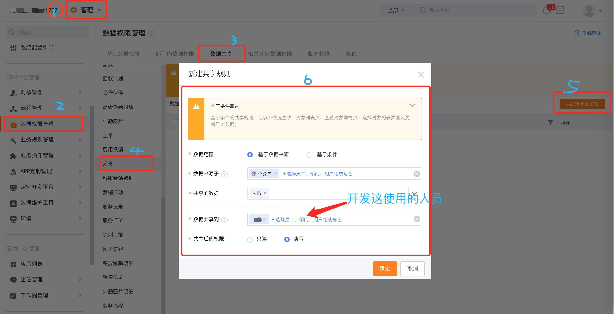
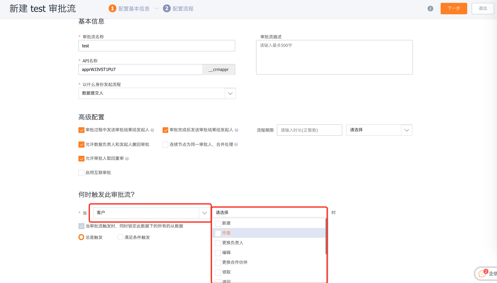

# 纷享OpenAPI答疑文档

## 说明

本文档基于客户对接涉及问题整理输出，仅供参考

### 1.currentOpenUserId如何获取？

 CRM相关接口需要传入接口调用者的身份（**currentOpenUserId**）参数，调用接口时会使用该用户的权限进行获取有权限的数据；

1. 一般对接应用程序建议使用CRM管理员账号(系统建设第一个账号，用户ID=1000);具体获取方式参考[用户级授权#通过code获取accessToken](http://open.fxiaoke.com/wiki.html#artiId=19)

   ```bash
   curl --location --request POST 'https://open.fxiaoke.com/oauth2.0/token' \
   --header 'Content-Type: application/json' \
   --data-raw '{
       "grantType":"authorization_code",
       "appId":"FSAID_13196a8",
       "appSecret":"aca766dc4a99481fb496392c0a4c8632",
       "redirectUrl":"https://open.fxiaoke.com/xxx",
       "code":"FSCOD_8671C14D7E4CC1EC30B306B5F28474F0"
   }'
   ```

2. 如果客户自己有需求，则让客户根据手机号获取用户ID，具体接口参考人员接口[根据手机号查询人员信息](https://open.fxiaoke.com/wiki.html#artiId=1122)

## 2.查询人员数据只能查询当前账号一条数据为什么？

1. 排查**currentOpenUserId**是否是CRM管理员角色(一般是crm管理员都可以获取全部数据)

2. CRM平台添加数据映射

   

### 3.调用接口返回500错误

1. **检查入参字段格式是否正确**

   比如String类型

   ```
   "field_name": "field_value"
   ```

   比如List类型

   ```
   "field_name": [
     "field_value1",
     "field_value2"
   ]
   ```

   比如图片类型

   ```
   "field_name": [
    {
      "ext": "jpg",
      // 此处path是指素材上传接口返回的mediaId
      "path": "6bbf2c04-b615-4c81-b2af-a02403098b91",
      "filename": "weixin.jpg"
    }
   ]
   ```

   比如Integer类型

   ```
   // "field_name": field_value,
   "field_name1": 1,
   "field_name2": 10000,
   ```

2. **检查入参报文是否正确**

   比如根据条件查询入参格式，正确格式如下：

   ```
   {
     "corpAccessToken": "${corpAccessToken}",
     "corpId": "${corpId}",
     "currentOpenUserId": "${currentOpenUserId}",
     "data": {
       "search_query_info": {
         "offset": 0,
         "limit": 2,
         "filters": []
       },
       "dataObjectApiName": "SPUObj"
     }
   }
   ```

   可能开发者把层次结构搞错了，`dataObjectApiName`字段放在和同`data`同一层级

3. **企信群问产研**

   ​	需要客户提供: `traceId`，最好入参也提供下

### 4.是否触发审批流?

1. 看审批具体设置触发条件(新建、编辑、作废等)
2. 假设设置`新建`触发，则通过OpenAPI新建数据会触发审批流



### 5.新增无规格产品提示500等错误，正确格式参考如下

```
{
    "corpAccessToken": "DD8DDC92792715C7D1B2EBE6C9C0194B",
    "currentOpenUserId": "FSUID_67251B0A17518A810686BBF5EAE89402",
    "corpId": "FSCID_96A02141379A19F0AE001DA6AEFDAC04",
    "data": {
        "object_data": {
            "owner": [
                "FSUID_67251B0A17518A810686BBF5EAE89402"
            ],
            "product_status": "1",
            "price": "10.00",
            "name": "规格大苏打盛大商品",
            "category": "2",
            "dataObjectApiName": "ProductObj"
        }
    }
}
```

1. 确保是否data -> object_data -> 具体字段
2. 确保字段的值是否正确，比如product_status填成了中文
3. 确保字段类型是否正确，比如owner是数组

### 6. 数据[20210525-010]的字段[客户名称]关联关系不存在-201112011

1. 出现类似关联关系不存在的问题，检查该字段，这种查找关联字段必须填crm中数据的id值，不能随便填写；（主从字段也是，不过新增主从不需要传入id）

### 7. 计划任务函数模板

```groovy
List objectIds = [context.data['_id']] // context.objectIds;
def(Boolean error,List dataList,String errorMessage) = Fx.object.findByIds("ProductObj", objectIds);
if(error) {
  log.info("【ERROR】批量查询产品数据错误！ " + errorMessage);
  return;
}
dataList && dataList.each{ item ->
  Map obj = item as Map;
  
  
  
}
```

#### 批量模糊查询

```groovy
String objectId = context.data['_id'] as String;
def (Boolean error,QueryResult result,String errorMessage) = Fx.object.find("NewOpportunityLinesObj",[
    ["new_opportunity_id":objectId]
], 100, 0);
if(error) {
  log.info("【ERROR】批量获取数据失败！" + errorMessage);
  return;
}
if(!result || result.size == 0) {
  log.info("【WARN】批量获取数据为空！");
  return;
}
List dataList = result.dataList as List;
dataList && dataList.each{
  
}
```

#### 汇总数据查询

```groovy
/**
 * 汇总数据信息
 */
def findMatchList(String objectName,List queryCriteria) {
  def (Boolean error,QueryResult result,String errorMessage) = Fx.object.find(objectName,queryCriteria, 1, 0);
  if(error) {
    log.info("【ERROR】批量获取数据失败！" + errorMessage);
    return [];
  }
  log.info("【INFO】查询符合数据条数：" + result.total)
  Integer pages = (result.total / 100) as Integer
  Range loops = Ranges.of(1, pages + 1);
  List finalDataList = [];
  loops.each { i -> 
    def (Boolean err,QueryResult result1,String errMessage) = Fx.object.find(objectName,queryCriteria, 100, (i-1) * 100);
    if(err) {
      log.info("【ERROR】批量获取数据失败！" + errMessage);
      return [];
    }
    if(result1 && result1.size > 0) {
      List partDataList = result1.dataList as List;
      finalDataList.addAll(partDataList);
    }
  }
  return finalDataList;
}
// **********************
// ******主程序开始******
// **********************

