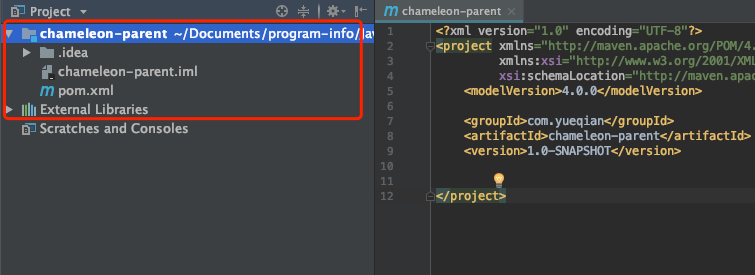
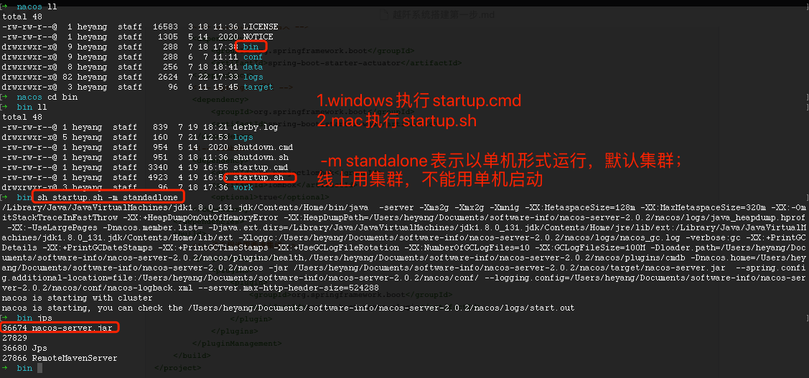
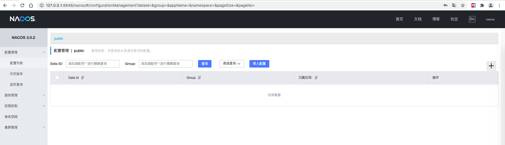
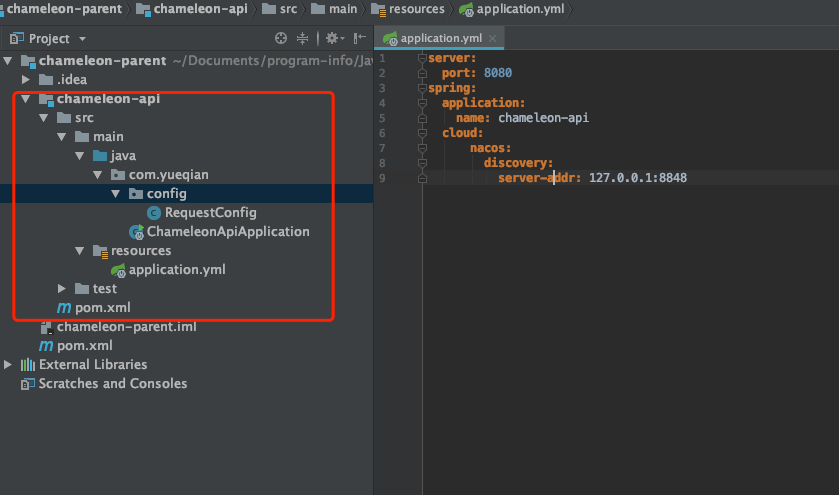
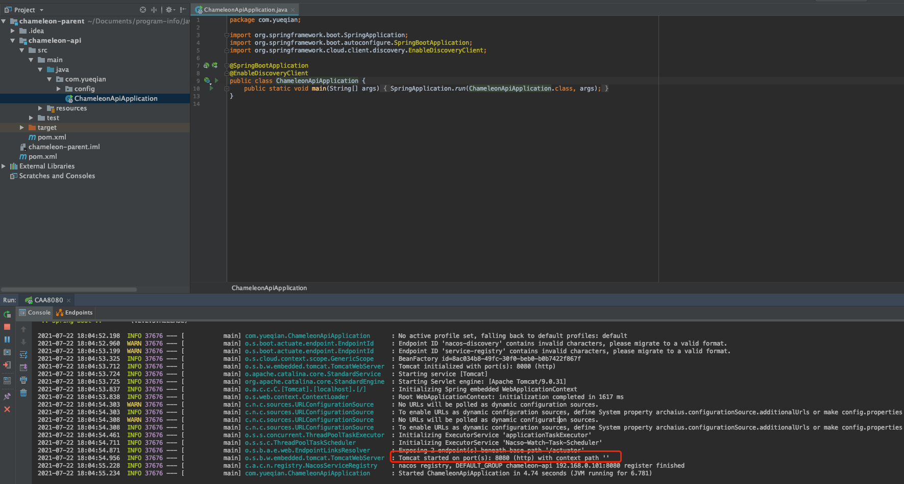
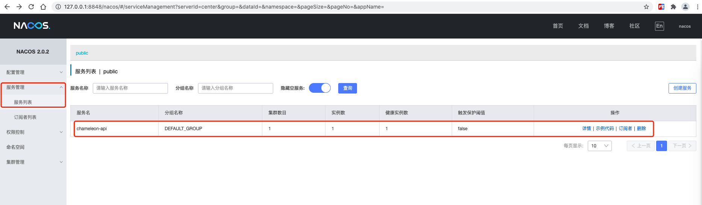

# 越阡系统搭建第一步

## 越阡系统：说明

越阡系统属于微服务应用，主要讲述工程搭建过程

开发工具：`idea 2018`

Java版本：`jdk8`

### 第一步

创建父工程`chameleon-parent`,删除src源码目录,pom文件增加`package`标签



最终父工程pom文件内容如下：此处目前加入springboot、Springcloud、springcloud alibaba等相关包信息，同时还包括了lombok。

```xml
<?xml version="1.0" encoding="UTF-8"?>
<project xmlns="http://maven.apache.org/POM/4.0.0"
         xmlns:xsi="http://www.w3.org/2001/XMLSchema-instance"
         xsi:schemaLocation="http://maven.apache.org/POM/4.0.0 http://maven.apache.org/xsd/maven-4.0.0.xsd">
    <modelVersion>4.0.0</modelVersion>

    <groupId>com.yueqian</groupId>
    <artifactId>chameleon-parent</artifactId>
    <version>1.0-SNAPSHOT</version>
    <packaging>pom</packaging>
    <!--基于SpringBoot2.2.5版本-->
    <parent>
        <groupId>org.springframework.boot</groupId>
        <artifactId>spring-boot-starter-parent</artifactId>
        <version>2.2.5.RELEASE</version>
        <relativePath/>
    </parent>
    <dependencyManagement>
        <!--SpringCloud-->
        <dependencies>
            <dependency>
                <groupId>org.springframework.cloud</groupId>
                <artifactId>spring-cloud-dependencies</artifactId>
                <version>Hoxton.SR3</version>
                <type>pom</type>
                <scope>import</scope>
            </dependency>
            <dependency>
                <groupId>com.alibaba.cloud</groupId>
                <artifactId>spring-cloud-alibaba-dependencies</artifactId>
                <version>2.2.1.RELEASE</version>
                <type>pom</type>
                <scope>import</scope>
            </dependency>
        </dependencies>
    </dependencyManagement>
    <build>
        <!--子工程谁需要谁集成-->
        <pluginManagement>
            <plugins>
                <plugin>
                    <groupId>org.springframework.boot</groupId>
                    <artifactId>spring-boot-maven-plugin</artifactId>
                </plugin>
            </plugins>
        </pluginManagement>
    </build>
</project>
```

### nacos服务端搭建

不过因为我们服务是基于springcloud alibaba来的，注册中心用的是`nacos`，所以在这之前我们先下载下nacos服务端，并运行启动

nacos下载地址：https://github.com/alibaba/nacos/releases/download/2.0.2/nacos-server-2.0.2.zip

nacos官网：https://nacos.io/zh-cn/



图中启动命令单词拼写有误，正确命令如下：

```bash
sh startup.sh -m standalone
```

nacos默认监听8848端口，参照上述将nacos运行完可以访问`http://127.0.0.1:8848/nacos`地址，用户和密码默认都是`nacos`



至此nacos服务端搭建完成 done.

### 最后创建chameleon-api子模块

创建对外访问工程模块`chameleon-api`



`chameleon-api`的pom文件内容如下：引入了nacos服务发现和参数验证相关包

```xml
<?xml version="1.0" encoding="UTF-8"?>
<project xmlns="http://maven.apache.org/POM/4.0.0"
         xmlns:xsi="http://www.w3.org/2001/XMLSchema-instance"
         xsi:schemaLocation="http://maven.apache.org/POM/4.0.0 http://maven.apache.org/xsd/maven-4.0.0.xsd">
    <parent>
        <artifactId>chameleon-parent</artifactId>
        <groupId>com.yueqian</groupId>
        <version>1.0-SNAPSHOT</version>
    </parent>
    <modelVersion>4.0.0</modelVersion>

    <artifactId>chameleon-api</artifactId>

    <dependencies>
        <!--nacos服务发现-->
        <dependency>
            <groupId>com.alibaba.cloud</groupId>
            <artifactId>spring-cloud-starter-alibaba-nacos-discovery</artifactId>
        </dependency>
        <!--validate验证相关-->
        <dependency>
            <groupId>org.springframework.boot</groupId>
            <artifactId>spring-boot-starter-validation</artifactId>
        </dependency>
    </dependencies>
    <build>
        <plugins>
            <plugin>
                <groupId>org.springframework.boot</groupId>
                <artifactId>spring-boot-maven-plugin</artifactId>
            </plugin>
        </plugins>
    </build>
</project>
```

其中启动类`ChameleonApiApplication`主要code如下：

```java
@SpringBootApplication
@EnableDiscoveryClient
public class ChameleonApiApplication {
    public static void main(String[] args) {
        SpringApplication.run(ChameleonApiApplication.class, args);
    }
}
```

观察`chameleon-parent`父pom文件新增了如下信息

```xml
<!-- 以上配置省略 -->
<version>1.0-SNAPSHOT</version>
<modules>
  <module>chameleon-api</module>
</modules>
<packaging>pom</packaging>
<!-- 以下配置省略 -->
```

至此父子模块工程构建完毕，后续只要在parent下添加相关子模块即可

我们来运行下`chameleon-api`模块，看运行结果



服务运行正常，我们看下nacos上信息



服务注册正常，没有问题。

整理下基础pom配置

```xml
<!-- actuator -->
<dependency>
  <groupId>org.springframework.boot</groupId>
  <artifactId>spring-boot-starter-actuator</artifactId>
</dependency>
<!-- web -->
<dependency>
  <groupId>org.springframework.boot</groupId>
  <artifactId>spring-boot-starter-web</artifactId>
</dependency>
<!--nacos服务发现-->
<dependency>
  <groupId>com.alibaba.cloud</groupId>
  <artifactId>spring-cloud-starter-alibaba-nacos-discovery</artifactId>
</dependency>
<!--配置管理-->
<dependency>
  <groupId>com.alibaba.cloud</groupId>
  <artifactId>spring-cloud-starter-alibaba-nacos-config</artifactId>
</dependency>
```

`bootstrap.yml`

```yaml
spring:
  cloud:
    nacos:
      config:
        server-addr: 127.0.0.1:8848 # nacos注册地址
        file-extension: yaml # 配置扩展
        group: DEFAULT_GROUP # 组名称
        shared-configs[0]: common.yaml # 共享配置文件信息
        namespace: 4dd30d5f-045b-49b1-bb60-411592bfd578 # 命名空间(不能放置dataId)
        prefix: chameleon-api # 模块名称
  profiles:
    active: sit # 使用环境
```


至此我们创建了一个父子工程，同时子模块服务启动的时候正常注册到nacos了，可以使用nacos相关功能

