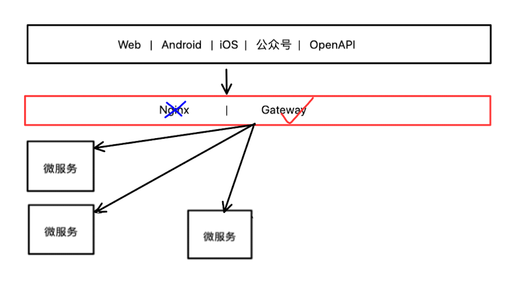
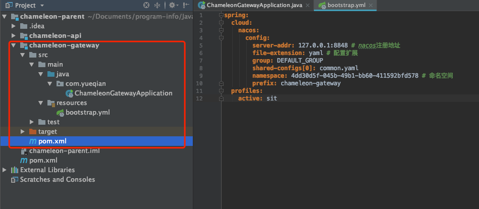
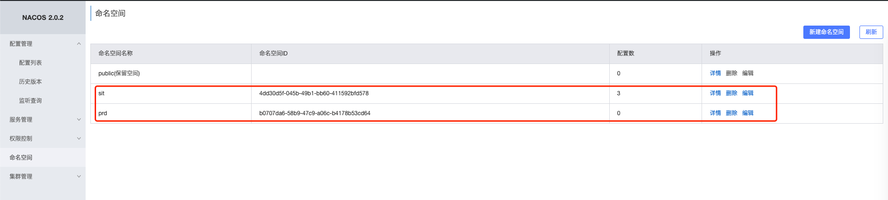
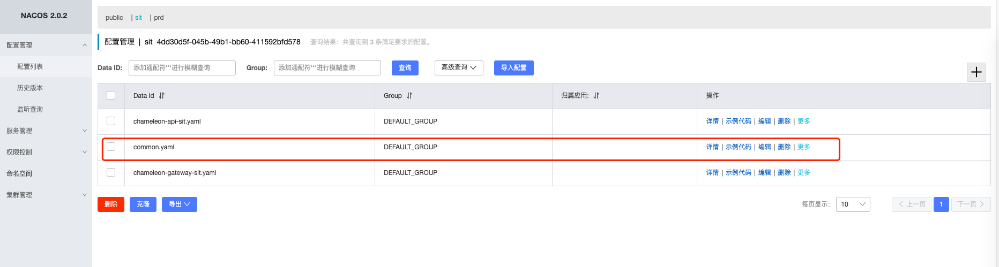
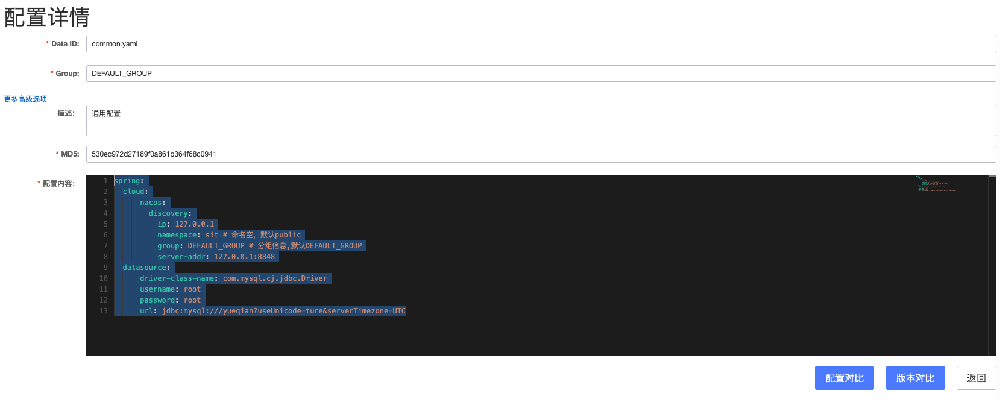
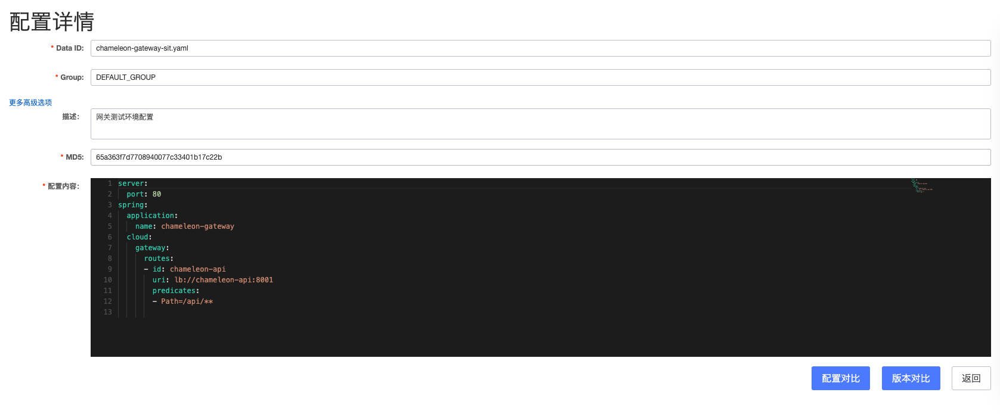
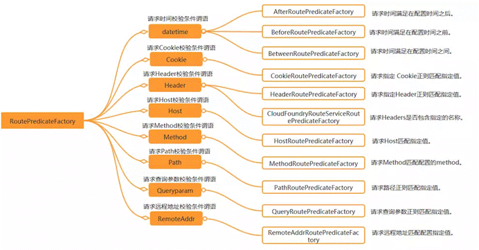
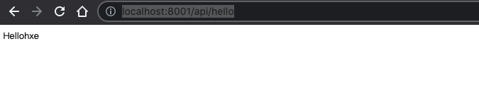
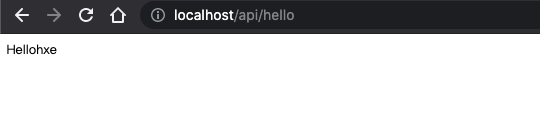

# 越阡系统第二步网关搭建

## 网关服务搭建



传统的nginx可以做请求接入，不过针对部分活动需要增加大量微服务，配置起来较为繁琐，使用专门的网关服务则可以提升效率

所有其他微服务的功能通过网关服务进行转发，网关服务使用Netty实现请求转发，同时可以在网关层做请求过滤，用户鉴权等操作

沿用上篇，直接新增模块`chameleon-gateway`，工程结构如下



其中pom如下

```xml
<?xml version="1.0" encoding="UTF-8"?>
<project xmlns="http://maven.apache.org/POM/4.0.0"
         xmlns:xsi="http://www.w3.org/2001/XMLSchema-instance"
         xsi:schemaLocation="http://maven.apache.org/POM/4.0.0 http://maven.apache.org/xsd/maven-4.0.0.xsd">
    <parent>
        <artifactId>chameleon-parent</artifactId>
        <groupId>com.yueqian</groupId>
        <version>1.0-SNAPSHOT</version>
    </parent>
    <modelVersion>4.0.0</modelVersion>

    <artifactId>chameleon-gateway</artifactId>

    <dependencies>
        <!-- actuator -->
        <dependency>
            <groupId>org.springframework.boot</groupId>
            <artifactId>spring-boot-starter-actuator</artifactId>
        </dependency>
        <!--nacos服务发现-->
        <dependency>
            <groupId>com.alibaba.cloud</groupId>
            <artifactId>spring-cloud-starter-alibaba-nacos-discovery</artifactId>
        </dependency>
        <!--配置管理-->
        <dependency>
            <groupId>com.alibaba.cloud</groupId>
            <artifactId>spring-cloud-starter-alibaba-nacos-config</artifactId>
        </dependency>
        <!--网关-->
        <dependency>
            <groupId>org.springframework.cloud</groupId>
            <artifactId>spring-cloud-starter-gateway</artifactId>
        </dependency>
    </dependencies>
    <build>
        <plugins>
            <plugin>
                <groupId>org.springframework.boot</groupId>
                <artifactId>spring-boot-maven-plugin</artifactId>
            </plugin>
        </plugins>
    </build>
</project>
```

`bootstrap.yml`中配置如下

```yaml
spring:
  cloud:
    nacos:
      config:
        server-addr: 127.0.0.1:8848 # nacos注册地址
        file-extension: yaml # 配置扩展
        group: DEFAULT_GROUP
        shared-configs[0]: common.yaml
        namespace: 4dd30d5f-045b-49b1-bb60-411592bfd578 # 命名空间
        prefix: chameleon-gateway
  profiles:
    active: sit
```

这里需要在nacos配置中做部分修改

1.新增命名空间



2.新增共享配置common.yaml,内容如下





```yaml
spring:
  cloud:
      nacos:
        discovery:
          ip: 127.0.0.1
          namespace: sit # 命名空，默认public
          group: DEFAULT_GROUP # 分组信息,默认DEFAULT_GROUP
          server-addr: 127.0.0.1:8848 # nacos服务中心地址
  datasource:
      driver-class-name: com.mysql.cj.jdbc.Driver
      username: root
      password: root
      url: jdbc:mysql://yueqian?useUnicode=ture&serverTimezone=UTC
```

再来看下`chameleon-gateway-sit.yaml`配置



```yaml
server:
  port: 80
spring:
  application:
    name: chameleon-gateway
  cloud:
    gateway:
      routes:
      - id: chameleon-api
        uri: lb://chameleon-api
        predicates: # 断定、断言
        - Path=/api/**
```



## 过滤器规则（Filter）

| 过滤规则            | 实例                           | 说明                                                         |
| :------------------ | :----------------------------- | :----------------------------------------------------------- |
| PrefixPath          | - PrefixPath=/app              | 在请求路径前加上app                                          |
| RewritePath         | - RewritePath=/test, /app/test | 访问localhost:9022/test,请求会转发到localhost:8001/app/test  |
| SetPath             | SetPath=/app/{path}            | 通过模板设置路径，转发的规则时会在路径前增加app，{path}表示原请求路径 |
| RedirectTo          |                                | 重定向                                                       |
| RemoveRequestHeader |                                | 去掉某个请求头信息                                           |

示例配置

```yaml
spring:
  cloud:
    gateway:
      routes:
      - id: prefixpath_route
        uri: https://example.org
        # 对所有的请求路径添加前缀
        # 访问/hello的请求被发送到https://example.org/mypath/hello
        filters:
        - PrefixPath=/mypath 
```

当网关服务添加完毕之后，我们启动`chameleon-api`和`chameleon-gateway`两个模块然后看下

在`chameleon-api`模块有个测试接口

http://localhost:8001/api/hello



我们通过访问网关服务接口看是否可以转发

http://localhost/api/hello



可以看到网关可以正常访问，至此网关搭建完毕.