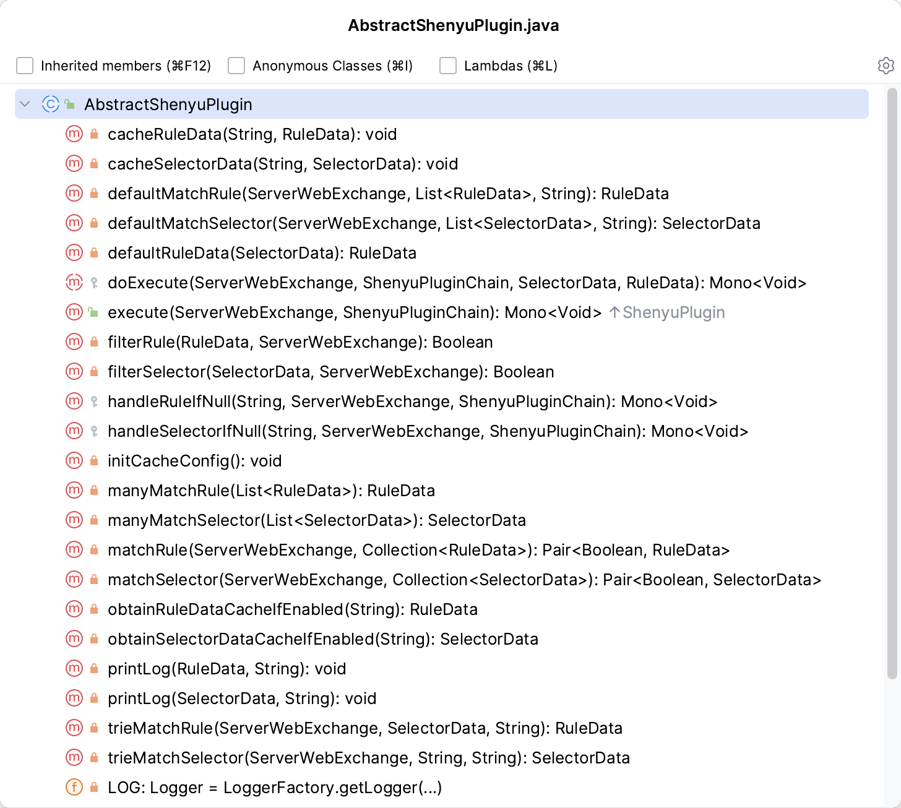

# Shenyu - Waf插件

​`基于ShenYu v2.6.0`​

> org.apache.shenyu.plugin.waf.WafPlugin

# 继承`AbstractShenyuPlugin`​接口



# Waf实现

```java
public class WafPlugin extends AbstractShenyuPlugin {

    private static final Logger LOG = LoggerFactory.getLogger(WafPlugin.class);
  
    @Override
    protected Mono<Void> doExecute(final ServerWebExchange exchange, final ShenyuPluginChain chain, final SelectorData selector, final RuleData rule) {
        // 获取waf配置;  ---> 注册中心监听 核心配置: mode: black or mixed (插件总开关）
		WafConfig wafConfig = Singleton.INST.get(WafConfig.class);
		// 如果selector和rule都没配置
		// 如果是黑名单模式，则直接放行；否则直接响应禁止访问错误。插件总开关打开了，并且模式是black模式，什么都没有配置，则表示全部放行请求.
        if (Objects.isNull(selector) && Objects.isNull(rule)) {
            if (WafModelEnum.BLACK.getName().equals(wafConfig.getModel())) {
                return chain.execute(exchange);
            }
			// 非黑名单模式，则全部拒绝
            exchange.getResponse().setStatusCode(HttpStatus.FORBIDDEN);
            Object error = ShenyuResultWrap.error(exchange, HttpStatus.FORBIDDEN.value(), Constants.REJECT_MSG, null);
            return WebFluxResultUtils.result(exchange, error);
        }
		// 根据rule匹配处理器
        WafHandle wafHandle = buildRuleHandle(rule);
		// 如果没有匹配到处理器，或则处理器没有选择处理方式(allow or reject) 则默认全部允许
        if (Objects.isNull(wafHandle) || StringUtils.isBlank(wafHandle.getPermission())) {
            LOG.error("waf handler can not configuration：{}", wafHandle);
            return chain.execute(exchange);
        }
		// 如果配置规则为reject，则拒绝该请求。
        if (WafEnum.REJECT.getName().equals(wafHandle.getPermission())) {
            exchange.getResponse().setStatusCode(HttpStatus.FORBIDDEN);
            Object error = ShenyuResultWrap.error(exchange, Integer.parseInt(wafHandle.getStatusCode()), Constants.REJECT_MSG, null);
            return WebFluxResultUtils.result(exchange, error);
        }
		// 非reject，则放行请求
        return chain.execute(exchange);
    }

    @Override
    protected Mono<Void> handleSelectorIfNull(final String pluginName, final ServerWebExchange exchange, final ShenyuPluginChain chain) {
        return doExecute(exchange, chain, null, null);
    }

    @Override
    protected Mono<Void> handleRuleIfNull(final String pluginName, final ServerWebExchange exchange, final ShenyuPluginChain chain) {
        return doExecute(exchange, chain, null, null);
    }

    @Override
    public String named() {
        return PluginEnum.WAF.getName();
    }

    @Override
    public int getOrder() {
        return PluginEnum.WAF.getCode();
    }
  
    private WafHandle buildRuleHandle(final RuleData rule) {
        return WafPluginDataHandler.CACHED_HANDLE.get().obtainHandle(CacheKeyUtils.INST.getKey(rule));
    }
}
```
