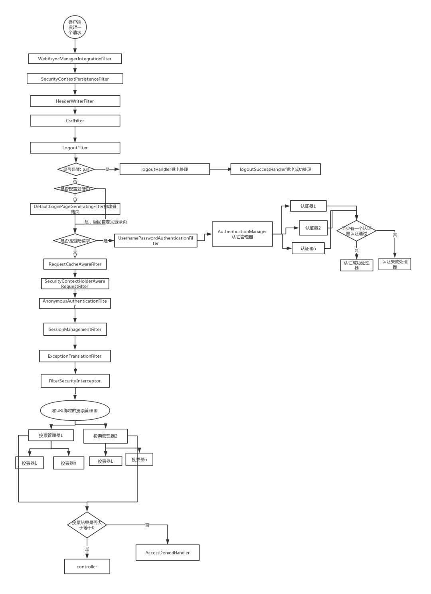

# #SpringSecurity分析

# maven信息

```xml
<dependency>
    <groupId>org.springframework.boot</groupId>
    <artifactId>spring-boot-starter-security</artifactId>
</dependency>
```

# Spring自动装配

org\springframework\boot\spring-boot-autoconfigure\2.5.7\spring-boot-autoconfigure-2.5.7.jar!\META-INF\spring.factories#**org.springframework.boot.autoconfigure.security.servlet.SecurityAutoConfiguration**

```java
@Configuration(proxyBeanMethods = false)
// 默认授权事件发布器
@ConditionalOnClass(DefaultAuthenticationEventPublisher.class)
// 读取授权属性配置 --> application.yml中spring.security开头的配置项（用户名、密码等配置。。）
@EnableConfigurationProperties(SecurityProperties.class)
// 核心信息
@Import({ 
        SpringBootWebSecurityConfiguration.class,
        WebSecurityEnablerConfiguration.class, // 确保@EnableWebSecurity注解被正确添加
        SecurityDataConfiguration.class  // 和spring data框架集成
})
public class SecurityAutoConfiguration {

    @Bean
    @ConditionalOnMissingBean(AuthenticationEventPublisher.class)
    public DefaultAuthenticationEventPublisher authenticationEventPublisher(ApplicationEventPublisher publisher) {
        return new DefaultAuthenticationEventPublisher(publisher);
    }
}
```

## 自动装配核心配置

**SpringBootWebSecurityConfiguration.class**

```java
@Configuration(proxyBeanMethods = false)
@ConditionalOnDefaultWebSecurity
@ConditionalOnWebApplication(type = Type.SERVLET)
class SpringBootWebSecurityConfiguration {

    @Bean
    @Order(SecurityProperties.BASIC_AUTH_ORDER) // 优先级，可自定义替代此处配置
    SecurityFilterChain defaultSecurityFilterChain(HttpSecurity http) throws Exception {
        http.authorizeRequests() 
            .anyRequest()
            .authenticated() // 都需要授权才能访问
            .and().formLogin() // 表单登录
            .and().httpBasic(); // 基础表单，网页中弹出框提示用户输入用户名和密码那种形式
        return http.build();
    }
}
```

## 自定义SecurityConfig

Spring Security自带的配置和样式不符合我们的业务需求，但是这个框架很强大，支持很强的配置功能。下面来看看如何配置比较接近实际业务场景的功能

```java
@EnableGlobalMethodSecurity(prePostEnabled = true)
@Configuration
public class SecurityConfig extends WebSecurityConfigurerAdapter {

    @Autowired
    private MyAccessDeniedHandler myAccessDeniedHandler;

    @Bean
    public UserDetailsService userDetailsService() {
        return new UserDetailsServiceImpl();
    }

    /**
     * 1. 自定义认证机制(这里userdetailservice需要显示传入)
     * 2. 如果不自定义认证机制，只需要实现userdetailservice接口即可
     **/
    @Override
    protected void configure(AuthenticationManagerBuilder auth) {
        CustomAuthenticationProvider customAuthenticationProvider = new CustomAuthenticationProvider();
        customAuthenticationProvider.setUserDetailsService(userDetailsService());
        auth.authenticationProvider(customAuthenticationProvider);
    }

    @Override
    protected void configure(HttpSecurity http) throws Exception {
        http.formLogin() // 表单提交
                .usernameParameter("username123") // 表单提交用户名字段名
                .passwordParameter("password123") // 表单提交密码字段名
                .loginPage("/login.html")  // 登录页地址
                .loginProcessingUrl("/login") // 登录操作api
                .successHandler(new MyAuthenticationSuccessHandler("/main.html")) // 登录成功后操作
                .failureHandler(new MyAuthenticationFailureHandler("/error.html")) // 登录失败后操作
                .and().authorizeRequests() // 授权所有请求及子方法
                .antMatchers("/api2/**").permitAll() // /api2/开头请求放行
                .antMatchers("/login.html").permitAll() // 放行
                .antMatchers("/error.html").permitAll() // 放行
                .antMatchers("/authority.html").hasAuthority("permission1") // 只有拥有permission1的权限才能访问authority.html页面
                .anyRequest().authenticated()
                .and().logout().deleteCookies("JSESSIONID").logoutSuccessUrl("/login.html").invalidateHttpSession(true).permitAll() // 请求/logout地址退出，退出删除cookie，退出成功后跳转login.html页面
                .and().exceptionHandling().accessDeniedHandler(myAccessDeniedHandler) // 访问异常默认转向自定义访问拒绝处理器
                .and().csrf().disable();

    }

    /**
     * 放行静态资源,css,js,images
     */
    @Override
    public void configure(WebSecurity web) throws Exception {
        web.ignoring().antMatchers("/css/**", "/js/**")
                .antMatchers("/**/*.png");
    }
}
```

通过上述配置，我们可以设置表单域中的username和password字段，不必使用默认的。同时支持设置登录地址、登录api 预计登录成功或失败后端回调处理。针对没有权限的也可支持自定义处理，针对静态资源可以直接放行，可以过滤csrf等安全风险。

```html
<!DOCTYPE html>
<html lang="en">
<head>
    <meta charset="UTF-8">
    <title>登陆</title>
</head>
<body>
<form method="post" action="/login">
    用户名：<input type="text" name="username123"><br />
    密码：<input type="password" name="password123"><br />
    <button type="submit">立即登陆</button>
</form>
</body>
</html>
```

上述的name就和配置中的参数对应起来了，不用强依赖username和password字段。

## 自定义认证机制

如果不想实现默认UserDetailsService的loadUserByUsername方法，Spring Security提供我们自定义认证器的能力，只需要我们实现CustomAuthenticationProvider接口的authenticate方法即可，之后在此认证器中做具体的逻辑操作。

```java
@Slf4j
@Component
public class CustomAuthenticationProvider implements AuthenticationProvider {
    private UserDetailsService userDetailsService;

    public void setUserDetailsService(UserDetailsService userDetailsService) {
        this.userDetailsService = userDetailsService;
    }

    @Override
    public Authentication authenticate(Authentication authentication) throws AuthenticationException {
        // 判断是否能认证成功
        Object principal = authentication.getPrincipal();
        if (principal == null) {
            throw new UsernameNotFoundException("Username must be not null");
        }
        Object credentials = authentication.getCredentials();
        if (credentials == null) {
            throw new UsernameNotFoundException("Credentials must be not null");
        }
        UserDetails userDetails = userDetailsService.loadUserByUsername(String.valueOf(principal));
        if (userDetails == null) {
            throw new UsernameNotFoundException("User not found");
        }
        // 返回principal,credentials及authorities
        return new UsernamePasswordAuthenticationToken(userDetails.getUsername(), userDetails.getPassword(), userDetails.getAuthorities());
    }

    @Override
    public boolean supports(Class<?> authentication) {
        return UsernamePasswordAuthenticationToken.class.isAssignableFrom(authentication);
    }
}
```

## 认证流程分析

### 请求流程图

​​​​

通过上图可以看出，Spring Security就是利用一系列的过滤器来实现认证与授权的。

### 大致分析

从几个必要的接口及类进行分析

#### Authentication --> JavaBean

认证实体信息，认证过程中的数据存储。

比如用户名密码登录，则该实体中保存用户名，密码等信息，认证成功后用户对应的权限也会存入。接口具体的方法有

```java
// 获取当前认证实体拥有的权限
Collection<? extends GrantedAuthority> getAuthorities();
// 获取当前凭证 例如：密码
Object getCredentials();
// 获取详细信息，例如：用户一些额外信息，自定义AbstractAuthenticationProcessingFilter的时候设置
Object getDetails();
// 获取主体，例如：当前用户
Object getPrincipal();
// 是否认证成功
boolean isAuthenticated();
// 设置是否认证成功
void setAuthenticated(boolean isAuthenticated) throws IllegalArgumentException;
```

这个主要就是些信息存储，在认证过程中进行信息流转，支持后续在业务中获取认证信息。

#### AbstractAuthenticationProcessingFilter

```java
public abstract class AbstractAuthenticationProcessingFilter extends GenericFilterBean implements ApplicationEventPublisherAware, MessageSourceAware
```

抽象类AbstractAuthenticationProcessingFilter，此类集成了GenericFilterBean，实现了ApplicationEventPublisherAware, MessageSourceAware两个接口。两个接口就是Spring容器中的Aware感知注入不做具体分析。GenericFilterBean相当于定义了一个Filter的功能，同时把java servlet等纳入Spring容器管理。

看下AbstractAuthenticationProcessingFilter核心方法doFilter(略作精简)

```java
private void doFilter(HttpServletRequest request, HttpServletResponse response, FilterChain chain)
                throws IOException, ServletException {
    // 根据请求判断此次请求是否要走本次验证。比如根据请求路径匹配(POST /login)
    // RequestMatcher > requiresAuthenticationRequestMatcher
    if (!requiresAuthentication(request, response)) { 
        chain.doFilter(request, response);
        return;
    }
    try {
        Authentication authenticationResult = attemptAuthentication(request, response);
        if (authenticationResult == null) {
            return;
        }
        // 认证成功：回调SessionAuthenticationStrategy接口的onAuthentication方法
        this.sessionStrategy.onAuthentication(authenticationResult, request, response); 
        // 是否在认证成功调用前继续其他过滤器执行
        if (this.continueChainBeforeSuccessfulAuthentication) { 
            chain.doFilter(request, response);
        }
        // 认证成功:回调AuthenticationSuccessHandler接口的onAuthenticationSuccess方法
        // 同时将认证信息放入上下文中:SecurityContextHolder.getContext().setAuthentication(authResult);
        successfulAuthentication(request, response, chain, authenticationResult); 
    }
    catch (InternalAuthenticationServiceException failed) {
        // 认证失败：回调AuthenticationFailureHandler接口的onAuthenticationFailure方法(支持自定义认证失败)
        unsuccessfulAuthentication(request, response, failed); 
    }
    catch (AuthenticationException ex) {
        // 认证失败：回调AuthenticationFailureHandler接口的onAuthenticationFailure方法(支持自定义认证失败)
        unsuccessfulAuthentication(request, response, ex);
    }
}
```

通过代码我们可以看出，先通过RequestMatcher对request中的请求地址进行匹配，判断是否需要走本过滤器器。接口调用子类的attemptAuthentication方法对请求信息进行包装，包装为Spring Security中需要的认证实体对象Authentication，如果认证成功则将认证实体信息放入请求上下文并发布认证成功事件；如果认证失败，则发布认证失败事件。

这里注意的是，子类实现的时候需要在attemptAuthentication方法中调用`this.getAuthenticationManager().authenticate(authRequest)`​进行请求认证。当然也可以自定义认证传入。

#### AuthenticationManager

认证管理，具体的认证接口，对应上图流程中的认证器。就两个方法，一个具体认证，一个判断是否采用当前认证器。

```java
// 具体认证实现
Authentication authenticate(Authentication authentication) throws AuthenticationException;
// 此次请求是否需要本认证器进行认证
boolean supports(Class<?> authentication);
```

我们看下核心认证器：`ProviderManager`​核心实现

```java
public Authentication authenticate(Authentication authentication) throws AuthenticationException {
    Class<? extends Authentication> toTest = authentication.getClass();
    // 迭代所有认证器
    for (AuthenticationProvider provider : getProviders()) { 
        // 判断此次是否要进行provider的认证
        if (!provider.supports(toTest)) { 
            continue;
        }
        try {
            result = provider.authenticate(authentication);
            if (result != null) {
                // 将authentication中的details复制到result中
                copyDetails(authentication, result); 
                break;
            }
        }
        catch (AccountStatusException | InternalAuthenticationServiceException ex) { 
            // 认证失败: 发布认证失败事件
            prepareException(ex, authentication); 
            throw ex;
        }
        // provider实现authenticate接口要抛出的异常父类，所以说provider只能throw此处的三个异常及其子类
        catch (AuthenticationException ex) { 
            lastException = ex;
        }
    }
    // 如果结果返回还是空，可能没有对应认证器，parent是个兜底认证; parent和getProviders()只会有一个是空
    if (result == null && this.parent != null) { 
        try {
            parentResult = this.parent.authenticate(authentication);
            result = parentResult;
        }
        catch (ProviderNotFoundException ex) { }
        catch (AuthenticationException ex) {
            parentException = ex;
            lastException = ex;
        }
    }
    if (result != null) {
        if (this.eraseCredentialsAfterAuthentication && (result instanceof CredentialsContainer)) {
            ((CredentialsContainer) result).eraseCredentials();
        }
        if (parentResult == null) {
            // 认证成功: 发布认证成功事件
            this.eventPublisher.publishAuthenticationSuccess(result); 
        }
        return result;
    }
    // 认证失败: 发布认证失败事件
    if (parentException == null) {
        prepareException(lastException, authentication); 
    }
    throw lastException;
}
```

至此，认证的核心类差不多就这样了。通过分析，比如一些复杂的需求我们可以自行定制。比如短信验证。

# 短信验证码自定义认证实现

## Authentication自定义实现

**SmsCodeAuthenticationToken：** 包含授权上下文信息，可以获取当前认证

```java
public class SmsCodeAuthenticationToken extends AbstractAuthenticationToken {
    private static final long serialVersionUID = SpringSecurityCoreVersion.SERIAL_VERSION_UID;

    private final Object principal;

    private Object credentials;

    public SmsCodeAuthenticationToken(Object principal, Object credentials) {
        super(null);
        this.principal = principal;
        this.credentials = credentials;
        setAuthenticated(false);
    }
    public SmsCodeAuthenticationToken(Object principal, Object credentials, Collection<? extends GrantedAuthority> authorities) {
        super(authorities);
        this.principal = principal;
        this.credentials = credentials;
        super.setAuthenticated(true); // must use super, as we override
    }

    @Override
    public Object getCredentials() {
        return this.credentials;
    }

    @Override
    public Object getPrincipal() {
        return this.principal;
    }

    @Override
    public void setAuthenticated(boolean isAuthenticated) throws IllegalArgumentException {
        Assert.isTrue(!isAuthenticated,
                "Cannot set this token to trusted - use constructor which takes a GrantedAuthority list instead");
        super.setAuthenticated(false);
    }

    @Override
    public void eraseCredentials() {
        super.eraseCredentials();
        this.credentials = null;
    }
}
```

## Abstract***ProcessingFilter自定义实现

**SmsCodeAuthenticationFilter：**自定义Filter，继承AbstractAuthenticationProcessingFilter，实现attemptAuthentication方法。规定`POST /mobile/token`​请求执行本过滤器，请求域中获取mobile和smsCode，包装成SmsCodeAuthenticationToken实体信息。

```java
public class SmsCodeAuthenticationFilter extends AbstractAuthenticationProcessingFilter {

    private boolean postOnly = true;

    // 手机号参数变量
    private String mobileParameter = "mobile";
    private String smsCode         = "smsCode";

    SmsCodeAuthenticationFilter() {
        super(new AntPathRequestMatcher("/mobile/token", "POST"));
    }

    /**
     * 添加未认证用户认证信息，然后在provider里面进行正式认证
     */
    public Authentication attemptAuthentication(HttpServletRequest httpServletRequest, HttpServletResponse httpServletResponse)
            throws AuthenticationException {
        if (postOnly && !httpServletRequest.getMethod().equals("POST")) {
            throw new AuthenticationServiceException("Authentication method not supported: " + httpServletRequest.getMethod());
        }

        String mobile = obtainMobile(httpServletRequest);
        String smsCode = obtainSmsCode(httpServletRequest);
        //todo:验证短信验证码2
        if (mobile == null) {
            mobile = "";
        }

        mobile = mobile.trim();

        SmsCodeAuthenticationToken authRequest = new SmsCodeAuthenticationToken(mobile, smsCode);
        // Allow subclasses to set the "details" property
        setDetails(httpServletRequest, authRequest);
        return this.getAuthenticationManager().authenticate(authRequest);
    }

    /**
     * 获取手机号
     */
    private String obtainMobile(HttpServletRequest request) {
        return request.getParameter(mobileParameter);
    }

    private String obtainSmsCode(HttpServletRequest request) {
        return request.getParameter(smsCode);
    }

    private void setDetails(HttpServletRequest request, SmsCodeAuthenticationToken authRequest) {
        authRequest.setDetails(authenticationDetailsSource.buildDetails(request));
    }

    public void setMobileParameter(String usernameParameter) {
        Assert.hasText(usernameParameter, "Username parameter must not be empty or null");
        this.mobileParameter = usernameParameter;
    }

    public void setPostOnly(boolean postOnly) {
        this.postOnly = postOnly;
    }

    public final String getMobileParameter() {
        return mobileParameter;
    }
}
```

所以当请求url为：/mobile/token 并且请求方法为POST，则进入该过滤器。`this.getAuthenticationManager()`​获取的是接口`AuthenticationManager`​的实现类ProviderManager，然后调用其authenticate方法；

```java
public Authentication authenticate(Authentication authentication) throws AuthenticationException {
        // 省略...
        for (AuthenticationProvider provider : getProviders()) {
            if (!provider.supports(toTest)) {
                continue;
            }
            if (logger.isTraceEnabled()) {
                logger.trace(LogMessage.format("Authenticating request with %s (%d/%d)",
                        provider.getClass().getSimpleName(), ++currentPosition, size));
            }
            try {
                result = provider.authenticate(authentication);
                if (result != null) {
                    copyDetails(authentication, result);
                    break;
                }
            }
    // 省略...
}
```

通过之前分析`ProviderManager`​我们知道，最终会调用接口AuthenticationProvider的实现类进行认证，所以我们接着自定义认证器。

## AuthenticationProvider自定义实现

**SmsCodeAuthenticationProvider：**主要针对传入的手机号和二维码进行校验认证。 发送短信的时候可以写入缓存，这里可以通过手机号获取对应的缓存进行校验判断。

```java
public class SmsCodeAuthenticationProvider implements AuthenticationProvider {
    private UserDetailsService userDetailsService;

    public void setUserDetailsService(UserDetailsService userDetailsService) {
        this.userDetailsService = userDetailsService;
    }

    @Override
    public Authentication authenticate(Authentication authentication) throws AuthenticationException {

        String mobile = String.valueOf(authentication.getPrincipal());
        String smsCode = String.valueOf(authentication.getCredentials());

        if (!"123456".equals(smsCode)) {
            throw new InternalAuthenticationServiceException("手机验证码不正确");
        }

        UserDetails userDetails = userDetailsService.loadUserByUsername(mobile);
        if (userDetails == null) {
            throw new InternalAuthenticationServiceException("User not found");
        }
        return new SmsCodeAuthenticationToken(userDetails.getUsername(), userDetails.getPassword(), userDetails.getAuthorities());
    }

    @Override
    public boolean supports(Class<?> authentication) {
        return SmsCodeAuthenticationToken.class.isAssignableFrom(authentication);
    }
}
```

## XXXConfigurer自定义配置

**SmsCodeConfigurer：**通过继承SecurityConfigurerAdapter<DefaultSecurityFilterChain, HttpSecurity>将自定义的过滤器加入Spring Security的过滤器链中。

```java
@Configuration
public class SmsCodeConfigurer extends SecurityConfigurerAdapter<DefaultSecurityFilterChain, HttpSecurity> {

    @Autowired
    private UserDetailsService userDetailsService;

    @Override
    public void configure(HttpSecurity http) {
        SmsCodeAuthenticationFilter smsCodeAuthenticationFilter = new SmsCodeAuthenticationFilter();
        smsCodeAuthenticationFilter.setAuthenticationManager(http.getSharedObject(AuthenticationManager.class));

        SmsCodeAuthenticationProvider smsCodeDaoAuthenticationProvider = new SmsCodeAuthenticationProvider();
        smsCodeDaoAuthenticationProvider.setUserDetailsService(userDetailsService);
        http.authenticationProvider(smsCodeDaoAuthenticationProvider)
                .addFilterAfter(smsCodeAuthenticationFilter, UsernamePasswordAuthenticationFilter.class);
    }
}
```

## 自定义配置生效

自定义配置已经完成了，但是要自定义过滤器真正生效，还需要在自定义配置中增加相应配置信息

**.apply(smsCodeConfigurer)**

```java
@EnableGlobalMethodSecurity(prePostEnabled = true)
@Configuration
public class SecurityConfig extends WebSecurityConfigurerAdapter {

    @Autowired
    private MyAccessDeniedHandler myAccessDeniedHandler;

    @Autowired
    private SmsCodeConfigurer smsCodeConfigurer;

    @Bean
    public UserDetailsService userDetailsService() {
        return new UserDetailsServiceImpl();
    }

    @Override
    protected void configure(AuthenticationManagerBuilder auth) {
        CustomAuthenticationProvider customAuthenticationProvider = new CustomAuthenticationProvider();
        customAuthenticationProvider.setUserDetailsService(userDetailsService());
        auth.authenticationProvider(customAuthenticationProvider);
    }


    @Override
    protected void configure(HttpSecurity http) throws Exception {
        //表单提交
        http.formLogin()
                .usernameParameter("username123")
                .passwordParameter("password123")
                .loginPage("/login.html")
                .loginProcessingUrl("/login")
                .successHandler(new MyAuthenticationSuccessHandler("/main.html"))
                .failureHandler(new MyAuthenticationFailureHandler("/error.html"))
                .and().apply(smsCodeConfigurer)
                .and().authorizeRequests()
                .antMatchers("/api2/**", "/mobile/token").permitAll()
                .antMatchers("/login.html").permitAll()
                .antMatchers("/error.html").permitAll()
                .antMatchers("/authority.html").hasAuthority("permission1")
                .anyRequest().authenticated()
                .and().logout().deleteCookies("JSESSIONID").logoutSuccessUrl("/login.html").invalidateHttpSession(true).permitAll()
                .and().exceptionHandling().accessDeniedHandler(myAccessDeniedHandler)
                .and().csrf().disable();
    }
}
```

这样，通过上述自定义过滤器的研究，可以理解其他功能实现基本类似。比如formLogin的配置是FormLoginConfigurer，logout的配置是LogoutConfigurer。。。
