# #在线诊断工具 - Arthas

# 相关QA

> 后续相关操作基于阿里提供[arthas-demo.jar](https://arthas.aliyun.com/arthas-demo.jar)展开

## Q: 如何使用Arthas?

## A: 主流平台使用

### Windows平台

> curl -O https://arthas.aliyun.com/arthas-boot.jar java -jar arthas-boot.jar

### Linux/Unix/Mac平台

> curl -L https://arthas.aliyun.com/install.sh | sh

当启动arthas之后，会侦测当前机器相关jvm进程，如下图：

​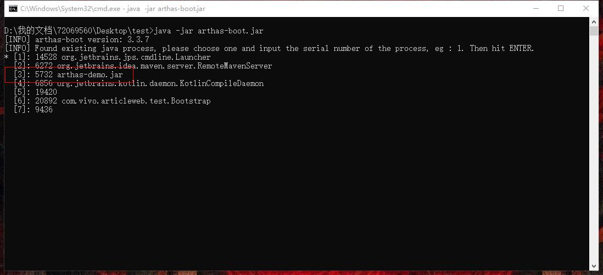​

## Q: 如何知道当前调试程序运行Main类?

## A: 通过`thread`​​​命令查看

​`thread`​​列出所有线程,`thread+线程id`​​查看指定pid线程对应堆栈, 通常`thread 1`​​表示main函数对应的线程 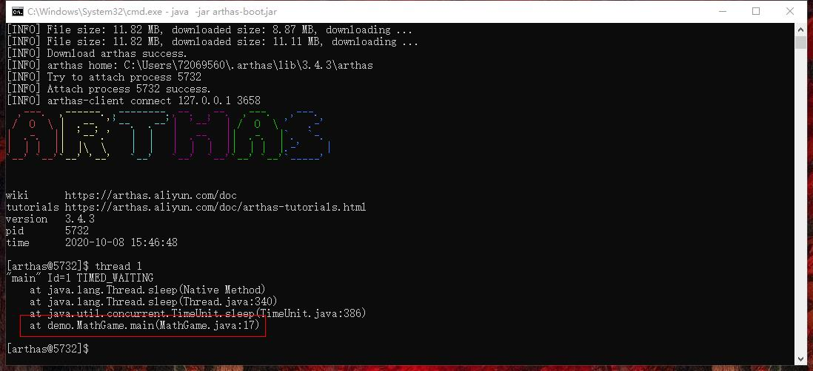 

如上图可知：

> Main类：demo.MathGame

## Q: 如何反编译已知类?

## A: 通过`jad`​​​命令查看,`jad+全限定名`​​​反编译指定类源码

​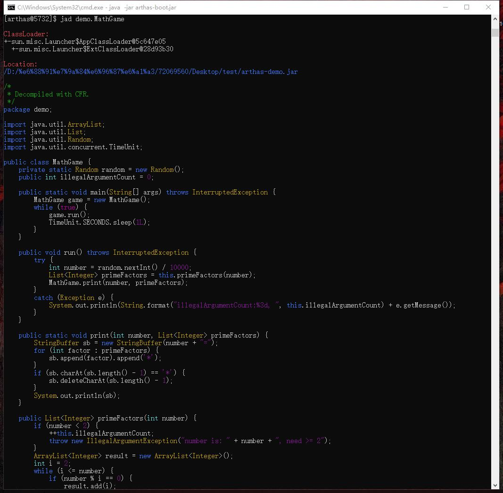 

如上图可以查看源码，同时可知加载的ClassLoader：

```
ClassLoader:                                                                                                                 
+-sun.misc.Launcher$AppClassLoader@5c647e05                                                                                  
  +-sun.misc.Launcher$ExtClassLoader@28d93b30  
```

## Q: 如何查看`primeFactors`​​​方法入参，出参等信息?

## A: 通过`watch`​​​命令查看

> watch命令可以观测值包括：入参、返回值、抛出异常 格式： watch [类名表达式] [方法名表达式] [观察表达式] [条件表达式]

类名表达式：demo.MathGame 方法表达式：primeFactors 观察表达式：合法的ognl表达式，例如：{params,returnObj},具体参看下图 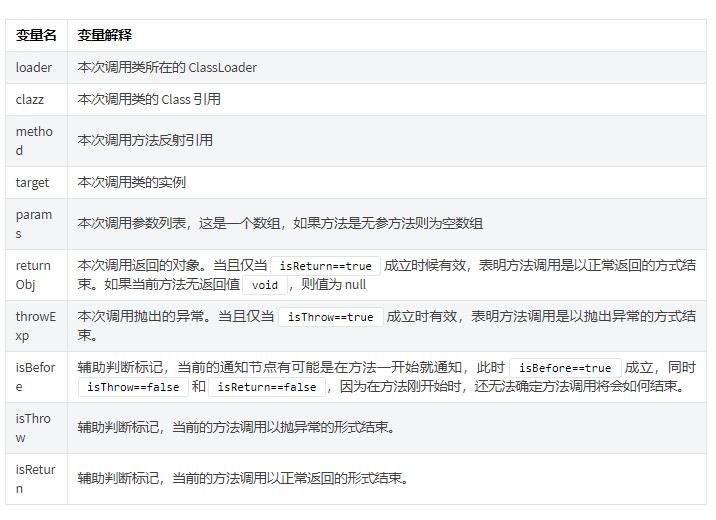​

|特殊|作用|
| :-----| ---------------------------------------------------|
|-b|在方法调用之前观察|
|-e|在方法异常之后观察|
|-s|在方法返回之后观察 （默认关闭)|
|-f|在方法结束之后(正常返回和异常返回)观察 (默认打开)|
|-E|开启正则表达式匹配，默认为通配符匹配|
|-x n|指定输出结果的属性遍历深度，默认为 n=1|

条件表达式:

示例：

### 输出入参和返回值

> watch demo.MathGame primeFactors "{params,returnObj}" -x 2 -n 2

​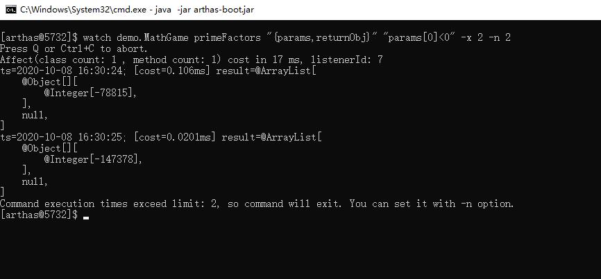​

### 输出过滤异常信息

> watch demo.MathGame primeFactors "{params,returnObj,throwExp}" -e -x 2 -n 2

​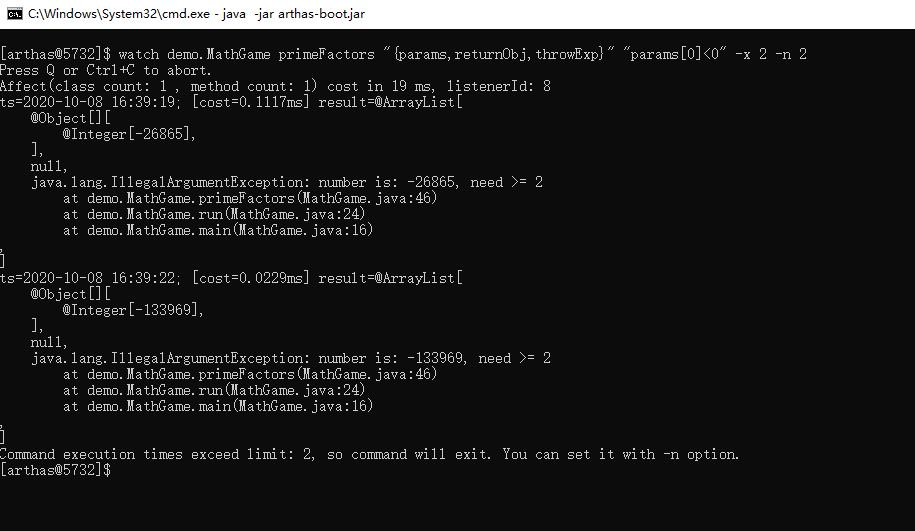​

### 按照耗时进行过滤

> watch demo.MathGame primeFactors '{params, returnObj}' '#cost>200' -x 2 -n 2

**tips：使用watch的时候，如果接口调用比较频繁，一定要加上-n指定输出次数**

## Q: 如何查看方法执行耗时信息?

## A: 通过`trace`​​​命令查看

示例：

### 输出MathGame类下所有方法耗时信息

> trace demo.MathGame run

​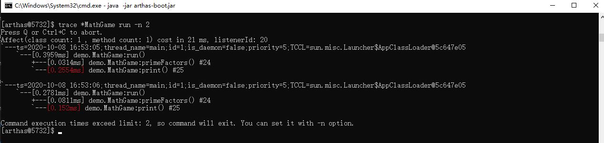​

### 据调用耗时过滤

> trace demo.MathGame run "#cost > 10"

## Q: 如何查看方法调用路径?

## A: 通过`stack`​​​命令查看

> stack demo.MathGame primeFactors

​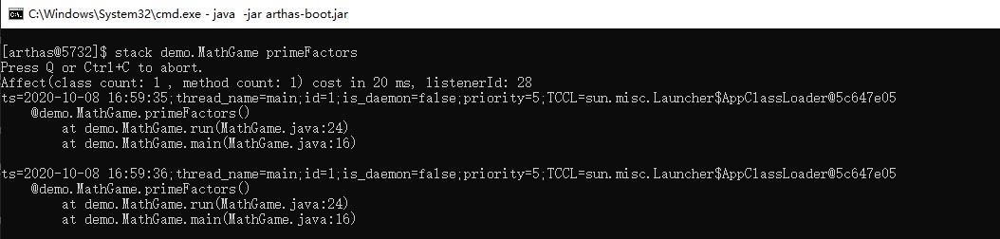​

# 概念实现

JPDA: Java平台调试器架构 JVMTI：Java虚拟机工具接口 JDWP：Java调试线协议 JDI：Java调试器接口

​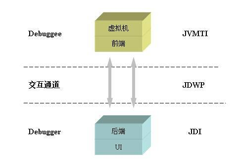​

# 字节码增强技术

## a. 运行示意图

​​

## b. 源码-字节码示例图

> 一堆16进制数字

​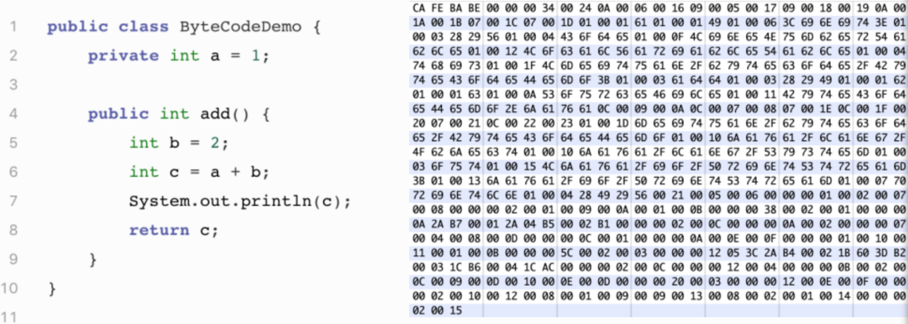​

## c. JVM中字节码文件规范图

​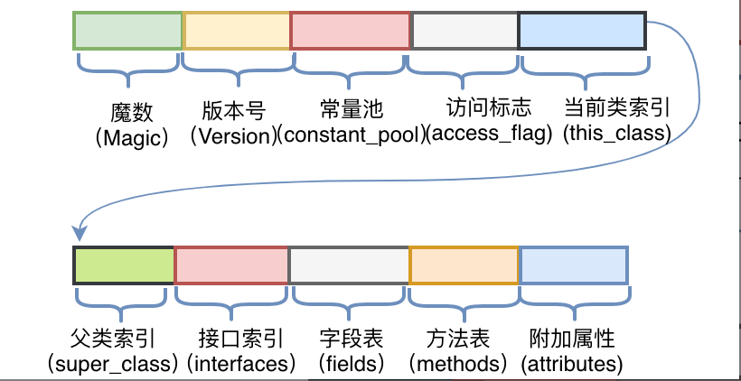​

## d. 字节码增强技术

​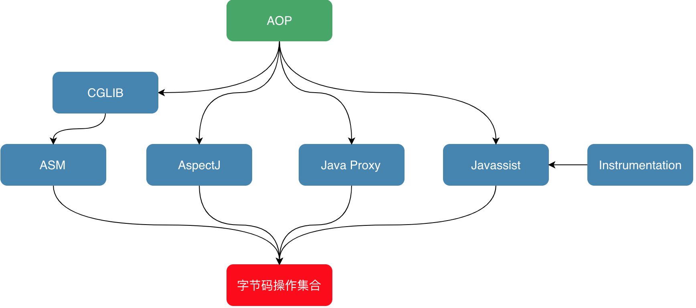​

## e. Instrument

> <u>Instrument</u>是JVM提供的一个可以修改已加载类的类库，专门为Java语言编写的插桩服务提供支持。 jdk1.6之后，通过实现ClassFileTransformer接口，可支持在运行时对类定义的修改。

‍
