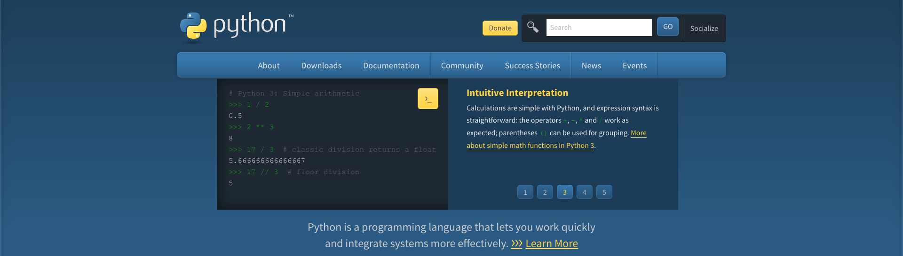

# 无限Python

# 三方库地址

> [https://pypi.org/](https://pypi.org/)

# Mirror

> etc.
>
> 阿里云 http://mirrors.aliyun.com/pypi/simple/  
> 清华大学 https://pypi.tuna.tsinghua.edu.cn/simple/

临时修改如下命令

```bash
 python -m pip install scrapy -i https://pypi.tuna.tsinghua.edu.cn/simple
```

永久修改

```bash
# 清华源
python -m pip config set global.index-url https://pypi.tuna.tsinghua.edu.cn/simple

# 阿里源
python -m pip config set global.index-url https://mirrors.aliyun.com/pypi/simple/
```
