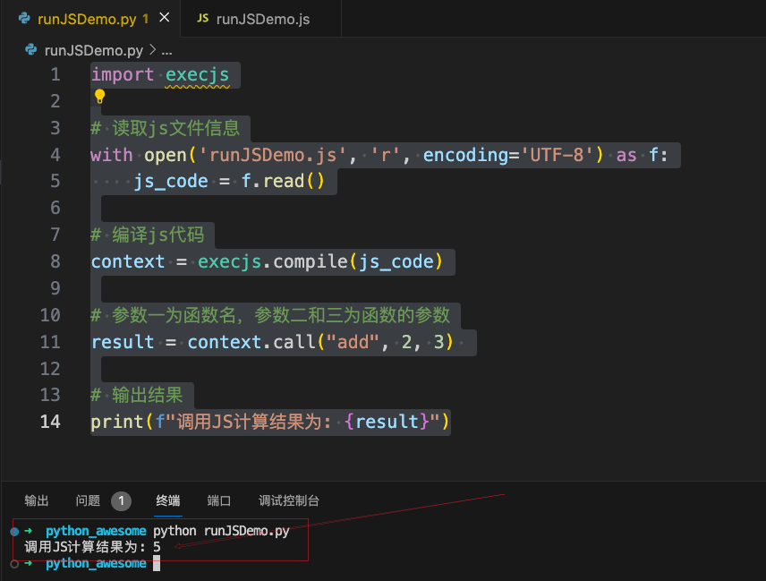

# #如何执行JS代码

# 引言

	在某些爬取浏览器数据的场景下, 需要通过Python执行JS的代码. 那么自然就需要研究Python如何执行JS代码了. 直接将浏览器JS相关代码COPY下来, 通过Python执行返回所需的结果.

# PyExecJS2库

> Python 3.11.1

我们引入`PyExecJS2`​库来实现JS代码的调用. 通过如下命令进行安装(如果安装慢, 可修改pip为国内源后在尝试安装)

```bash
pip install PyExecJS2
# python -m pip install PyExecJS2===1.6.1
# python -m pip install PyExecJS2===1.6.1 -i https://pypi.tuna.tsinghua.edu.cn/simple
```

# 基本使用

### 准备JS文件

​`runJSDemo.js`​

```js
function add(a,b){
    return a+b;
}
```

## Python调用编写

​`runJSDemo.py`​

```python
import execjs

# 读取js文件信息
with open('runJSDemo.js', 'r', encoding='UTF-8') as f:
    js_code = f.read()

# 编译js代码
context = execjs.compile(js_code)

# 参数一为函数名，参数二和三为函数的参数
result = context.call("add", 2, 3) 

# 输出结果
print(f"调用JS计算结果为: {result}")
```

## 执行结果

​​

# 总结

	通过使用`PyExecJS2`​库我们能很方便的进行JS代码的调用.

‍
