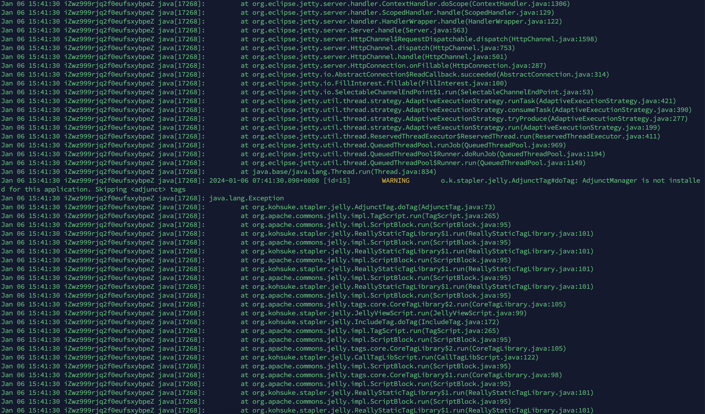

# Linux系统注册Jenkins服务

# 新增服务文件

> ​`/etc/systemd/system/jenkins.service`​

​`示例 jenkins.service`​

```ini
[Unit]
Description=Jenkins Service
After=network.target

[Service]
ExecStart=/opt/ly/jdk-11.0.20/bin/java -jar -Xms512m -Xmx1g -Xmn1g /opt/ly/jenkins.war --httpPort=8080
Restart=always
User=root
Group=root

[Install]
WantedBy=default.target
```

* ​`[Unit]`​ 部分定义了 Systemd 单元的基本信息：

  * ​`Description`​​: 描述了服务的简要信息，这里是 "Jenkins Service"。
  * ​`After`​​: 指定服务应在哪个系统目标（target）之后启动，这里是 `network.target`​​，表示在网络服务启动后启动 Jenkins。

    1. ​**`After=network.target`**​: 在网络服务启动之后启动，确保网络已经准备就绪。
    2. ​**`After=syslog.target`**​: 在系统日志服务启动之后启动，确保日志服务可用。
    3. ​**`After=multi-user.target`**​: 在多用户模式启动之后启动，表示系统已经完成了基本的启动并且可以接受用户登录。
    4. ​**`After=graphical.target`**​: 在图形用户界面（GUI）启动之后启动，适用于带有图形桌面环境的系统。
    5. ​**`After=sshd.service`**​: 在SSH服务启动之后启动，确保SSH服务可用。
* ​`[Service]`​ 部分定义了服务的执行和管理参数：

  * ​`ExecStart`​: 指定服务启动时要执行的命令。
  * ​`Restart`​​: 指定服务在退出时是否应该重启。这里设置为 `always`​​，表示始终重启。

    1. ​**`Restart=no`**​: 默认值。表示服务不会被自动重启。
    2. ​**`Restart=always`**​: 表示服务会始终在退出时被自动重启。这对于确保服务一直运行非常有用。
    3. ​**`Restart=on-failure`**​: 表示服务只有在非正常退出（即返回非零的退出状态）时才会被自动重启。
    4. ​**`Restart=unless-stopped`**​: 表示服务除非被手动停止，否则会一直被重启。
    5. ​**`Restart=on-abort`**​: 表示服务在发生致命错误时会被自动重启。
  * ​`User`​​ 和 `Group`​​: 指定运行服务的用户和用户组。请将其替换为实际的用户名和用户组。
* ​`[Install]`​ 部分定义了如何安装这个服务：

  * ​`WantedBy`​​: 指定服务应该在哪个系统目标之下被启用。这里是 `default.target`​​，表示在默认目标下启用服务。

    * ​**`WantedBy=default.target`**​: 表示服务应该在系统默认目标启动时被启用。默认目标通常是一个多用户系统目标，表示系统已经完成了基本的启动过程。
    * ​**`WantedBy=multi-user.target`**​: 表示服务应该在多用户模式启动时被启用。
    * ​**`WantedBy=graphical.target`**​: 表示服务应该在图形用户界面（GUI）启动时被启用。

# 重新加载Systemd配置

```bash
sudo systemctl daemon-reload
```

# 启用 Jenkins 服务，使其随系统启动而启动

```bash
sudo systemctl enable jenkins
```

# 启动 Jenkins 服务

```bash
sudo systemctl start jenkins
```

# 查看服务状态

‍

```bash
sudo systemctl status jenkins
```

# 查看日志

```bash
# 查看 Jenkins 服务的日志
sudo journalctl -u jenkins.service

# 查看 Jenkins 服务的实时日志
sudo journalctl -fu jenkins.service
```

# 移除服务

```bash
# 停止服务
sudo systemctl stop service_name
# 禁用服务(开机不启动)
sudo systemctl disable service_name
# 卸载
sudo systemctl daemon-reload
# 删除服务文件 `/etc/systemd/system/jenkins.service`
sudo rm -f /etc/systemd/system/jenkins.service
```

‍

# Jenkins启动错误

​​

参考：https://blog.51cto.com/u_7794482/5426688

‍
