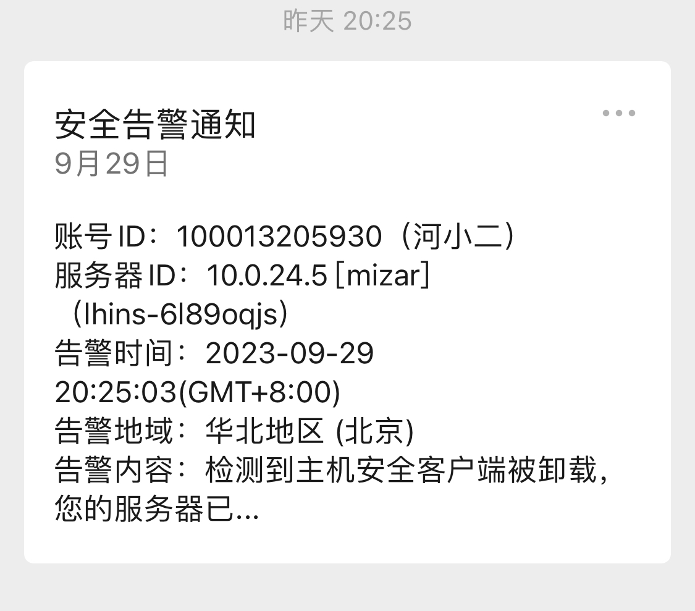
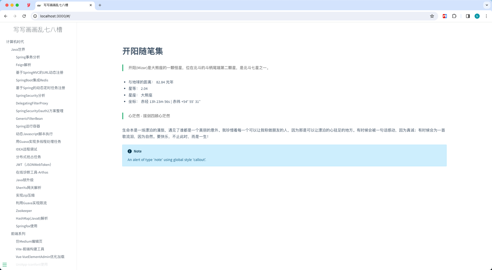

# 记一次知识库丢失经历

> **内容输出**才是知识库的最终真谛.

# 起因

我相信每个人都有建设自己知识库的想法, 我自然也不例外. 同样随着年龄的增长, 总是忘记这忘记那儿的. 这些年经历的知识库工具使用了很多, 比如workpress, csdn, 博客园, docsify(Github托管).但是最终都是用着用着就不怎么用了. 而我这些年又执着于寻找输出内容的工具, 而不是内容本身. 其实是本末倒置了. 跑题了, 先不说这些.  最后我使用了Confluence来构建wiki知识库. 当然是破解版的(这里留下个炸弹, 后续再说)+腾讯云轻量服务器部署的. 总的来说, Confluence使用起来确实不错. 

> 我相信每个人都有建设自己知识库的想法, 我自然也不例外. 随着年龄的增长, 总是忘记这忘记那儿

# 异常

国庆节前夕, 大家沉浸在即将放假的喜悦之中时. 我自然也不例外. 但是最近接触Cloudflare托管, 世界级的服务. 因为以前都是通过ssh链接服务器,然后通过本地端口转发, 访问自己部署的Confluence的, 所以就有些不是很方便. 正好自己名下有个域名, 于是就起了通过Cloudflare管理的念头. 

刚开始, 域名是在阿里云买的, 所以直接在阿里云设置域名解析也是可以用的. 但是就是脑海中升起用Cloudflare托管的念头, 然后就付诸实行了(悔之晚矣). 在阿里云上改了域名的DNS服务器为Cloudflare, 说是24小时左右, 但是我的变更很快就生效了. 然后通过域名访问转发, 因为国内一些备案要求, 没来得及备案. 所以先用域名转发IP实现的. 然后就愉快的下班了~~

结果第二天晚上, 就收到腾讯云的告警通知, 不过当时也没注意. 问题还是在之后几个小时想去访问知识库的时候, 发现打不开了.才去腾讯云机器观察.

 

其实这时候我心里凉了一截, 已经有一些猜测了. 

# 救援

1. 不停的重启下载备份数据. 但是总是几分钟就断了. 初步观察应该是启动后拉起脚本自动下载病毒程序了.
2. 向腾讯云提交工单, 腾讯工程师那边给出的回复是备份数据, 重装系统.

tips: 主要也是对Linux并没有那么熟悉. 如果第一次重启之后登陆后, 直接禁用所有对外的网络. 

# 终局

备份下来的数据和文件信息因为软件需要再次破解无法导入使用. 所有知识全部消失在无垠的虚空中....

# 回首

1. 尽量使用正版软件
2. 加强网络安全意识(坏人可不会和你讲情面, 何况在网络上都见不到你, 黑掉你的资产满足自己的需求你能咋办, 能咋办, 能咋办.)
3. 伟大的毛主席告诉我们:**​ 而今迈步从头越  ​**因此没什么大不了的, 丢失了数据, 从头在来罢了~~~

‍
# 在起波澜

思源总的来说比较不错，但是在细节方面做的不够好。所以升起替换的想法。想起了之前用docsify搭建的笔记观感挺好，于是折腾了一波。换成了它。




附一份docsify配置
```html
<!DOCTYPE html>
<html lang="en">

<head>
  <meta charset="UTF-8">
  <title>写写画画乱七八槽</title>
  <meta http-equiv="X-UA-Compatible" content="IE=edge,chrome=1" />
  <meta name="description" content="Description">
  <meta name="viewport" content="width=device-width, initial-scale=1.0, minimum-scale=1.0">
  <link rel="icon" type="image/svg+xml" href="/_media/logo.png" />
  <link rel="stylesheet" href="//cdn.jsdelivr.net/npm/docsify@4/lib/themes/vue.css">
  <!-- Themes (light + dark) -->
  <!-- <link rel="stylesheet" href="//cdn.jsdelivr.net/npm/docsify-themeable@0/dist/css/theme-simple.css"> -->
  <!-- 目录跳转 -->
  <link rel="stylesheet" href="https://unpkg.com/docsify-toc@1.0.0/dist/toc.css">
</head>

<body>
  <div id="app" style="text-align: center; margin-top: 200px; font-size: 36px; font-weight: 100;">精彩内容马上就来...</div>
  <script>
    // 参考：https://docsify.js.org/#/zh-cn/configuration
    // 参考：https://leohsiao.com/Web/CMS/docsify.html
    window.$docsify = {
      name: "写写画画乱七八槽",
      // name: '<font style="font-family:"楷体","楷体_GB2312";">Mizar 随笔集</font>',
      // 在侧边栏中出现的网站图标，你可以使用CSS来更改大小
      // logo: '/_media/logo.png',
      // routerMode: 'history',
      // 仓库地址
      // repo: 'https://github.com/TimeOfPassage/timeofpassage.github.io/',
      // 加载 _navbar.md
      // loadNavbar: false,
      // 加载 nav.md
      // loadNavbar: 'nav.md',
      // 通过设置 coverpage 参数，可以开启渲染封面的功能
      coverpage: false,
      // coverpage: 'coverpage.md',
      // 加载自定义侧边栏
      // hideSidebar: true,
      loadSidebar: true,
      loadSidebar: 'sidebar.md',
      // subMaxLevel: 3,
      // 切换页面后是否自动跳转到页面顶部。
      auto2top: true,
      // 复制插件配置, //cdn.jsdelivr.net/npm/docsify-copy-code/dist/docsify-copy-code.min.js
      copyCode: {
        buttonText: '复制',
        errorText: '复制失败',
        successText: '已复制',
      },
      // tabs 插件配置, https://cdn.jsdelivr.net/npm/docsify-tabs@1
      // tabs: {
      //   persist: true,      // default
      //   sync: true,      // default
      //   theme: 'classic', // default
      //   tabComments: true,      // default
      //   tabHeadings: true       // default
      // },
      // 提示框
      'flexible-alerts': {
        style: 'flat'
      },
      // 目录跳转
      toc: {
        scope: '.markdown-section',
        headings: 'h1, h2, h3, h4, h5, h6',
        title: '概览',
      },
      // 搜索插件
      // search: {
      //   placeholder: '输入内容进行搜索',
      // }
      // 回到顶部
      // scrollToTop: {
      //   auto: true,
      //   text: '⬆️',
      //   right: 15,
      //   bottom: 15,
      //   offset: 500
      // }
    }
  </script>
  <!-- docsify -->
  <script src="//cdn.jsdelivr.net/npm/docsify/lib/docsify.min.js"></script>
  <!-- 表情 -->
  <script src="//cdn.jsdelivr.net/npm/docsify/lib/plugins/emoji.min.js"></script>
  <!-- 图片放大 -->
  <script src="//cdn.jsdelivr.net/npm/docsify/lib/plugins/zoom-image.min.js"></script>
  <!-- 支持代码复制 -->
  <script src="//cdn.jsdelivr.net/npm/docsify-copy-code/dist/docsify-copy-code.min.js"></script>
  <!-- docsify-tabs (latest v1.x.x) -->
  <!-- <script src="//cdn.jsdelivr.net/npm/docsify-tabs@1"></script> -->
  <!-- Latest -->
  <script src="https://unpkg.com/docsify-plugin-flexible-alerts"></script>
  <!-- 目录跳转 -->
  <script src="https://unpkg.com/docsify-toc@1.0.0/dist/toc.js"></script>
  <!-- 全文搜索插件 -->
  <!-- <script src="//cdn.jsdelivr.net/npm/docsify/lib/plugins/search.min.js"></script> -->
  <!-- 回到顶部 -->
  <!-- <script src="//unpkg.com/docsify-scroll-to-top/dist/docsify-scroll-to-top.min.js"></script> -->
  <!-- 面板分割 -->
  <script src="https://cdn.jsdelivr.net/npm/docsify-example-panels"></script>
  <!-- 主题 -->
  <script src="https://cdn.jsdelivr.net/npm/docsify-themeable@0/dist/js/docsify-themeable.min.js"></script>
  <!-- 语法高亮 -->
  <script src="//cdn.jsdelivr.net/npm/prismjs@1/components/prism-python.min.js"></script>
  <script src="//cdn.jsdelivr.net/npm/prismjs@1/components/prism-java.min.js"></script>
  <script src="//cdn.jsdelivr.net/npm/prismjs@1/components/prism-dart.min.js"></script>
  <script src="//cdn.jsdelivr.net/npm/prismjs@1/components/prism-bash.min.js"></script>
  <script src="//cdn.jsdelivr.net/npm/prismjs@1/components/prism-sql.min.js"></script>
  <script src="//cdn.jsdelivr.net/npm/prismjs@1/components/prism-go.min.js"></script>
  <script src="//cdn.jsdelivr.net/npm/prismjs@1/components/prism-css.min.js"></script>
  <script src="//cdn.jsdelivr.net/npm/prismjs@1/components/prism-xml.min.js"></script>

  <style>
    /* sidebar-toggle */
    .sidebar-toggle {
      width: 20px;
      height: 38px;
      position: relative;
      top: calc(100vh/2);
      left: 300px;
      transition: transform .25s ease-out;
      background-image: url("data:image/svg+xml;base64,PHN2ZyB3aWR0aD0iMTgiIGhlaWdodD0iMTgiIGZpbGw9Im5vbmUiIHhtbG5zPSJodHRwOi8vd3d3LnczLm9yZy8yMDAwL3N2ZyI+PHBhdGggZD0iTTcuOTg3IDEzLjIyOEwzLjc2IDlsNC40NTctNC40NTguNjI3LS42M0EuNzUuNzUgMCAxMDcuNzggMi44NThsLS40OTguNUwyLjE3IDguNDdhLjc1Ljc1IDAgMDAwIDEuMDZsNC44NTQgNC44NTUuNzU5Ljc2YS43NS43NSAwIDAwMS4wNjItMS4wNTdsLS44NTctLjg2eiIgZmlsbD0iIzY0NkE3MyIvPjxwYXRoIGQ9Ik0xNC42NjggMTMuMjI4TDEwLjQ0IDlsNC40NTctNC40NTguNjI3LS42M2EuNzUuNzUgMCAxMC0xLjA2NC0xLjA1NmwtLjQ5OC41TDguODUgOC40N2EuNzUuNzUgMCAwMDAgMS4wNmw0Ljg1NCA0Ljg1NS43NTguNzZhLjc1Ljc1IDAgMDAxLjA2Mi0xLjA1N2wtLjg1Ni0uODZ6IiBmaWxsPSIjNjQ2QTczIi8+PC9zdmc+");
      background-repeat: no-repeat;
      background-position: center;
    }

    .sidebar-toggle:hover {
      background-image: url("data:image/svg+xml;base64,PHN2ZyB3aWR0aD0iMTgiIGhlaWdodD0iMTgiIGZpbGw9Im5vbmUiIHhtbG5zPSJodHRwOi8vd3d3LnczLm9yZy8yMDAwL3N2ZyI+PHBhdGggZD0iTTcuOTg3IDEzLjIyOEwzLjc2IDlsNC40NTctNC40NTguNjI3LS42M0EuNzUuNzUgMCAxMDcuNzggMi44NTdsLS40OTguNUwyLjE3IDguNDdhLjc1Ljc1IDAgMDAwIDEuMDZsNC44NTQgNC44NTUuNzU5Ljc2YS43NS43NSAwIDAwMS4wNjItMS4wNTdsLS44NTctLjg2eiIgZmlsbD0iIzMzNzBGRiIvPjxwYXRoIGQ9Ik0xNC42NjggMTMuMjI4TDEwLjQ0IDlsNC40NTctNC40NTguNjI3LS42M2EuNzUuNzUgMCAxMC0xLjA2NC0xLjA1NmwtLjQ5OC41TDguODUgOC40N2EuNzUuNzUgMCAwMDAgMS4wNmw0Ljg1NCA0Ljg1NS43NTguNzZhLjc1Ljc1IDAgMDAxLjA2Mi0xLjA1N2wtLjg1Ni0uODZ6IiBmaWxsPSIjMzM3MEZGIi8+PC9zdmc+");
      background-repeat: no-repeat;
      background-position: center;
    }

    .sidebar-toggle span {
      display: none;
    }

    body.close .sidebar-toggle {
      transform: translateX(-300px);
    }

    body.close .sidebar-toggle span {
      display: block;
    }

    body.close .sidebar-toggle {
      background-image: none;
    }

    /* nav */
    .nav {
      width: 0px;
    }

    .nav .page_toc {
      display: none;
    }

    body.close .nav {
      width: var(--toc-width, 200px);
    }

    body.close .nav .page_toc {
      display: block;
    }
  </style>
</body>

</html>
```


生命不息, 折腾不止!
‍
