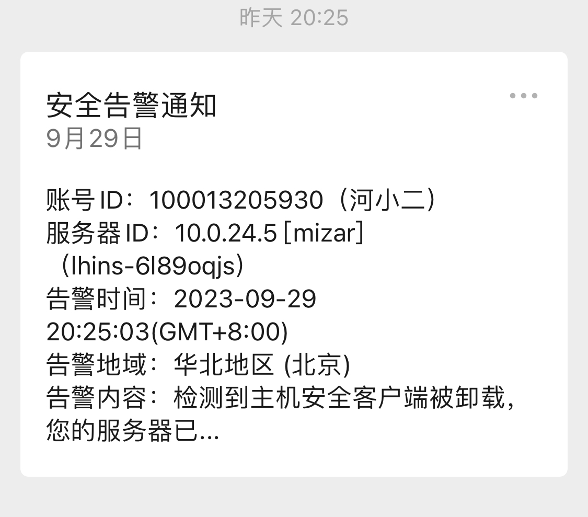
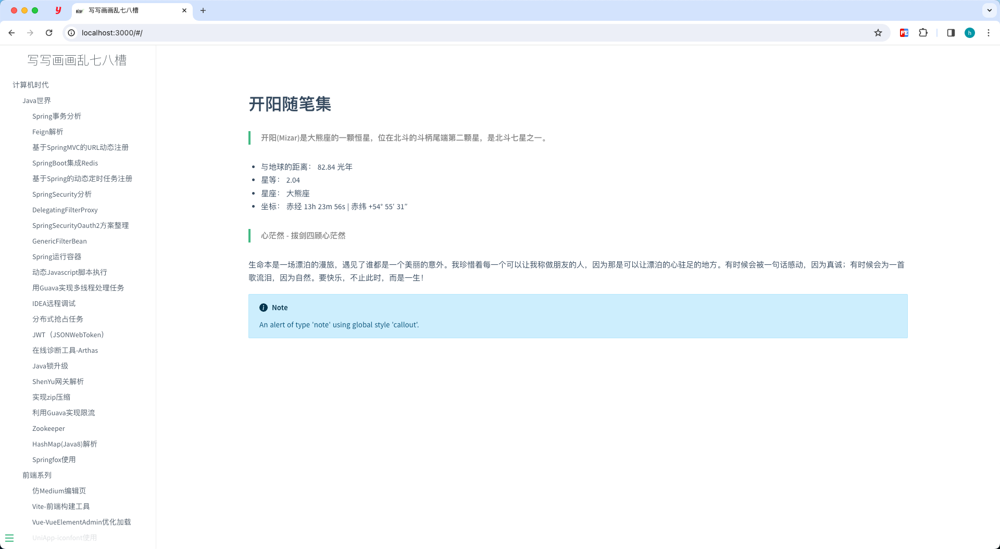

# 记一次知识库丢失经历

> **内容输出**才是知识库的最终真谛.

# 起因

我相信每个人都有建设自己知识库的想法, 我自然也不例外. 同样随着年龄的增长, 总是忘记这忘记那儿的. 这些年经历的知识库工具使用了很多, 比如workpress, csdn, 博客园, docsify(Github托管).但是最终都是用着用着就不怎么用了. 而我这些年又执着于寻找输出内容的工具, 而不是内容本身. 其实是本末倒置了. 跑题了, 先不说这些.  最后我使用了Confluence来构建wiki知识库. 当然是破解版的(这里留下个炸弹, 后续再说)+腾讯云轻量服务器部署的. 总的来说, Confluence使用起来确实不错. 

> 我相信每个人都有建设自己知识库的想法, 我自然也不例外. 随着年龄的增长, 总是忘记这忘记那儿

# 异常

国庆节前夕, 大家沉浸在即将放假的喜悦之中时. 我自然也不例外. 但是最近接触Cloudflare托管, 世界级的服务. 因为以前都是通过ssh链接服务器,然后通过本地端口转发, 访问自己部署的Confluence的, 所以就有些不是很方便. 正好自己名下有个域名, 于是就起了通过Cloudflare管理的念头. 

刚开始, 域名是在阿里云买的, 所以直接在阿里云设置域名解析也是可以用的. 但是就是脑海中升起用Cloudflare托管的念头, 然后就付诸实行了(悔之晚矣). 在阿里云上改了域名的DNS服务器为Cloudflare, 说是24小时左右, 但是我的变更很快就生效了. 然后通过域名访问转发, 因为国内一些备案要求, 没来得及备案. 所以先用域名转发IP实现的. 然后就愉快的下班了~~

结果第二天晚上, 就收到腾讯云的告警通知, 不过当时也没注意. 问题还是在之后几个小时想去访问知识库的时候, 发现打不开了.才去腾讯云机器观察.

 

其实这时候我心里凉了一截, 已经有一些猜测了. 

# 救援

1. 不停的重启下载备份数据. 但是总是几分钟就断了. 初步观察应该是启动后拉起脚本自动下载病毒程序了.
2. 向腾讯云提交工单, 腾讯工程师那边给出的回复是备份数据, 重装系统.

tips: 主要也是对Linux并没有那么熟悉. 如果第一次重启之后登陆后, 直接禁用所有对外的网络. 

# 终局

备份下来的数据和文件信息因为软件需要再次破解无法导入使用. 所有知识全部消失在无垠的虚空中....

# 回首

1. 尽量使用正版软件
2. 加强网络安全意识(坏人可不会和你讲情面, 何况在网络上都见不到你, 黑掉你的资产满足自己的需求你能咋办, 能咋办, 能咋办.)
3. 伟大的毛主席告诉我们:**​ 而今迈步从头越  ​**因此没什么大不了的, 丢失了数据, 从头在来罢了~~~

‍
# 在起波澜

思源总的来说比较不错，但是在细节方面做的不够好。所以升起替换的想法。想起了之前用docsify搭建的笔记观感挺好，于是折腾了一波。换成了它。

<u>​ ​</u>​<u>生命不息, 折腾不止</u><u>!</u>

‍
