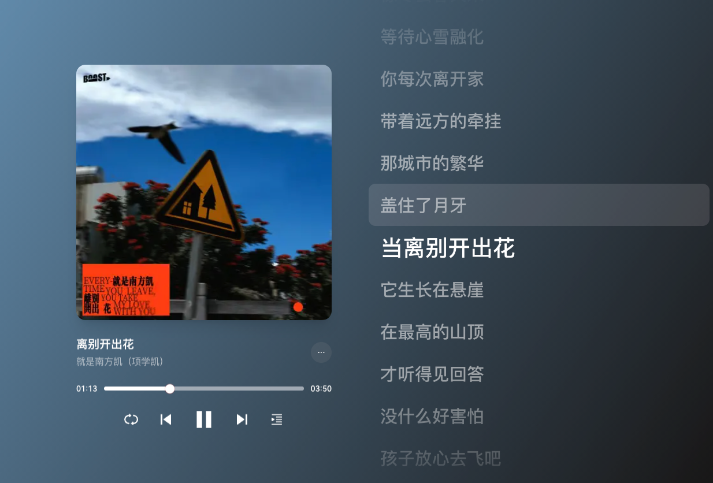

# 离别开出花

<audio controls="controls" src="/生活漫谈/音乐/assets/离别开出花.mp3"></audio>

作词 : 李浩瑞
作曲 : 李浩瑞
制作人 : 刘涛/李浩瑞
编曲 : 谭侃侃
吉他/贝斯 : 谭侃侃
混音工程师 : 袁中仁
母带后期混音师 : 袁中仁
和声 : 李浩瑞/谭侃侃/顾雄/袁中仁/夹_zZ
和声编写 : 李浩瑞/顾雄
配唱制作人 : 刘涛/李浩瑞
录音师 : 袁中仁
人声编辑 : 刘涛
视觉设计 : kidult.
监制 : 许雯静Vivian Xu@索尼音乐/刘嘉雄Charles Liu@索尼音乐
策划总监 : 左三好
营销推广 : 祝鑫
混音室 : 好乐无荒混音棚（长沙）
录音棚 : 好乐无荒录音棚（长沙）
制作公司 : 好乐无荒
OP/SP : 好乐无荒
项目统筹 : 宋旭辉Shawn Song@索尼音乐/李若嫣Ruoyan Li@索尼音乐
统筹 : 赵楚峰Chufeng Zhao@索尼音乐
总监制 : 陈国威Andrew Chan@索尼音乐
联合企划 : 大声密谋

坐上那朵离家的云霞
飘去无人知晓的天涯
背着妈妈说的那句话
孩子人生其实不复杂

喔～眼泪轻轻地擦
别管那多嘴乌鸦
咽下那些风沙
你才能慢慢长大
要错过几个她
用你最好的年华
这是青春的代价

当离别开出花
伸出新长的枝桠
像冬去春又来
等待心雪融化

你每次离开家
带着远方的牵挂
那城市的繁华
盖住了月牙

当离别开出花
它生长在悬崖
在最高的山顶
才听得见回答

没什么好害怕
孩子放心去飞吧
在你的身后
有个等你的家

坐上那朵离家的云霞
飘去无人知晓的天涯
背着妈妈说的那句话
孩子人生其实不复杂

喔～眼泪轻轻地擦
别忘那童年梦话
散在远方的花
也随风慢慢长大
要错过几个她
用你最真的年华
这是青春的回答

当离别开出花
伸出新长的枝桠
像冬去春又来
等待心雪融化

你每次离开家
带着远方的牵挂
那城市的繁华
盖住了月牙

当离别开出花
它生长在悬崖
在最高的山顶
才听得见回答

没什么好害怕
孩子放心去飞吧
在你的身后
有个等你的家

当离别开出花
伸出新长的枝桠
像冬去春又来
等待心雪融化

你每次离开家
带着远方的牵挂
那城市的繁华
盖住了月牙

当离别开出花
它生长在悬崖
在最高的山顶
才听得见回答

没什么好害怕
孩子放心去飞吧
在你的身后
有个等你的家

