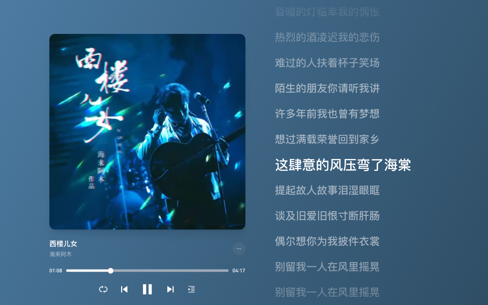

# 西楼儿女

<audio controls="controls" src="/生活漫谈/音乐/assets/西楼儿女.mp3"></audio>

作词：海来阿木
作曲：海来阿木

你看天色又在远处落下
寂寞的城道别天边晚霞
迷茫的人走在路上想家
生活的碎让泪横过脸颊
谁在西楼唱着儿女情长
昏暗的灯临幸我的惆怅
热烈的酒凌迟我的悲伤
难过的人扶著杯子笑场

陌生的朋友你请听我讲
许多年前我也曾有梦想
想过满载荣誉回到家乡
这肆意的风压弯了海棠
提起故人故事泪湿眼眶
谈及旧爱旧恨寸断肝肠
偶尔想你为我披件衣裳
别留我一人在风里摇晃

别留我一人在风里摇晃
偶尔想你为我披件衣裳
谈及旧爱旧恨寸断肝肠
提起故人故事泪湿眼眶
这肆意的风压弯了海棠
想过满载荣誉回到家乡
许多年前我也曾有梦想
陌生的朋友你请听我讲

难过的人扶著杯子笑场
热烈的酒凌迟我的悲伤
昏暗的灯临幸我的惆怅
谁在西楼唱着儿女情长
生活的碎让泪横过脸颊
迷茫的人走在路上想家
寂寞的城道别天边晚霞
你看天色又在远处落下

陌生的朋友你请听我讲
许多年前我也曾有梦想
想过满载荣誉回到家乡
这肆意的风压弯了海棠
提起故人故事泪溼眼眶
谈及旧爱旧恨寸断肝肠
偶尔想你为我披件衣裳
别留我一人在风里摇晃

别留我一人在风里摇晃

