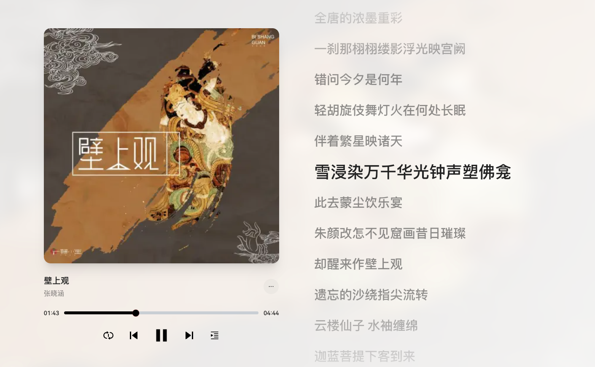

# 壁上观

<audio controls src="/生活漫谈/音乐/assets/壁上观.mp3" title="壁上观"></audio>



```bash
[ti:壁上观]
[ar:一棵小葱/张晓涵]
[al:壁上观]
[by:]
[offset:0]
[00:00.00]壁上观 - 张曦匀（张晓涵）
[00:02.05]词：小六
[00:04.10]曲：周明聪
[00:06.15]编曲：甘虎
[00:08.20]制作人：周明聪
[00:10.26]电吉他：王晓东
[00:12.31]木吉他：顾雄
[00:14.36]琵琶：孙莹
[00:16.41]和声：曾婕
[00:18.46]混音：顾雄
[00:20.52]封面：徐开林
[00:22.57]遗忘的沙绕指尖流转
[00:27.46]云楼仙子 水袖缠绵
[00:32.22]迦蓝菩提下客到来
[00:37.53]梦邀起舞八部天
[00:46.22]嶙峋的沟壑起伏层峦
[00:51.33]笙箫琵琶 金色步辇
[00:56.82]千秋黄沙 不曾褪减
[01:01.47]全唐的浓墨重彩
[01:10.36]一刹那栩栩缕影浮光映宫阙
[01:18.58]错问今夕是何年
[01:26.60]轻胡旋伎舞灯火在何处长眠
[01:34.52]伴着繁星映诸天
[01:42.52]雪浸染万千华光钟声塑佛龛
[01:50.48]此去蒙尘饮乐宴
[01:58.50]朱颜改怎不见窟画昔日璀璨
[02:06.48]却醒来作壁上观
[02:47.56]遗忘的沙绕指尖流转
[02:51.50]云楼仙子 水袖缠绵
[02:55.06]迦蓝菩提下客到来
[02:59.08]梦邀起舞八部天
[03:03.53]嶙峋的沟壑起伏层峦
[03:07.44]笙箫琵琶 金色步辇
[03:11.52]千秋黄沙 不曾褪减
[03:14.94]全唐的浓墨重彩
[03:20.51]一刹那栩栩缕影浮光映宫阙
[03:28.50]错问今夕是何年
[03:36.47]轻胡旋伎舞灯火在何处长眠
[03:44.54]伴着繁星映诸天
[03:52.43]雪浸染万千华光钟声塑佛龛
[04:00.54]此去蒙尘饮乐宴
[04:08.53]朱颜改怎不见窟画昔日璀璨
[04:16.47]却醒来作壁上观
```