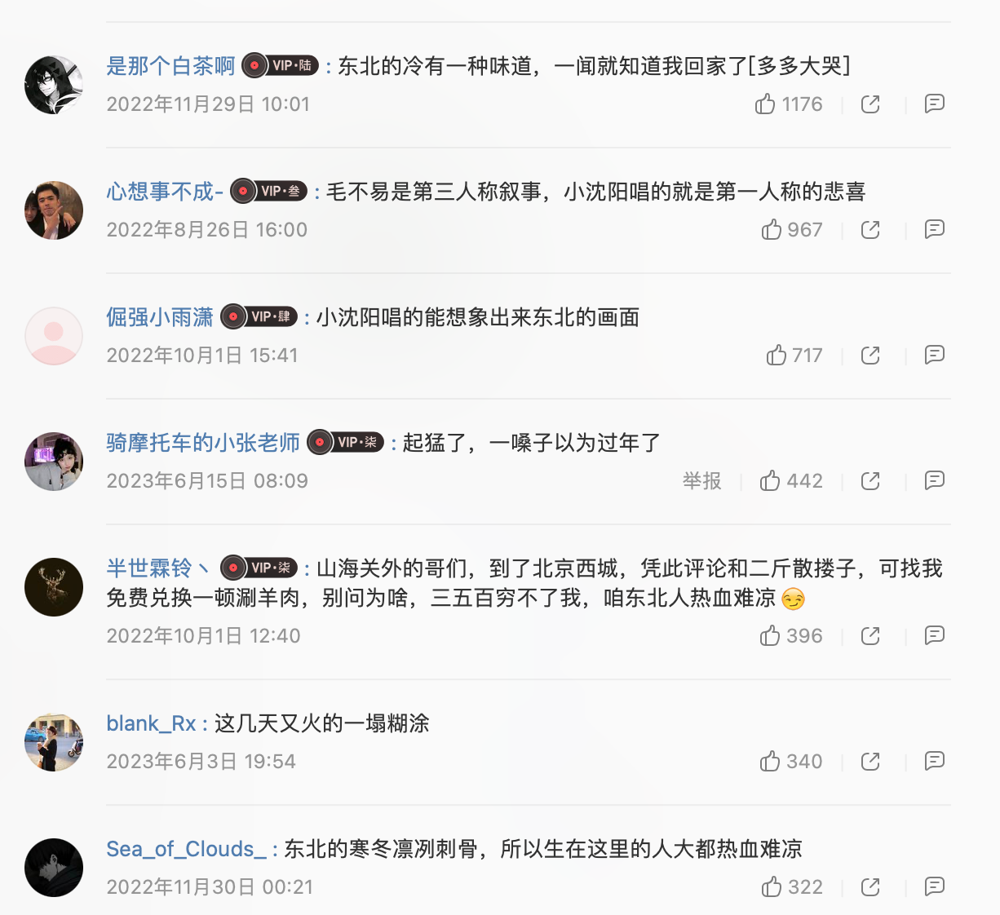

<!-- panels:start -->
<!-- div:title-panel -->

# 东北的冬 - 小沈阳

<!-- div:left-panel -->

> 作词 : 大平

> 作曲 : 大平

> 编曲 : 文魁

> 制作人 : 金志文

打冰尜欻嘎拉哈

成串的辣椒在墙上挂

窗户上都结霜花

兜里都揣着爆米花

纯粮的酒它火辣辣

大铁锅里贴饼子

大茶缸子老红茶

扭起来秧歌吹喇叭

东北的冬刮西北风

半夜三更总雪打灯

大棉裤它最抗风啊

夹鞋片子冻脚疼

咿呀个呐咿呀

嚯大棉袄二棉裤

里面是棉花外面裹着布

哪怕零下四五十度

咱穿上它也不打怵

开山劈岭伐大树

这就是我说的劳动保护

打出溜滑堆雪娃

冰车一滑就不回家

粘豆包儿得蘸白沙

酸菜缸里开白花

东北的冬刮西北风

大雪壳子三尺冰

热炕头上最招疯

火盆一围就满脸红

东北的冬

东北的冬刮西北风

半夜三更总雪打灯

大棉裤它最抗风啊

夹鞋片子冻脚疼

东北的冬

东北的冬

<!-- div:right-panel -->

<!-- panels:end -->