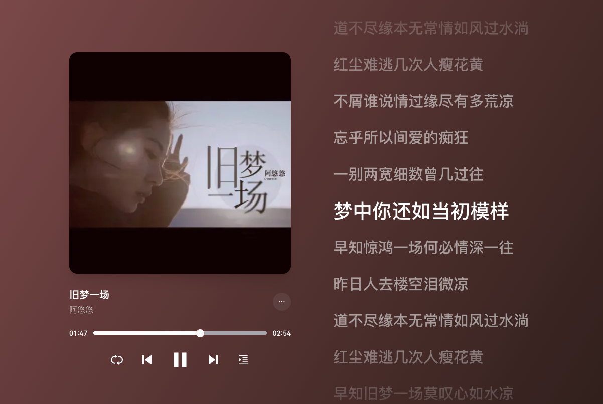

# 旧梦一场 - 阿悠悠

[旧梦一场-阿悠悠](assets/旧梦一场-阿悠悠.mp3 ':include :type=audio controls width=100%')

作词：一博
作曲：一博&张池
编曲：周琦
录音：张明懂
混音：刘城函
吉他：周琦
和声：胜屿
制作人：胜屿

总有几段旧爱昙花一刹芬芳
换几人划过梦的中央
每次挥手间总留一抹惆怅
拼凑填满半生浮想
不屑谁说情过缘尽有多荒凉
忘乎所以间爱的痴狂

一别两宽细数曾几过往
梦中你还如当初模样
早知惊鸿一场何必情深一往
昨日人去楼空泪微凉
道不尽缘本无常情如风过水淌
红尘难逃几次人瘦花黄

不屑谁说情过缘尽有多荒凉
忘乎所以间爱的痴狂
一别两宽细数曾几过往
梦中你还如当初模样
早知惊鸿一场何必情深一往

昨日人去楼空泪微凉
道不尽缘本无常情如风过水淌
红尘难逃几次人瘦花黄
早知旧梦一场莫叹心如水凉
冬去春回花又满山岗

谁不是阵阵感伤悟出感叹两行
他日总有某人一世情长
他日总有某人一世情长

