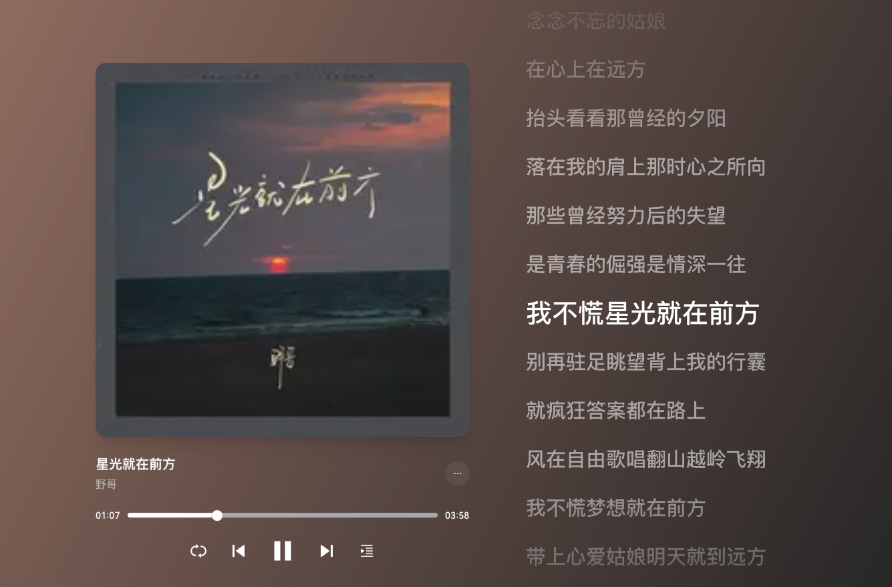

# 星光就在前方

<audio controls="controls" src="/生活漫谈/音乐/assets/星光就在前方.mp3"></audio>

星光就在前方 - 野哥

作词：任天宇/刘家泽

作曲：任天宇

制作人：任天宇

编曲：卡其漠罗洋/王灏

吉他：大牛

混音：任天宇

和声：刘海丰

统筹：廖凌鹏

封面：灭害灵

监制：刘家泽/任天宇

出品：刘家泽

发行：冯昌榆

制作公司：匠心音乐/梨云音乐社

OP：匠心音乐

每次努力回头望

那姑娘在远方

总会想来日方长

梦一场去流浪

生活给我一身伤

或惆怅或迷惘

念念不忘的姑娘

在心上在远方

抬头看看那曾经的夕阳

落在我的肩上那时心之所向

那些曾经努力后的失望

是青春的倔强是情深一往

我不慌星光就在前方

别再驻足眺望背上我的行囊

就疯狂答案都在路上

风在自由歌唱翻山越岭飞翔

我不慌梦想就在前方

带上心爱姑娘明天就到远方

手不放紧跟梦的方向

梦中就有希望

也许就在身旁满目星光

生活给我一身伤

或惆怅或迷惘

念念不忘的姑娘

在心上在远方

抬头看看那曾经的夕阳

落在我的肩上那时心之所向

那些曾经努力后的失望

是青春的倔强是情深一往

我不慌星光就在前方

别再驻足眺望背上我的行囊

就疯狂答案都在路上

风在自由歌唱翻山越岭飞翔

我不慌梦想就在前方

带上心爱姑娘明天就到远方

手不放紧跟梦的方向

梦中就有希望也许就在身旁

我不慌星光就在前方

别再驻足眺望背上我的行囊

就疯狂答案都在路上

风在自由歌唱翻山越岭飞翔

我不慌梦想就在前方

带上心爱姑娘明天就到远方

手不放紧跟梦的方向

梦中就有希望

也许就在身旁满目星光

每次努力回头望

