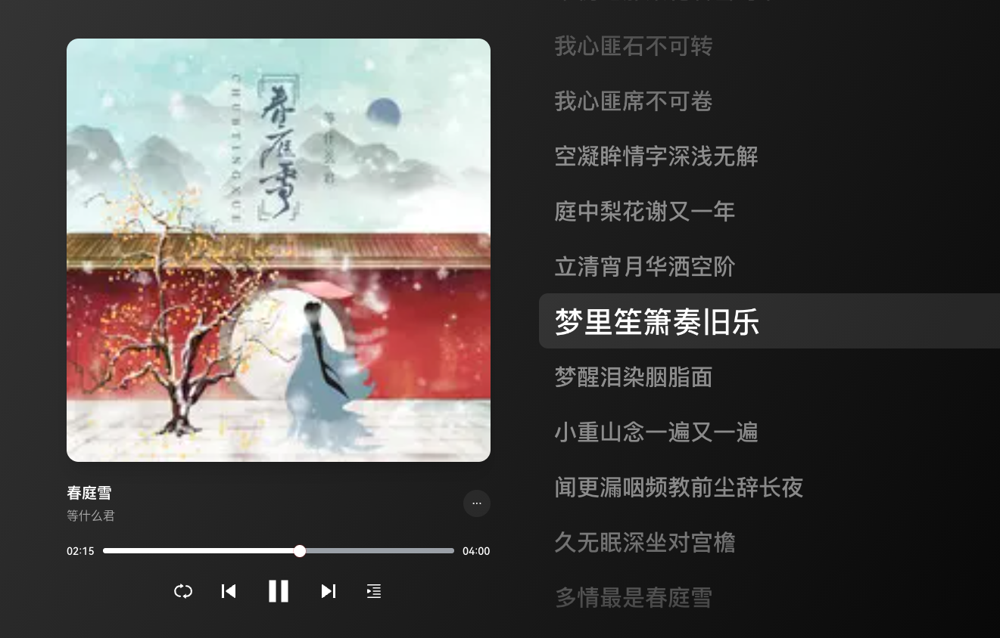

# 春庭雪 - 等什么君

<audio controls="controls" src="/生活漫谈/音乐/assets/春庭雪-等什么君.mp3"></audio>

[00:01.00]春庭雪 - 等什么君(邓寓君) 
[00:02.00]作词：清彦 
[00:03.00]作曲：爆款 
[00:04.00]编曲：Mzf小慕
[00:05.00]原唱：橙翼
[00:06.00]吉他：齐成刚
[00:07.00]和声/和声编写：曾婕Joey.z
[00:08.00]笛子：笛呆子囚牛
[00:09.00]萧：笛呆子囚牛
[00:10.00]二胡：二胡妹
[00:11.00]混音：幺唠
[00:12.00]统筹：锦书
[00:13.00]监制：潇喆Sean
[00:14.00]录音室：音浪录音室
[00:15.00]出品：鲸鱼向海（北京）文化有限公司
[00:16.00]（此版本为正式授权翻唱作品）

[00:16.28]庭中梨花谢又一年
[00:22.77]立清宵月华洒空阶
[00:28.95]梦里笙箫奏旧乐
[00:32.35]梦醒泪染胭脂面
[00:36.04]小重山念一遍又一遍

[00:42.94]闻更漏咽频教前尘辞长夜
[00:49.12]久无眠深坐对宫檐
[00:55.41]多情最是春庭雪
[00:58.60]年年落满离人苑
[01:02.25]薛涛笺上言若如初见

[01:08.43]这一世
[01:10.48]太漫长却止步咫尺天涯间
[01:15.02]谁仍记那梨花若雪时节
[01:21.60]我心匪石不可转
[01:24.84]我心匪席不可卷
[01:28.54]空凝眸情字深浅无解

[02:01.50]庭中梨花谢又一年
[02:08.06]立清宵月华洒空阶
[02:14.15]梦里笙箫奏旧乐
[02:17.49]梦醒泪染胭脂面
[02:21.13]小重山念一遍又一遍

[02:28.27]闻更漏咽频教前尘辞长夜
[02:34.35]久无眠深坐对宫檐
[02:40.59]多情最是春庭雪
[02:43.78]年年落满离人苑
[02:47.47]薛涛笺上言若如初见

[02:53.61]这一世
[02:55.70]太漫长却止步咫尺天涯间
[03:00.24]谁仍记那梨花若雪时节
[03:06.78]我心匪石不可转
[03:09.97]我心匪席不可卷
[03:13.71]空凝眸情字深浅无解

[03:20.10]这一世
[03:22.06]太漫长却止步咫尺天涯间
[03:26.55]谁仍记那梨花若雪时节
[03:33.08]我心匪石不可转
[03:36.32]我心匪席不可卷
[03:40.07]空凝眸情字深浅无解
[03:46.65]春欲晚梨花谢又一年
 

