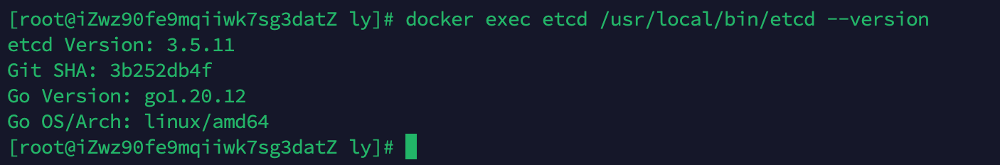
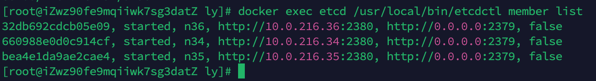
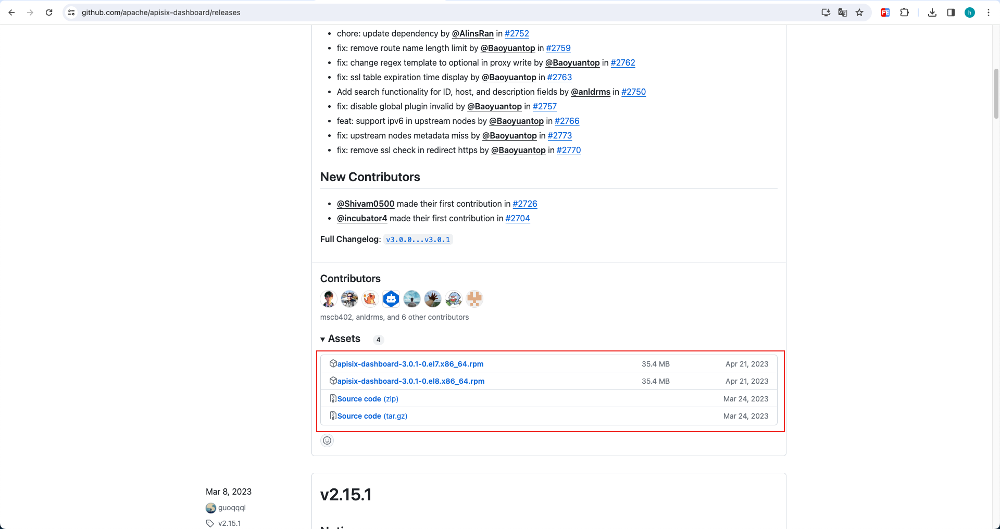
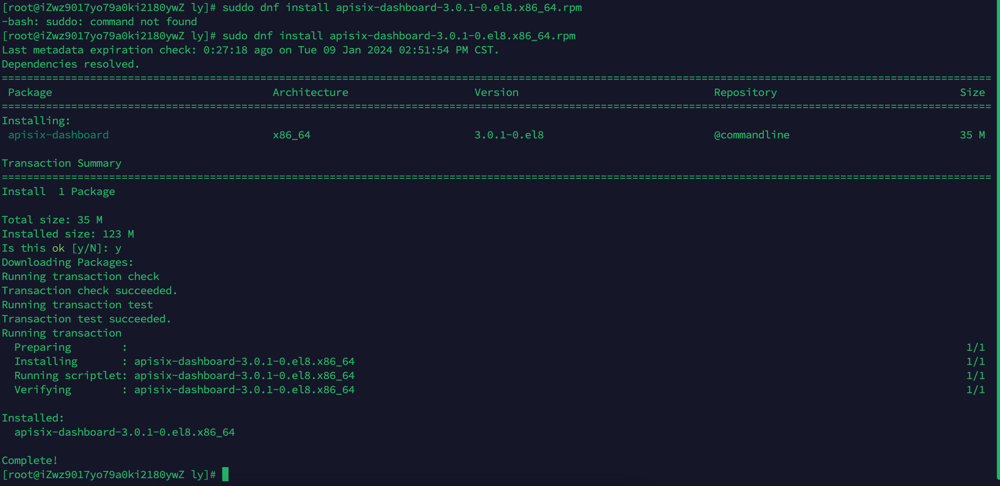

# ApiSix网关

## 1. Etcd集群搭建

### 启动命令(集群版)

```bash
# 节点自己的名字 --name
# 告知集群自己的客户端地址 --advertise-client-urls
# 设置监听客户端通讯的URL列表 --listen-client-urls
# 告知集群自己集群通讯地址 --initial-advertise-peer-urls
# 用于监听伙伴通讯的URL列表 --listen-peer-urls
# etcd 集群的初始化集群记号 --initial-cluster-token
# 集群成员 --initial-cluster 
# 初始化集群状态 --initial-cluster-state

# 34机器
docker run --name etcd \
  -p 2379:2379 -p 2380:2380 \
  -v /opt/ly/etcd/data:/etcd-data \
  -d quay.io/coreos/etcd:v3.5.11 /usr/local/bin/etcd \
  --name n34 \
  --data-dir /etcd-data \
  --listen-client-urls http://0.0.0.0:2379 \
  --advertise-client-urls http://0.0.0.0:2379 \
  --listen-peer-urls http://0.0.0.0:2380 \
  --initial-advertise-peer-urls http://10.0.216.34:2380 \
  --initial-cluster "n34=http://10.0.216.34:2380,n35=http://10.0.216.35:2380,n36=http://10.0.216.36:2380" \
  --initial-cluster-token apisix-etcd-cluster \
  --initial-cluster-state new \
  --log-level info \
  --logger zap \
  --log-outputs stderr

# 35机器
docker run --name etcd \
  -p 2379:2379 -p 2380:2380 \
  -v /opt/ly/etcd/data:/etcd-data \
  -d quay.io/coreos/etcd:v3.5.11 /usr/local/bin/etcd \
  --name n35 \
  --data-dir /etcd-data \
  --listen-client-urls http://0.0.0.0:2379 \
  --advertise-client-urls http://0.0.0.0:2379 \
  --listen-peer-urls http://0.0.0.0:2380 \
  --initial-advertise-peer-urls http://10.0.216.35:2380 \
  --initial-cluster "n34=http://10.0.216.34:2380,n35=http://10.0.216.35:2380,n36=http://10.0.216.36:2380" \
  --initial-cluster-token apisix-etcd-cluster \
  --initial-cluster-state new \
  --log-level info \
  --logger zap \
  --log-outputs stderr

# 36机器
docker run --name etcd \
  -p 2379:2379 -p 2380:2380 \
  -v /opt/ly/etcd/data:/etcd-data \
  -d quay.io/coreos/etcd:v3.5.11 /usr/local/bin/etcd \
  --name n36 \
  --data-dir /etcd-data \
  --listen-client-urls http://0.0.0.0:2379 \
  --advertise-client-urls http://0.0.0.0:2379 \
  --listen-peer-urls http://0.0.0.0:2380 \
  --initial-advertise-peer-urls http://10.0.216.36:2380 \
  --initial-cluster "n34=http://10.0.216.34:2380,n35=http://10.0.216.35:2380,n36=http://10.0.216.36:2380" \
  --initial-cluster-token apisix-etcd-cluster \
  --initial-cluster-state new \
  --log-level info \
  --logger zap \
  --log-outputs stderr
```

### 验证命令

```bash
# 验证
docker exec etcd /usr/local/bin/etcd --version
docker exec etcd /usr/local/bin/etcdctl version
docker exec etcd /usr/local/bin/etcdutl version
docker exec etcd /usr/local/bin/etcdctl endpoint health
docker exec etcd /usr/local/bin/etcdctl put foo bar
docker exec etcd /usr/local/bin/etcdctl get foo
```



###  获取集群成员

```bash
docker exec etcd /usr/local/bin/etcdctl member list
```



至此，Etcd集群搭建完毕！

## 2. ApiSix

镜像：`docker pull apache/apisix:3.7.0-debian`

### 配置文件 config.yaml

```yaml
deployment:
  role: traditional
  role_traditional:
    config_provider: etcd
  admin:
    allow_admin:
      - 0.0.0.0/0  # Please set it to the subnet address you obtained.
                  # If not set, by default all IP access is allowed.
  etcd:
    host:
      - "http://10.0.216.34:2379"
      - "http://10.0.216.35:2379"
      - "http://10.0.216.36:2379"
    prefix: "/apisix"
    timeout: 30
```

### 启动命令

```bash
docker run --name apache-apisix \
  -p 9080:9080 -p 9180:9180 \
  -v /opt/ly/apisix/config.yaml:/usr/local/apisix/conf/config.yaml \
  --restart=always \
  -d apache/apisix:3.7.0-debian
```


## 3. ApiSix-Dashboard

### 软件下载

地址：https://github.com/apache/apisix-dashboard/releases



### 软件安装

```bash
sudo dnf install apisix-dashboard-3.0.1-0.el8.x86_64.rpm
```



### 软件目录

> /usr/local/apisix/dashboard/
>
> ./manager-api

### 注册系统服务

```bash
# 服务文件写入系统目录
echo "[Unit]
Description=apisix-dashboard
Conflicts=apisix-dashboard.service
After=network-online.target

[Service]
WorkingDirectory=/usr/local/apisix/dashboard
ExecStart=/usr/local/apisix/dashboard/manager-api" > /usr/lib/systemd/system/apisix-dashboard.service

# 重载
systemctl daemon-reload
# 启动
systemctl start apisix-dashboard
# 开机自启动
systemctl enable apisix-dashboard

```

