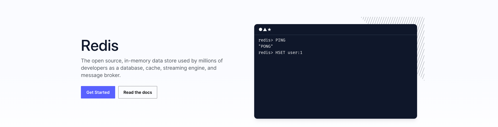
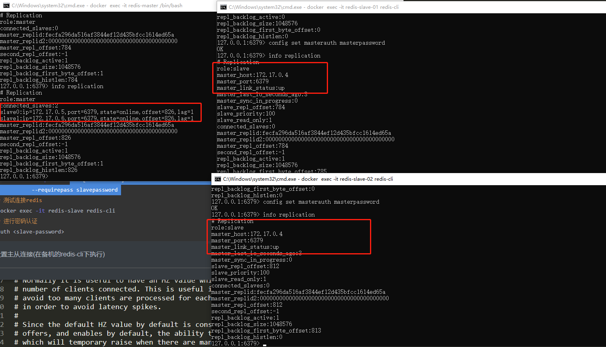
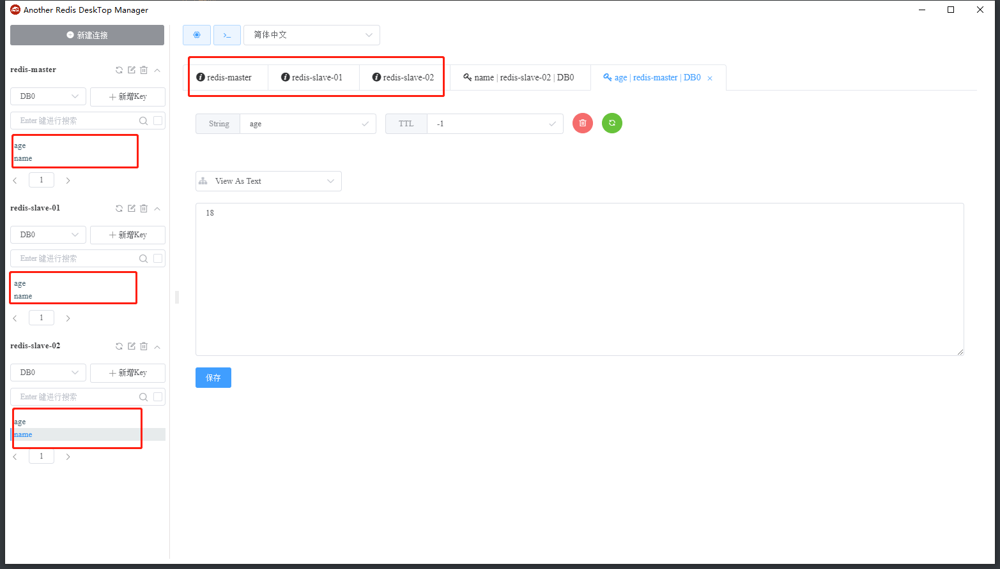
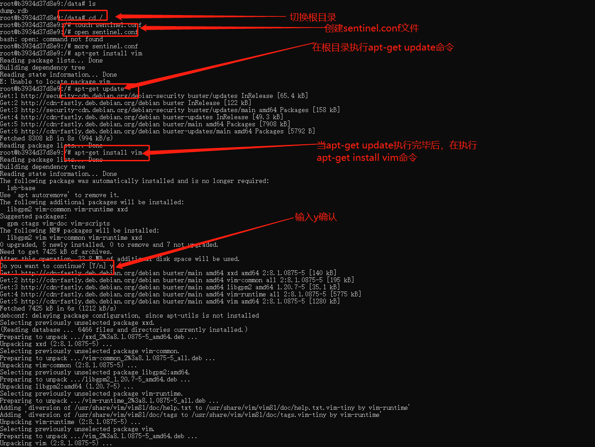
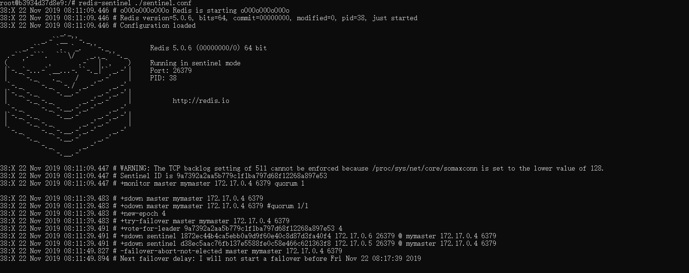
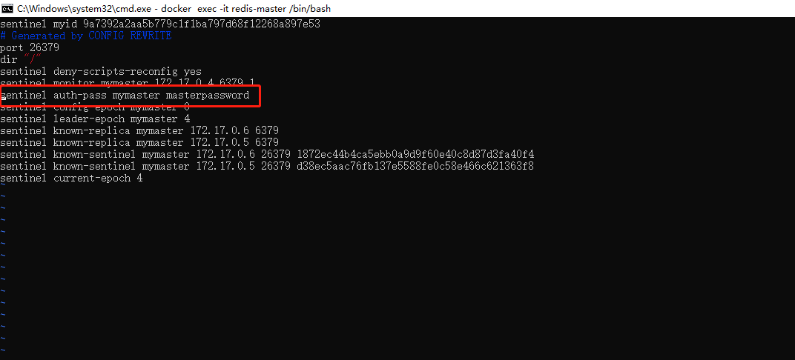
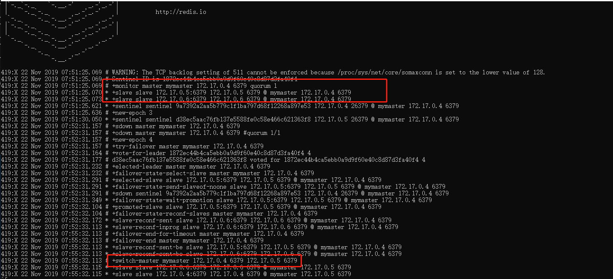

# #Redis

# 基本运行

```bash
# 简单启动：  
docker run --name [some-redis] -d [redis:5.0.6]
```

```bash
# 启动持久化实例：
docker run --name [some-redis] -d [redis:5.0.6] redis-server --appendonly yes
```

```bash
# 客户端链接：
docker run -it --rm --link [Redis01]:redis [redis:5.0.6] redis-cli -h [Redis01]
```

# 主从部署

> # 使用该命令查看redis容器在docker中虚拟出来的ip等信息
>
> docker inspect redis-master/redis-slave

‍

## 创建master 主库(docker容器)

 suggestion: `slave-password`​ 最好和 `master-password`​相等

```bash
# 运行服务
docker run -it --name redis-master -d -p 6379:6379 [redis:5.0.6] redis-server --requirepass masterpassword
# 测试连接redis
docker exec -it redis-master redis-cli -a <master-password>
```

## 创建slave 从库(docker容器)

```bash
# 运行服务 同时设定从库密码，可选
docker run -it --name redis-slave -d -p 6380:6379 [redis:5.0.6] redis-server --requirepass slavepassword 
# 测试连接redis
docker exec -it redis-slave redis-cli
# 进行密码认证
auth <slave-password>
```

## 设置主从连接(在备机的redis-cli下执行)

```bash
# 从库配置
slaveof <master-ip> <master-port>  # <master-ip>为主库服务ip，<master-port>表示主库所在端口，默认6379
# 密码认证
config set masterauth <master-password> # <master-password>即为主库访问密码 (如果主机有密码一定要设置)
# 测试命令
info / info replication / info sentinel
```

**tips**: 如果主机有密码，一定要设置，否则显示主机连接(`master_link_status`​)状态为`down`​; 这里的master-ip可以通过开篇命令`docker inspect redis`​进行拿到

一主两从结果配置如下：

​​

然后看下客户端工具连接情况：

​​

到这，一主多从搭建完毕!!!

接下来开始Sentinel模式配置...

# Sentinel模式设置

## 首先执行以下命令进入容器内控制台

> docker exec -it redis-master /bin/bash

## 进入根目录、创建`sentinel.conf`​​​​文件，执行`apt-get update`​​​​更新命令，然后`apt-get install vim`​​​​安装vim命令，等待`vim`​​​​安装完成​​

## 在`sentinel.conf`​​​文件中添加一下命令

> sentinel monitor mymaster 1
>
> ```
> 规范： sentinel monitor <master-group-name> <ip> <port> <quorum>
> ```

## 然后启动命令

```
> redis-sentinel ./sentinel.conf
```

如果出现一下日志，则表示启动失败，没有设置访问密码，需要在文件`sentinel.conf`​​中添加`sentinel auth-pass mymaster <masterpassowd>`​​

​​

设置访问master密码

​​

## 模拟master宕机，slave自动选举切换成master的角色​​

# Cluster集群

> redis:6.0.5 镜像

## 机器准备

> 机器A：192.168.0.10
>
> 机器B：192.168.0.11
>
> 机器C：192.168.0.12

TIPS: 机器安装docker工具

‍
