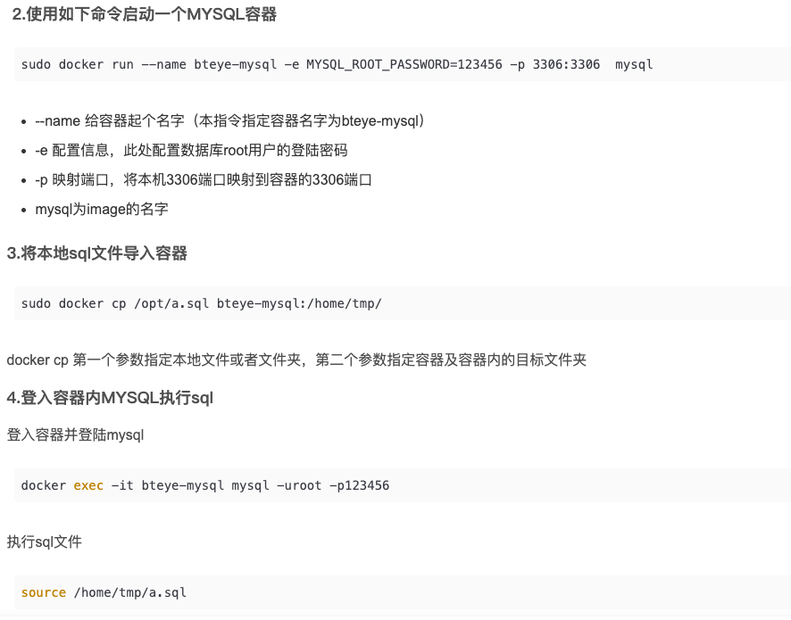

# 离线机器安装docker容器

1. 首先找一个能联网的机器，该机器安装完docker 并且有mysql nginx的镜像
2. 在能联网的机器上执行：docker save -o /root/app/mysql57.tar mysql:5.7；

```bash
docker save -o /root/app/mysql57.tar mysql:5.7
```

把/root/app/mysql57.tar文件上传到无法上网的机器上然后执行：docker load -i /root/Downloads/mysql57.tar

```bash
docker load -i /root/Downloads/mysql57.tar
```

启动mysql：docker run -d --name mysql -p 3306:3306 -e MYSQL_ROOT_PASSWORD=123456 mysql:5.7

```bash
docker run -d --name mysql -p 3306:3306 -e MYSQL_ROOT_PASSWORD=123456 mysql:5.7
```

