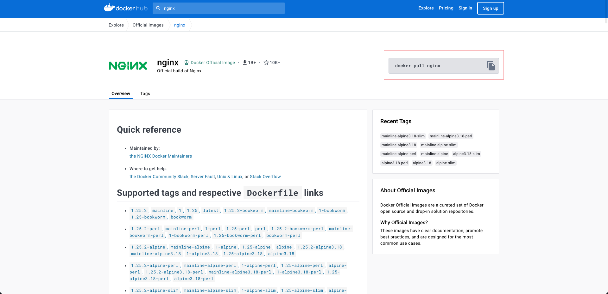
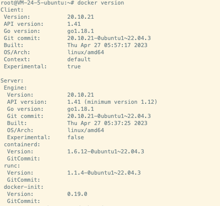

# #Nginx

# ​​前言

> 我们通常会用Nginx来做请求代理服务. 所以这里会简单的描述下如何用docker部署一个nginx容器并使用.

‍

**前置要求:   ​**机器安装了docker.  下图是我机器docker信息(仅供参考)



# 镜像获取

我们在命令行通过如下命令获取最新版本nginx

```bash
docker pull nginx
```

可以通过下面命令获取指定版本, 比如 1.22

```bash
docker pull nginx:1.22
```

# 容器运行

## 快速运行

```bash
docker run -d --name nginx nginx
```

## 通用部署

启动一个nginx容器, 名称为`nginxweb`​. 将宿主机的`80`​端口和`443`​端口和容器内的同端口绑定. 则访问宿主机80和443端口的流量则会转发给此容器的80和443端口. 同时挂载三个目录, 分别同步html信息、conf信息、log信息. (`-v`​: *将本地目录(文件)挂载到容器指定目录；*)

```bash
docker run -d -p 80:80 -p 443:443  \
 --name nginx \
 -v $prefixPath/nginx/html:/usr/share/nginx/html \
 -v $prefixPath/nginx/conf:/etc/nginx/conf.d \
 -v $prefixPath/nginx/logs:/var/log/nginx \
 --restart=always \
 nginx:latest
```

# 配置文件

## 默认配置

```nginx
#user  nobody;
worker_processes  1;

#error_log  logs/error.log;
#error_log  logs/error.log  notice;
#error_log  logs/error.log  info;

#pid        logs/nginx.pid;


events {
    worker_connections  1024;
}


http {
    include       mime.types;
    default_type  application/octet-stream;

    #log_format  main  '$remote_addr - $remote_user [$time_local] "$request" '
    #                  '$status $body_bytes_sent "$http_referer" '
    #                  '"$http_user_agent" "$http_x_forwarded_for"';

    #access_log  logs/access.log  main;

    sendfile        on;
    #tcp_nopush     on;

    #keepalive_timeout  0;
    keepalive_timeout  65;

    #gzip  on;

    server {
        listen       80;
        server_name  localhost;

        #charset koi8-r;

        #access_log  logs/host.access.log  main;

        location / {
            root   html;
            index  index.html index.htm;
        }

        #error_page  404              /404.html;

        # redirect server error pages to the static page /50x.html
        #
        error_page   500 502 503 504  /50x.html;
        location = /50x.html {
            root   html;
        }

        # proxy the PHP scripts to Apache listening on 127.0.0.1:80
        #
        #location ~ \.php$ {
        #    proxy_pass   http://127.0.0.1;
        #}

        # pass the PHP scripts to FastCGI server listening on 127.0.0.1:9000
        #
        #location ~ \.php$ {
        #    root           html;
        #    fastcgi_pass   127.0.0.1:9000;
        #    fastcgi_index  index.php;
        #    fastcgi_param  SCRIPT_FILENAME  /scripts$fastcgi_script_name;
        #    include        fastcgi_params;
        #}

        # deny access to .htaccess files, if Apache's document root
        # concurs with nginx's one
        #
        #location ~ /\.ht {
        #    deny  all;
        #}
    }


    # another virtual host using mix of IP-, name-, and port-based configuration
    #
    #server {
    #    listen       8000;
    #    listen       somename:8080;
    #    server_name  somename  alias  another.alias;

    #    location / {
    #        root   html;
    #        index  index.html index.htm;
    #    }
    #}


    # HTTPS server
    #
    #server {
    #    listen       443 ssl;
    #    server_name  localhost;

    #    ssl_certificate      cert.pem;
    #    ssl_certificate_key  cert.key;

    #    ssl_session_cache    shared:SSL:1m;
    #    ssl_session_timeout  5m;

    #    ssl_ciphers  HIGH:!aNULL:!MD5;
    #    ssl_prefer_server_ciphers  on;

    #    location / {
    #        root   html;
    #        index  index.html index.htm;
    #    }
    #}

}
```

## 文件结构

```nginx
...              #全局块

events {         #events块
   ...
}

http      #http块
{
    ...   #http全局块
    server        #server块
    { 
        ...       #server全局块
        location [PATTERN]   #location块
        {
            ...
        }
        location [PATTERN] 
        {
            ...
        }
    }
    server
    {
      ...
    }
    ...     #http全局块
}
```

* **全局块**：配置影响nginx全局的指令。一般有运行nginx服务器的用户组，nginx进程pid存放路径，日志存放路径，配置文件引入，允许生成worker process数等。
* **events块**：配置影响nginx服务器或与用户的网络连接。有每个进程的最大连接数，选取哪种事件驱动模型处理连接请求，是否允许同时接受多个网路连接，开启多个网络连接序列化等。
* **http块**：可以嵌套多个server，配置代理，缓存，日志定义等绝大多数功能和第三方模块的配置。如文件引入，mime-type定义，日志自定义，是否使用sendfile传输文件，连接超时时间，单连接请求数等。
* **server块**：配置虚拟主机的相关参数，一个http中可以有多个server。
* **location块**：配置请求的路由，以及各种页面的处理情况。

# 1.22的默认配置

## nginx.conf

> Location: /etc/nginx/nginx.conf

```nginx

user  nginx;
worker_processes  auto;

error_log  /var/log/nginx/error.log notice;
pid        /var/run/nginx.pid;


events {
    worker_connections  1024;
}


http {
    include       /etc/nginx/mime.types;
    default_type  application/octet-stream;

    log_format  main  '$remote_addr - $remote_user [$time_local] "$request" '
                      '$status $body_bytes_sent "$http_referer" '
                      '"$http_user_agent" "$http_x_forwarded_for"';

    access_log  /var/log/nginx/access.log  main;

    sendfile        on;
    #tcp_nopush     on;

    keepalive_timeout  65;

    #gzip  on;

    include /etc/nginx/conf.d/*.conf;
}
```

## default.conf

> Location：/etc/nginx/conf.d/default.conf

```nginx
server {
    listen       80;
    listen  [::]:80;
    server_name  localhost;

    #access_log  /var/log/nginx/host.access.log  main;

    location / {
        root   /usr/share/nginx/html;
        index  index.html index.htm;
    }

    #error_page  404              /404.html;

    # redirect server error pages to the static page /50x.html
    #
    error_page   500 502 503 504  /50x.html;
    location = /50x.html {
        root   /usr/share/nginx/html;
    }

    # proxy the PHP scripts to Apache listening on 127.0.0.1:80
    #
    #location ~ \.php$ {
    #    proxy_pass   http://127.0.0.1;
    #}

    # pass the PHP scripts to FastCGI server listening on 127.0.0.1:9000
    #
    #location ~ \.php$ {
    #    root           html;
    #    fastcgi_pass   127.0.0.1:9000;
    #    fastcgi_index  index.php;
    #    fastcgi_param  SCRIPT_FILENAME  /scripts$fastcgi_script_name;
    #    include        fastcgi_params;
    #}

    # deny access to .htaccess files, if Apache's document root
    # concurs with nginx's one
    #
    #location ~ /\.ht {
    #    deny  all;
    #}
}
```

# 思源配置

​`80.conf`​

```nginx
server {
    listen       80;
    server_name  localhost;

    rewrite ^(.*)$ https://$host$1 permanent;
}
```

​`443.conf`​

```nginx
server {
    listen      443 ssl;
    server_name  localhost;

    ssl_certificate /etc/nginx/conf.d/mizar.pem;
    ssl_certificate_key /etc/nginx/conf.d/mizar.key;

    #access_log  /var/log/nginx/host.access.log  main;

    location / {
        #root   /usr/share/nginx/html;
        #index  index.html index.htm;
		proxy_set_header   X-Real-IP $remote_addr;
        proxy_set_header   Host      $http_host;
        proxy_pass         http://10.0.24.5:6806;
		proxy_http_version 1.1;
		proxy_set_header Upgrade $http_upgrade;
		proxy_set_header Connection upgrade;
        client_max_body_size 100m;
		proxy_buffers 64 128k;
		proxy_buffer_size 512k;
    }

    #error_page  404              /404.html;

    # redirect server error pages to the static page /50x.html
    #
    error_page   500 502 503 504  /50x.html;
    location = /50x.html {
        root   /usr/share/nginx/html;
    }
}
```

# 反向代理参考配置

```bash
docker run --name nginx \
    -p 80:80 \
    -v /opt/ly/nginx/html:/usr/share/nginx/html \
    -v /opt/ly/nginx/conf:/etc/nginx/conf.d \
    -v /opt/ly/nginx/logs:/var/log/nginx \
    --restart=always \
    -d nginx:1.24.0
```

基础配置

```nginx
# 第一个子域名
upstream xxxx-server {
		ip_hash;
        server xxx.x.x.x:8080;
}

server {
    listen       80;
    server_name  x.com;

    access_log  /var/log/nginx/xxx.access.log  main;

    location / {
        proxy_pass http://xxxx-server;
        proxy_set_header X-Real-IP $remote_addr;
        proxy_set_header X-Forwarded-For $proxy_add_x_forwarded_for;
        proxy_set_header Host $http_host;
        proxy_set_header X-NginX-Proxy true;
    }
}

# 第二个子域名
upstream xxxx2-server {
		ip_hash;
        server xxx.x.x.x:8080;
}

server {
    listen       80;
    server_name  x2.com;

    access_log  /var/log/nginx/xxx2.access.log  main;

    location / {
        proxy_pass http://xxxx2-server;
        proxy_set_header X-Real-IP $remote_addr;
        proxy_set_header X-Forwarded-For $proxy_add_x_forwarded_for;
        proxy_set_header Host $http_host;
        proxy_set_header X-NginX-Proxy true;
    }
}
```
