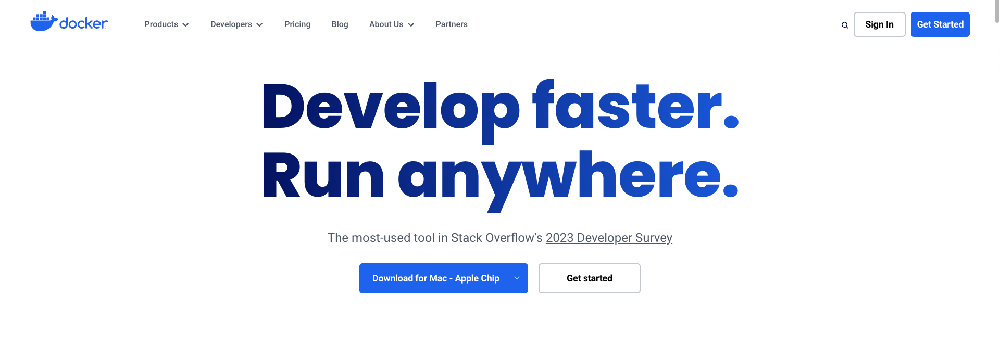

# Docker万物生

docker镜像仓库

> [https://hub.docker.com/](https://hub.docker.com/ "https://hub.docker.com/")

# 基本命令

```bash
# 列出docker相关信息
docker version
docker info


# 列出本机所有image文件
docker images


# 删除image文件
docker image rm [imageName]
docker rmi [imageName]


# 将image文件从仓库抓取到本地(不指定版本号，默认拉取最新版)
docker image pull [imageName]
etc. docker image pull rabbitmq


# 运行image文件(如果本机没有image，则会从远程仓库拉取)
docker run [imageName]


# 进入容器内部使用命令行体验
docker run -it [containerID/containerName] bash


# 终止容器
docker stop [containerID/containerName]


# 列出本机正在运行的容器
docker ps


# 列出本机所有容器，包括终止的
docker ps -a


# 删除终止运行容器文件
docker rm -f [containerID/containerName]


# 拷贝容器内/path/to/1.txt到宿主机当前目录1.txt
docke cp [containerI/path/to/fileD]:[/path/to/1.txt] 1.txt


# 修改容器启动命令
docker update [OPTIONS] CONTAINER [CONTAINER...]
docker update --restart=always koa-demo:0.0.1
```

# 制作容器示例

## 下载源码

```bash
git clone https://github.com/ruanyf/koa-demos.git
cd koa-demos
```

## 编写dockerfile

```dockerfile
# 继承官方8.4版本的node镜像
FROM node:8.4
# 将当前目录所有文件复制到app目录下(.dockerignore排除的文件不复制)
COPY . /app
# 指定之后工作目录为app
WORKDIR /app
# 在/app目录下，运行npm install命令安装依赖，安装后所有依赖都将打进image文件
RUN npm install --registry=https://registry.npm.taobao.org
# 将容器3000端口暴露出来，允许外部连接这个端口
EXPOSE 3000
# 容器启动后自动执行的命令
CMD node demos/01.js
```

​`RUN`​命令和`CMD`​命令区别：

RUN命令在image文件**构建阶段**执行，执行结果会打进image文件内；

CMD命令是在容器**启动后**执行；

一个Dockerfile可以有多个RUN命令，只能有一个CMD命令;

​`docker container run`​命令后如果附件命令，则会覆盖CMD命令。

## 构建镜像

```bash
docker image build -t koa-demo .
# 或者
docker image build -t koa-demo:0.0.1 .
```

​`-t`​: 指定image文件的名字,可以用冒号指定标签(版本)，如果不指定，默认latest;最后的`.`​表示Dockerfile所在的路径，然后等待运行结果

通过`docker image ls`​查看制作的镜像.

​​

## 镜像验证

通过启动容器验证

```bash
docker container run -p 8000:3000 -it koa-demo:0.0.1 /bin/bash
# 或
docker container run -d -p 8000:3000 -it koa-demo:0.0.1
```

​`-p`​: 将容器的3000端口映射到本机的8000端口

​`-d`​: 后台运行

​`--restart always`​: 随系统启动容器

​`--volume "$PWD/":/var/www/html`​:将当前目录（`$PWD`​）映射到容器的/var/www/html目录，当前目录的任何修改，都会反映到容器里面，进而被外部访问到。

​`-i`​: 交互式操作

​`-t`​: 终端shell

​`-it`​: 将容器的shell映射到当前的shell,然后在本机器窗口输入的命令会传入容器

​`/bin/bash`​: 表示容器启动后，内部shell执行后的第一个命令。这里是启动bash， 保证用户可以使用shell

‍
