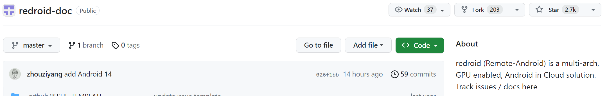
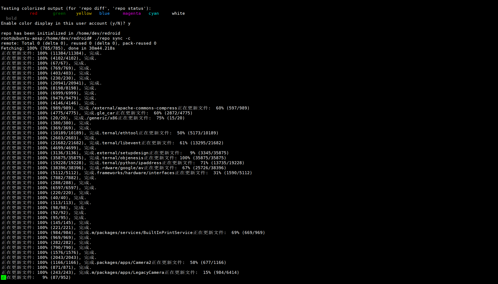
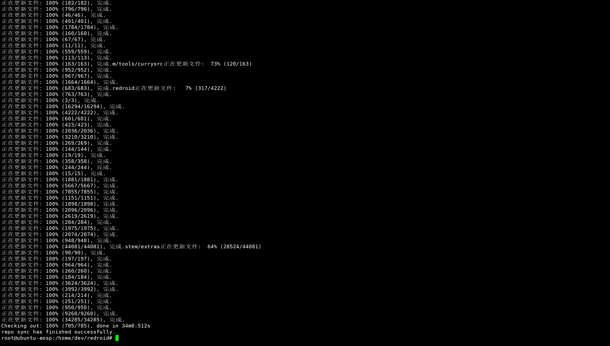
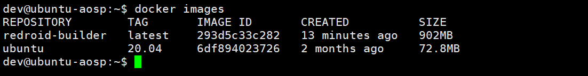
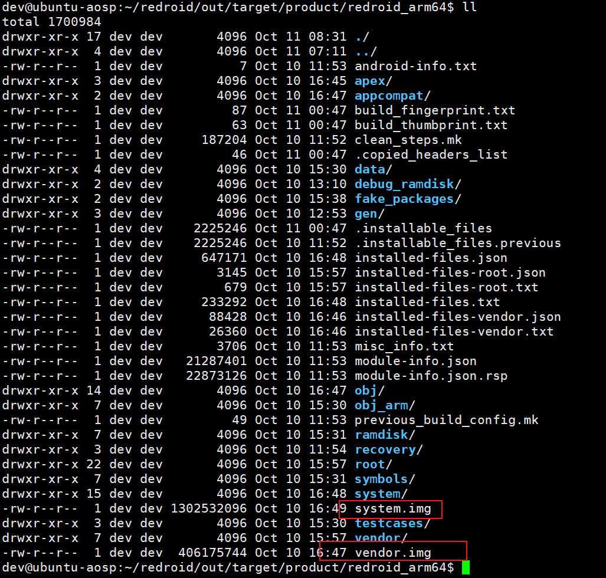
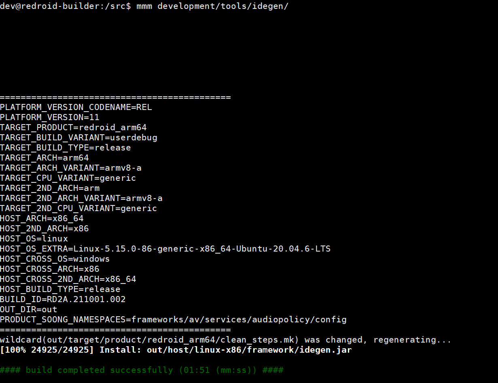
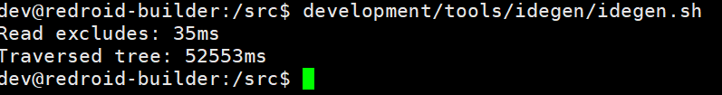
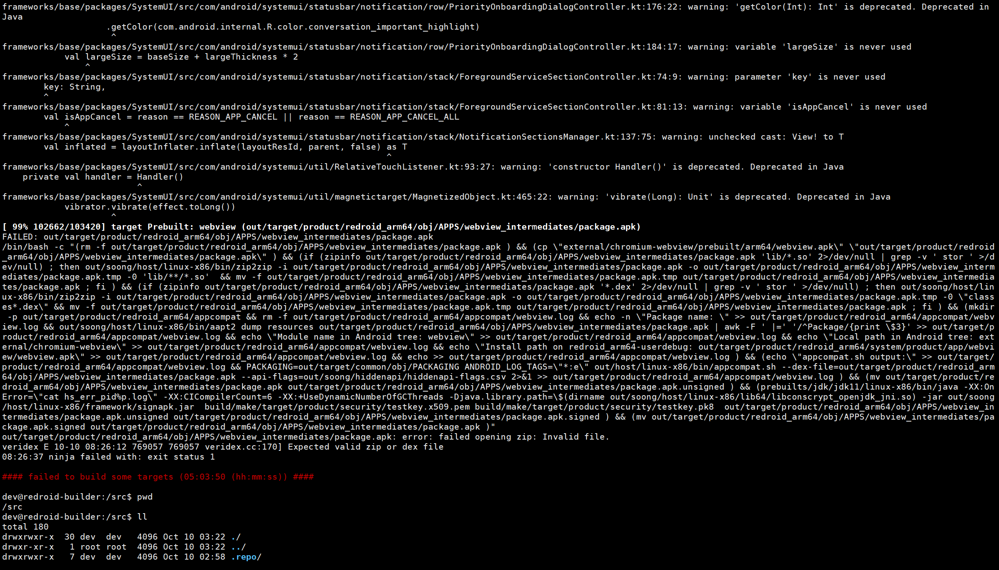
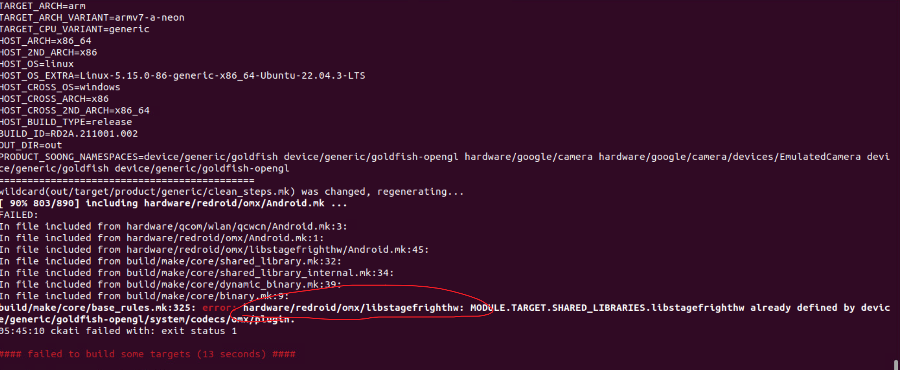
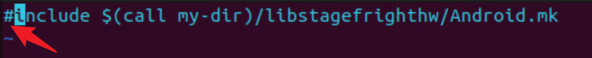

# #Redroid编译

# 引言

	需要修改[redroid](https://github.com/remote-android/redroid-doc)项目，从而探索出一条可以动态修改机型的解决方案。其他方案基本无法满足，尝试通过编译Android、修改Android相关获取IMEI等基本信息的地方从而修改适合业务需求的镜像包。

# 源码获取

## 环境

> Ubuntu 22.0.4
>
> 	CPU 6核12线程
>
> 	RAM 128GB
>
> 	磁盘 500GB

普通用户家目录执行即可，部分命令需要sudo执行。

## 安装git-lfs

```bash
wget https://github.com/git-lfs/git-lfs/releases/download/v3.4.0/git-lfs-linux-amd64-v3.4.0.tar.gz
tar -xzvf git-lfs-linux-amd64-v3.4.0.tar.gz
cd git-lfs-3.4.0
sudo ./install.sh
# 通过下面命令检测
git lfs install
应该输出：Git LFS initialized. 
```

## 安装repo工具

> 由于Redroid只是针对AOSP修改了部分模块，所以拉取源码过程和AOSP类似。
>
> AOSP源码是由上百个git仓库组成，所以Google提供了**repo**工具专门用于将上百个仓库同步至本机

```bash
mkdir ~/redroid && cd ~/redroid
curl https://mirrors.tuna.tsinghua.edu.cn/git/git-repo -o repo
# 下面这个repo-1可能有问题，推荐下载上述清华源repo
# curl https://storage.googleapis.com/git-repo-downloads/repo-1 > ./repo
chmod a+x repo
# 下面最好也执行下
./repo forall -g lfs -c 'git lfs pull'
```

## 基本设置

```bash
# 初始化仓库
./repo init -u https://github.com/remote-android/platform_manifests.git -b redroid-11.0.0 --depth=1 --git-lfs
# # check @remote-android/platform_manifests for supported branch / manifest

# 用户是dev，所以是/home/dev, 视个人具体目录(执行init会提示，copy响应行执行即可)
# 执行后才会生成.repo目录：./repo init -u https://github.com/remote-android/platform_manifests.git -b redroid-11.0.0 --depth=1 --git-lfs
# cp /home/dev/redroid/.repo/repo/repo /home/dev/redroid/repo

# 设置git信息 (复制执行即可)
git config --global user.name "xxx"
git config --global user.email "xxx@xx.com"

# (视情况执行)
# sudo apt install python
# 如果本机有python3命令没有python命令，可以用ln软链接设置
# 比如python3：/usr/bin/python3 没有python命令，则如下执行
sudo ln -s /usr/bin/python3 /usr/bin/python
```

## 同步

此过程视网速决定时间（科学上网，网速不错情况下，check消耗1h左右）同步仓库大约80G，默认从google仓库同步，可查询相关xml，将之替换为中科大源或者清华源。

```bash
./repo sync -c
```

​​

​​

# 通过Docker容器环境编译

## 交换缓存设置(非必须设置)

> 内存小的情况必须设置，比如16G以内
>
> 如果本身系统分配的交换缓存就多，比如8G （free -m查看），则可以只修改系统min_free_kbytes

```bash
# 查看当前swap详情;free -m :  可以查看使用信息
swapon -s
# 停用
swapoff /swapfile
# 删除
rm /swapfile

# 新建swap空间，以20G为例，创建文件, 命名为“swapfile”，当然你也可以随意写。
fallocate -l 20G /swapfile
# 设置文件权限
chmod 600 /swapfile
# 挂载
mkswap /swapfile
# 激活启动
swapon /swapfile

#### 永久设置 (参考vim命令使用)
vim /etc/fstab
# 文件最后插入如下信息
/swapfile swap swap defaults 0 0

# 系统默认内存只有6000KB时才会启用交换空间， 所以需要更改设置
# vim /etc/sysctl.conf
# 文件最后插入如下信息 （视内存情况分配 8G -> 1.5G; 4G -> 1G）
# vm.min_free_kbytes=1500000 # 大致1.5G
# 上面两行可使用下面命令修改，同等效果
sysctl -w vm.min_free_kbytes=1500000 >> /etc/sysctl.conf
```

## 构建运行镜像

```bash

mkdir ~/dockerbuilder && cd ~/dockerbuilder
vi Dockerfile
```

​`Dockerfile`​内容

```docker
FROM ubuntu:20.04

ARG userid
ARG groupid
ARG username

# COPY apt.conf /etc/apt/apt.conf

# COPY sources.list etc/apt/sources.list

ENV DEBIAN_FRONTEND noninteractive

RUN apt-get update \
    && echo "install package for building AOSP" \
    && apt-get install -y git-core gnupg flex bison build-essential zip curl zlib1g-dev \
        gcc-multilib g++-multilib libc6-dev-i386 libncurses5 lib32ncurses5-dev x11proto-core-dev \
        libx11-dev lib32z1-dev libgl1-mesa-dev libxml2-utils xsltproc unzip fontconfig \
    && echo "install utils" \
    && apt-get install -y sudo rsync \
    && echo "install packages for build mesa3d or meson related" \
    && apt-get install -y python3-pip pkg-config python3-dev ninja-build \
    && pip3 install mako meson \
    && echo "packages for legacy mesa3d (< 22.0.0)" \
    && apt-get install -y python2 python-mako python-is-python2 python-enum34 gettext


RUN groupadd -g $groupid $username \
    && useradd -m -u $userid -g $groupid $username \
    && echo "$username ALL=(ALL) NOPASSWD: ALL" >> /etc/sudoers \
    && echo $username >/root/username \
    && echo "$username:$username" | chpasswd && adduser $username sudo


ENV HOME=/home/$username \
    USER=$username \
    PATH=/src/.repo/repo:/src/prebuilts/jdk/jdk8/linux-x86/bin/:$PATH


ENTRYPOINT chroot --userspec=$(cat /root/username):$(cat /root/username) / /bin/bash -i
```

在当前目录执行`build`​构建镜像

```bash

#####################
# create builder
#####################
docker build --build-arg userid=$(id -u) --build-arg groupid=$(id -g) --build-arg username=$(id -un) -t redroid-builder .
```

构建结果

​

## 通过终端形式进入容器执行编译

6核12线程，128G内存编译大约花了4小时；如果虚拟机中跑ubuntu，最好设置[swap](https://www.cnblogs.com/zuojie/p/17399868.html)分区,参考：交换缓存设置(非必须设置) 设置，防止内存hang死导致失败。

```bash
#####################
# start builder (可能要等一会)
#####################
docker run -it --privileged --rm --hostname redroid-builder --name redroid-builder -v ~/redroid:/src redroid-builder

# 进入src挂载目录
cd src/

# 初始化命令
. build/envsetup.sh

########################################
# 执行完lunch，一定要看输出。有没有ninja警告或错误。如果run没有--privileged可能会有错误输出。
# 官方提供是没有--privileged这个参数的。

# 选择redroid_x86_64-userdebug编译x86
# 选择redroid_arm64-userdebug编译arm
lunch redroid_arm64-userdebug

# 注意，此命令是针对源码进行完整编译
m
```

​​

## 构建产品镜像

当完整编译且成功后，退出容器进入`~/redroid/out/target/product/redroid_x86_64`​目录下指定目录执行镜像构建

```bash
#####################
# create redroid image in *HOST*
#####################
cd ~/redroid/out/target/product/redroid_x86_64

sudo mount system.img system -o ro
sudo mount vendor.img vendor -o ro
sudo tar --xattrs -c vendor -C system --exclude="vendor" . | docker import -c 'ENTRYPOINT ["/init", "androidboot.hardware=redroid"]' - redroid
sudo umount system vendor

# create rootfs only image for develop purpose
tar --xattrs -c -C root . | docker import -c 'ENTRYPOINT ["/init", "androidboot.hardware=redroid"]' - redroid-dev
```

## 附录：其余参考命令

```bash
# 编译当前模块
mm
# 编译指定目录
mmm [path]
# etc. 编译设置模块
mmm packages/apps/Settings/
# 将编译过得模块写到system.img里面去 (增量编译使用)
make snod
# 执行后，只能重新全量编译（慎用!!!）
make clean # 等同于 rm -rf out/
```

# 导入Android Studio

## 生成

> mmm development/tools/idegen/

​​

‍

> development/tools/idegen/idegen.sh

​​

# Error

下列错误多数是源码下载有问题（repo有问题），未聚焦到底是什么引起的。

​​

> 1. 替换repo，使用清华源的repo
>
> 2. ./repo forall -g lfs -c 'git lfs pull' 也执行下
> 3. 容器编译增加参数：--privileged

‍

​​

参考[issue](https://github.com/remote-android/redroid-doc/issues/449)从而让编译通过

> ​`hardware/redroid/omx/Android.mk`​ 注释其中信息，重新执行之前编译命令
>
> ​​

# 附录

1. Ubuntu 22 桌面安装：[https://linux.cn/article-13408-1.html](https://linux.cn/article-13408-1.html)
2. 清华源repo：[https://mirrors.tuna.tsinghua.edu.cn/help/git-repo/](https://mirrors.tuna.tsinghua.edu.cn/help/git-repo/)

‍
