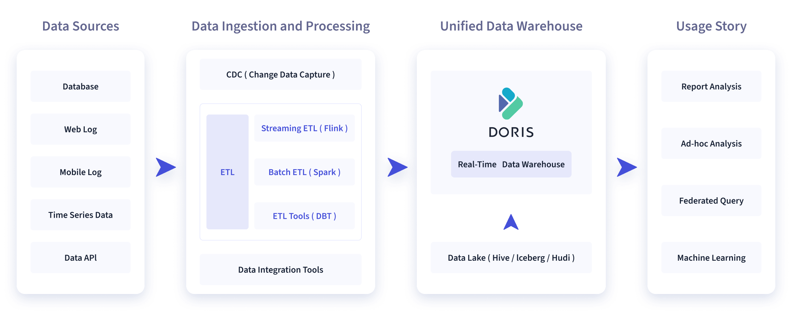

# #Apache Doris

**Apache Doris ​**是一个**​ 基于 MPP 架构的 ​**​`高性能`​、`实时的`​ <u>分析型</u>  **数据库**，

以极速易用的特点被人们所熟知，仅需**亚秒级响应时间**即可返回**海量数据下的**​**查询****结果**，不仅可以**支持高并发**的点**查询**场景，也能支持**高吞吐**的**复杂分析**场景。

基于此，

Apache Doris 能够较好的满足**报表分析**、**即席查询**、**统一数仓构建**、**数据湖联邦查询**加速等使用场景，

用户可以在此之上构建**用户行为分析、AB 实验平台、日志检索分析、用户画像分析、订单分析等**​**应用**。

‍

Apache Doris 最早是诞生于百度广告报表业务的 Palo 项目，2017 年正式对外开源，2018 年 7 月由百度捐赠给 Apache 基金会进行孵化，之后在 Apache 导师的指导下由孵化器项目管理委员会成员进行孵化和运营。目前 Apache Doris 社区已经聚集了来自不同行业数百家企业的 400 余位贡献者，并且每月活跃贡献者人数也超过 100 位。 2022 年 6 月，Apache Doris 成功从 Apache 孵化器毕业，正式成为 Apache 顶级项目（Top-Level Project，TLP）

‍

​​
