# #Redroid源码修改

# 引言

项目编译完成之后，我们则要查看它，理解它，从而修改它。由于项目实在庞大，建议先从整体知道编译后目录是什么作用。后续根据需求按需去查看理解修改。

一般Android开发分为**应用开发**和**框架开发**。**应用开发**就是基于Android系统开发上层应用：比如支付宝、微信等APP；**框架开发**则可能基于Android开源代码做需求更改，比如车机系统、小米系统、魅族系统等；

接下来我们来看下如何通过源码层面修改IMEI，让三方应用获取我们指定的`IMEI`​信息。

# 准备

## 新建项目

### 选择项目模板

为了改源码打包后嗯看改变，我们先建个DEMO应用，只用来获取IMEI的。通过Android Studio新建项目，如果有Android开发经验，可以选择`Empty Activity`​, 如果没有的话，则直接选择`Base Activity（下图）`​. 会提供一些基本功能。

​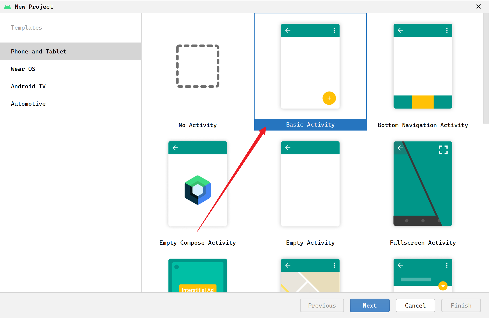​

### 设置项目信息

点击`Next`​，开始设置基本项目信息：项目名称、包名、存储位置、开发语言(Java\Kotlin)、支持最小运行SDK(Redroid 11 -> API 30)，然后点击Finish开始创建项目。Android通过使用Gradle（类似Maven）进行版本控制的，等待编译完成。

​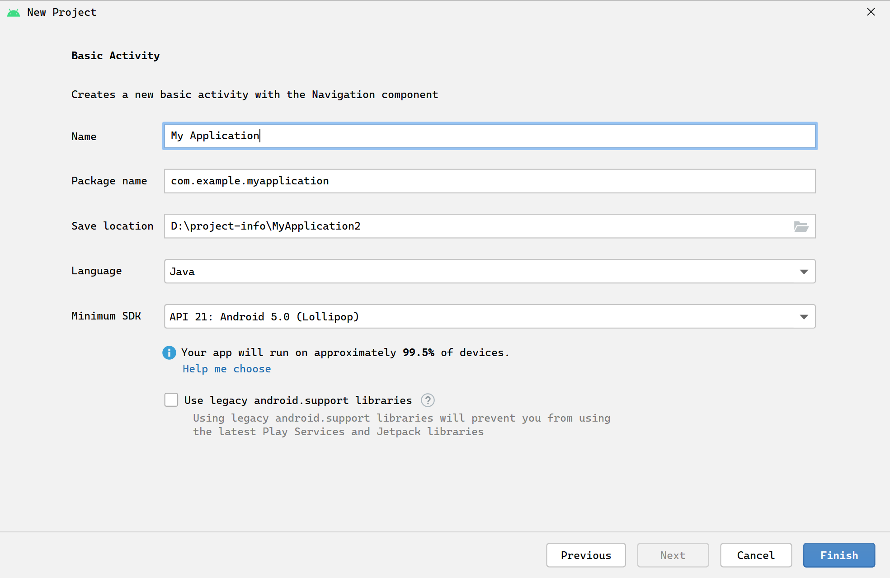​

### 项目整体结构

看下整体目录：

​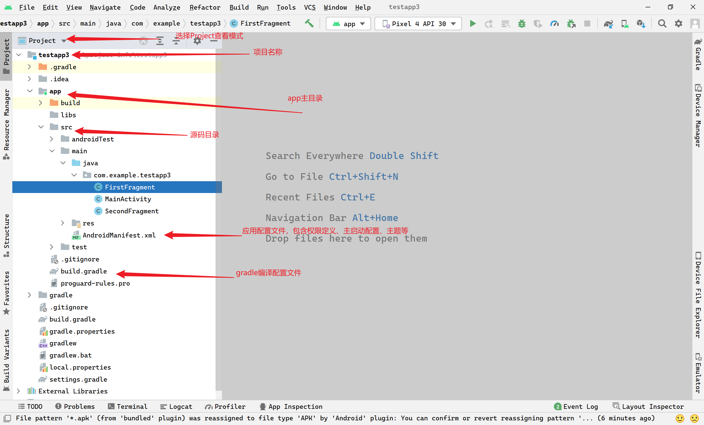

## 修改项目

### 资源文件信息控件

Android界面是通过xml进行配置声明的，所以我们找到下图配置文件，增加TextView组件，组件id不能重复(单文件，最好全局也不要定义重复)。

​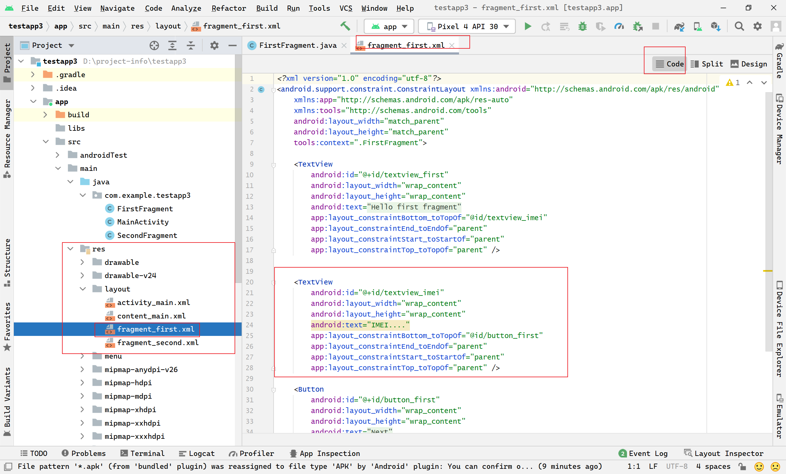​

```xml
<?xml version="1.0" encoding="utf-8"?>
<android.support.constraint.ConstraintLayout xmlns:android="http://schemas.android.com/apk/res/android"
    xmlns:app="http://schemas.android.com/apk/res-auto"
    xmlns:tools="http://schemas.android.com/tools"
    android:layout_width="match_parent"
    android:layout_height="match_parent"
    tools:context=".FirstFragment">

    <TextView
        android:id="@+id/textview_first"
        android:layout_width="wrap_content"
        android:layout_height="wrap_content"
        android:text="@string/hello_first_fragment"
        app:layout_constraintBottom_toTopOf="@id/textview_imei"
        app:layout_constraintEnd_toEndOf="parent"
        app:layout_constraintStart_toStartOf="parent"
        app:layout_constraintTop_toTopOf="parent" />


    <TextView
        android:id="@+id/textview_imei"
        android:layout_width="wrap_content"
        android:layout_height="wrap_content"
        android:text="IMEI...."
        app:layout_constraintBottom_toTopOf="@id/button_first"
        app:layout_constraintEnd_toEndOf="parent"
        app:layout_constraintStart_toStartOf="parent"
        app:layout_constraintTop_toTopOf="parent" />

    <Button
        android:id="@+id/button_first"
        android:layout_width="wrap_content"
        android:layout_height="wrap_content"
        android:text="@string/next"
        app:layout_constraintBottom_toBottomOf="parent"
        app:layout_constraintEnd_toEndOf="parent"
        app:layout_constraintStart_toStartOf="parent"
        app:layout_constraintTop_toBottomOf="@id/textview_imei" />
</android.support.constraint.ConstraintLayout>
```

### 界面逻辑修改

修改`FirstFragment.java`​文件，这里binding.xxxxx，即xml中的控件id.

​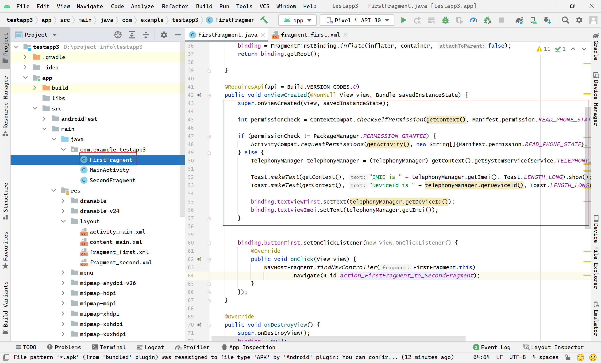​

```java
package com.example.testapp3;

import android.Manifest;
import android.app.Service;
import android.content.pm.PackageManager;
import android.os.Build;
import android.os.Bundle;
import android.support.annotation.RequiresApi;
import android.support.v4.app.ActivityCompat;
import android.support.v4.content.ContextCompat;
import android.telephony.TelephonyManager;
import android.util.Log;
import android.view.LayoutInflater;
import android.view.View;
import android.view.ViewGroup;

import android.support.annotation.NonNull;
import android.support.v4.app.Fragment;
import android.widget.Toast;

import androidx.navigation.fragment.NavHostFragment;

import com.example.testapp3.databinding.FragmentFirstBinding;

public class FirstFragment extends Fragment implements ActivityCompat.OnRequestPermissionsResultCallback {

    private FragmentFirstBinding binding;
    private final int REQUEST_READ_PHONE_STATE = 1;

    @Override
    public View onCreateView(
            LayoutInflater inflater, ViewGroup container,
            Bundle savedInstanceState
    ) {

        binding = FragmentFirstBinding.inflate(inflater, container, false);
        return binding.getRoot();

    }

    @RequiresApi(api = Build.VERSION_CODES.O)
    public void onViewCreated(@NonNull View view, Bundle savedInstanceState) {
        super.onViewCreated(view, savedInstanceState);

        int permissionCheck = ContextCompat.checkSelfPermission(getContext(), Manifest.permission.READ_PHONE_STATE);

        if (permissionCheck != PackageManager.PERMISSION_GRANTED) {
            ActivityCompat.requestPermissions(getActivity(), new String[]{Manifest.permission.READ_PHONE_STATE}, REQUEST_READ_PHONE_STATE);
        } else {
            TelephonyManager telephonyManager = (TelephonyManager) getContext().getSystemService(Service.TELEPHONY_SERVICE);

            Toast.makeText(getContext(), "IMIE is " + telephonyManager.getImei(), Toast.LENGTH_LONG).show();
            Toast.makeText(getContext(), "DeviceId is " + telephonyManager.getDeviceId(), Toast.LENGTH_LONG).show();

            binding.textviewFirst.setText(telephonyManager.getDeviceId());
            binding.textviewImei.setText(telephonyManager.getImei());
        }


        binding.buttonFirst.setOnClickListener(new View.OnClickListener() {
            @Override
            public void onClick(View view) {
                NavHostFragment.findNavController(FirstFragment.this)
                        .navigate(R.id.action_FirstFragment_to_SecondFragment);
            }
        });
    }

    @Override
    public void onDestroyView() {
        super.onDestroyView();
        binding = null;
    }


    @RequiresApi(api = Build.VERSION_CODES.O)
    @Override
    public void onRequestPermissionsResult(int requestCode, @NonNull String[] permissions, @NonNull int[] grantResults) {
        switch (requestCode) {
            case REQUEST_READ_PHONE_STATE:
                if ((grantResults.length > 0) && (grantResults[0] == PackageManager.PERMISSION_GRANTED)) {
                    TelephonyManager telephonyManager = (TelephonyManager) getContext().getSystemService(Service.TELEPHONY_SERVICE);
                    int permissionCheck = ContextCompat.checkSelfPermission(getContext(), Manifest.permission.READ_PHONE_STATE);

                    if (permissionCheck != PackageManager.PERMISSION_GRANTED) {
                        ActivityCompat.requestPermissions(getActivity(), new String[]{Manifest.permission.READ_PHONE_STATE}, REQUEST_READ_PHONE_STATE);
                    } else {
                        telephonyManager = (TelephonyManager) getContext().getSystemService(Service.TELEPHONY_SERVICE);

                        binding.textviewImei.setText(telephonyManager.getImei());
                    }
                }
                break;

            default:
                break;
        }
    }
}
```

### 权限添加

修改AndroidManifest.xml增加权限

​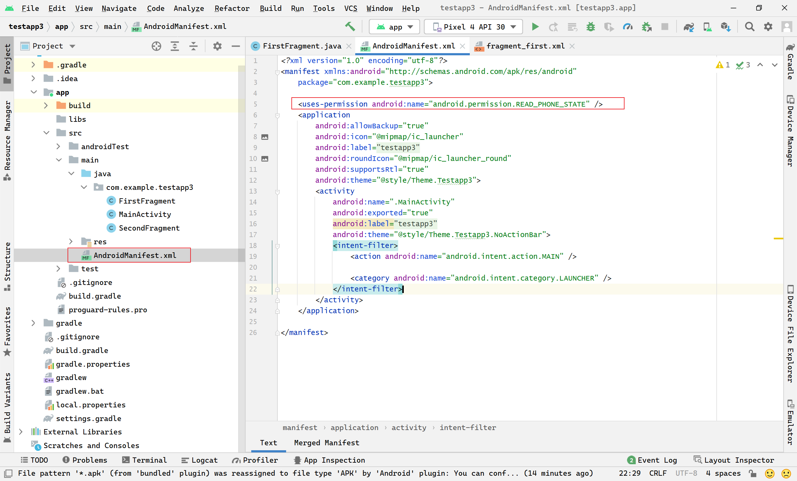​

```xml
<?xml version="1.0" encoding="utf-8"?>
<manifest xmlns:android="http://schemas.android.com/apk/res/android"
    package="com.example.testapp3">

    <uses-permission android:name="android.permission.READ_PHONE_STATE" />
    <application
        android:allowBackup="true"
        android:icon="@mipmap/ic_launcher"
        android:label="@string/app_name"
        android:roundIcon="@mipmap/ic_launcher_round"
        android:supportsRtl="true"
        android:theme="@style/Theme.Testapp3">
        <activity
            android:name=".MainActivity"
            android:exported="true"
            android:label="@string/app_name"
            android:theme="@style/Theme.Testapp3.NoActionBar">
            <intent-filter>
                <action android:name="android.intent.action.MAIN" />

                <category android:name="android.intent.category.LAUNCHER" />
            </intent-filter>
        </activity>
    </application>

</manifest>
```

## 运行项目

### 模拟器

如果侧边没有，可在View -> Tool Windows中找找，然后点击Create device按钮创建虚拟机。创建略过。

​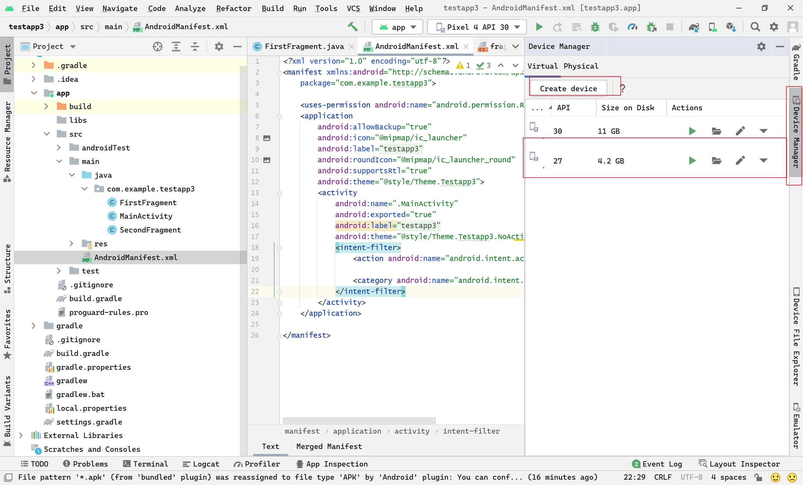​

### 运行配置

选择app，选择创建模拟器，点击后续的害虫图标按钮，以DEBUG模式运行。

​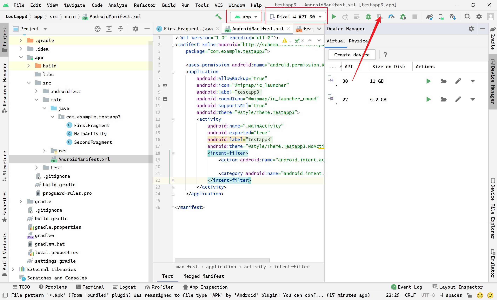​

### 效果

启动过程中，可能会弹出确认框，申请通话权限。点击允许即可。然后在kill app，重新打开进入。下图会根据模拟器不同显示不同的IMEI信息。Tips: Google的AVD好像都是相同的IMEI。

​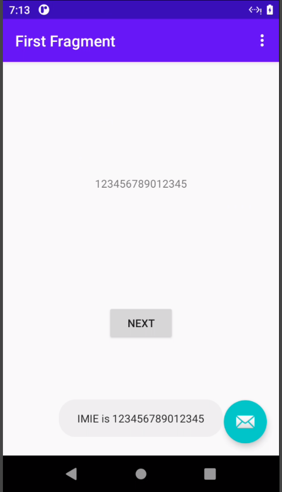​

‍

# 源码修改

根据准备项目过程，我们可以看出获取IMEI是通过``TelephonyManager``​获取的。那我们则要找到对应的源码查看其内容。

​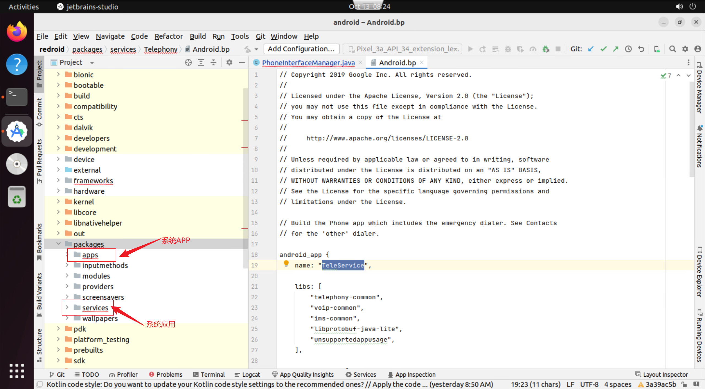​

通过导入Android Studio中，我们简单浏览下，这里主要说明两个：packages\app和packages\services  app目录主要存放了出场应用的一些源码信息。比如设置、联系人、拨号；services包下则放着我们需要的文件，我们直接看对应文件吧。

​`TelephonyManager`​获取IMEI是通过ITelephony接口实现的。而这个是在com.android.phone进程里获取的

​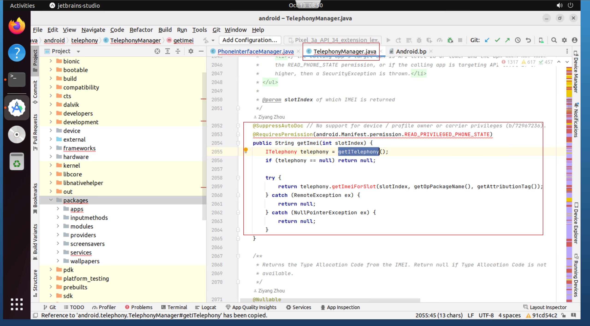​

我们直接ITelephony实现，找到getImeiForSlot方法.

​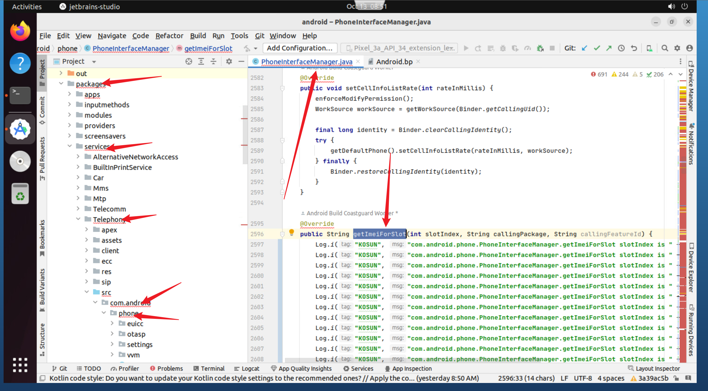​

注释所有代码，改为我们自己的代码.

​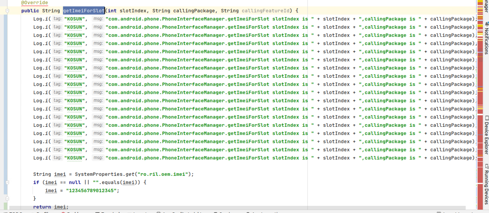​

至此修改完成。

# 模块打包

上述修改代码完成后我们进行编译运行验证（当然也可以通过as中的模拟器验证，不过没研究透怎么处理）

进入redroid源码目录里，执行环境设置、模块编译。

​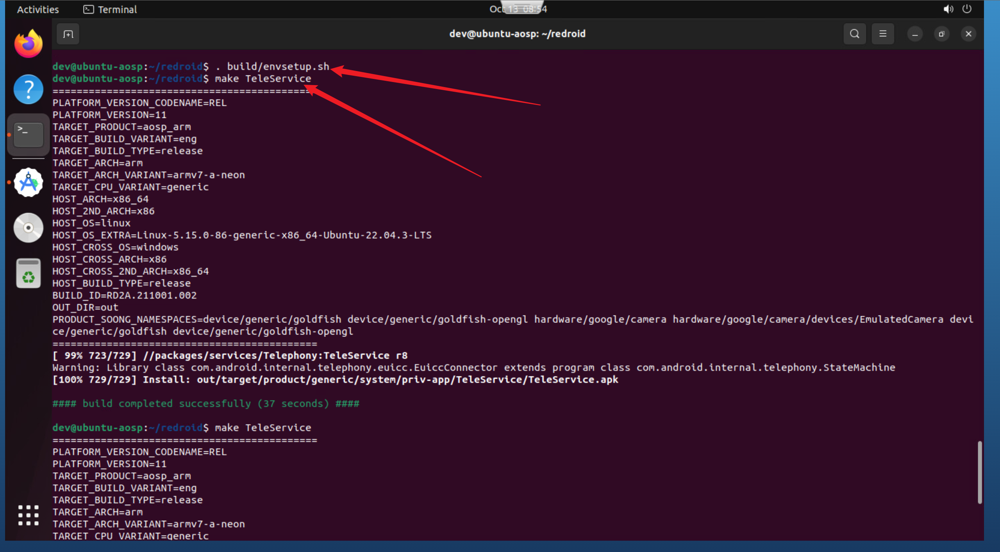​

这里怎么确认编译什么模块呢。可参考：[https://juejin.cn/post/7206134581745238074](https://juejin.cn/post/7206134581745238074) 访问该模块对应.bp查看获取上述TeleService.

编译完成后，会提示Complied Successfully。同时存在上述apk目录。

进入指定目录将改APK获取，传入目标arm服务器。

redroid可通过下述命令实现编译后替换apk验证。

比如Settings.apk\TeleService.apk

```shell
docker run -it --privileged --network macvlan_br --ip 192.168.88.200 -v /home/pi/Settings.apk:/system/priv-app/Settings/Settings.apk -v /home/pi/TeleService.apk:/system/priv-app/TeleService/TeleService.apk --name android11_200 -d redroid-test:latest ro.secure=0 ro.deviceName='Kosun Phone'
```

# 结果

​​

‍

‍

至此，修改IMEI结束。

‍

# 总结

由于应用开发者实现业务逻辑多种多样，有可能不一定通过Android sdk来获取IMEI，所以针对那些应用，都不调用修改的方法，自然获取的IMEI和我们设置的是不一致的。

不过针对云手机，在特定场景下的使用（Android 11、12）我们可针对所用的定制需求即可。

# 附录

shell修改mac地址

> ifconfig eth0 down  # 此处eth0网卡会下线，如果通过eth0修改则会链接终端，无法继续执行操作
>
> ifconfig eth0 hw ether 02:42:c0:a8:58:c8
>
> ifconfig eth0 up

‍
