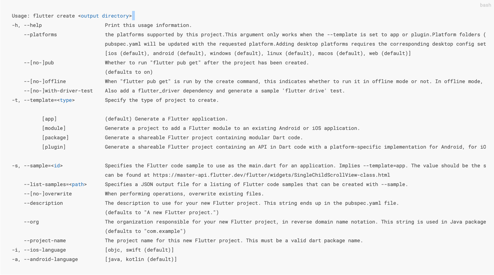

# #Flutter基本命令及使用

# 环境安装

参考flutter中文网[安装教程](https://flutter.cn/docs/get-started/install)，根据不同环境进行安装，推荐编辑`VS Code`​或者`Android Studio`​

使用命令`flutter doctor`​进行环境检测

# 创建命令

最基本的命令

```bash
flutter create [ProjectName]
```

创建时候指定不同平台语言, 使用 `-i`​指定iOS端语言 使用`-a`​制定Android端语言

```bash
flutter create -i swift -a kotlin [ProjectName]
```

包名修改, 使用`-org`​指定, 默认`com.example`​

```bash
flutter create --org com.txzhe [ProjectName]
```

详细使用

​​

# 环境变量

```bash
# Flutter
FLUTTER_HOME=/Users/xxx/Documents/software-info/flutter

# 国内mirror
export PUB_HOSTED_URL=https://pub.flutter-io.cn
export FLUTTER_STORAGE_BASE_URL=https://storage.flutter-io.cn

export PATH="$FLUTTER_HOME/bin:$PATH"
```

‍
