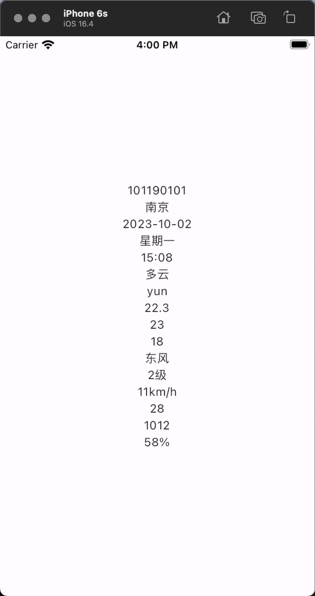

# #Riverpod库

# 引言

	在用Flutter开发APP过程中, 我们需要一种状态管理库来配合开发. 目前这类框架早期有`Provider`​、`BloC`​等. 当下Provider的作者重新除了一个`Riverpod`​. 仔细观察, 其实就是Provider单词变形.  后续这个可能就是其主推的数据驱动框架了. 所以今天我们来看下这个库基本使用.

# Futures

## Compile safe (安全编译)

No more `ProviderNotFoundException`​ or forgetting to handle loading states. Using Riverpod, if your code compiles, it works.

能编译通过就能运行.

## Provider, without its limitations (没有限制)

Riverpod is inspired by Provider but solves some of it's key issues such as supporting multiple providers of the same type; awaiting asynchronous providers; adding providers from anywhere, ...

Riverpod灵感来自Provider, 所以解决了Provider的一些问题. 比如不支持多个同类型Provider、同步异步问题、任何地方提供providers等等...

## Doesn't depend on Flutter (不依赖Flutter)

Create/share/tests providers, with no dependency on Flutter. This includes being able to listen to providers without a `BuildContext`​.

脱离Flutter上下文, 不需要在提供`BuildContext`​信息

## Declare shared state from anywhere (在任何地方声明共享状态)

No need to jump between your `main.dart`​ and your UI files anymore.  
Place the code of your shared state where it belongs, be it in a separate package or right next to the Widget that needs it, without losing testability.

不需要在`main.dart`​和UI文件跳转了. 这个感觉意思就是相当于各UI组件处理自己的状态信息.  非必要不声明公共的状态信息.

```dart
// A shared state that can be accessed by multiple
// objects at the same time
final countProvider = StateProvider((ref) => 0);

// Consumes the shared state and rebuild when it changes
class Title extends ConsumerWidget {
  @override
  Widget build(BuildContext context, WidgetRef ref) {
    final count = ref.watch(countProvider);
    return Text('$count');
  }
}
```

## Recompute states/rebuild UI only when needed (按需重构)

We no longer have to sort/filter lists inside the `build`​ method or have to resort to advanced cache mechanism.

With ``Provider``​ and "families", sort your lists or do HTTP requests only when you **truly** need it.

```dart
final todosProvider = StateProvider<List<Todo>>((ref) => []);
final filterProvider = StateProvider<Filter>((ref) => Filter.all);

final filteredTodosProvider = Provider<List<Todo>>((ref) {
  final todos = ref.watch(todosProvider);
  switch (ref.watch(filterProvider)) {
    case Filter.all:
      return todos;
    case Filter.completed:
      return todos.where((todo) => todo.completed).toList();
    case Filter.uncompleted:
      return todos.where((todo) => !todo.completed).toList();
  }
});
```

## Safely read providers (更安全的读取)

Reading a provider will never result in a bad state. If you can write the code needed to read a provider, you will obtain a valid value.

This even applies to asynchronously loaded values. As opposed to with provider, Riverpod allows cleanly handling loading/error cases.

大致意思就是: 获取状态信息时候支持异常捕捉后处理, 非法错误处理.

```dart
final configurationsProvider = FutureProvider<Configuration>((ref) async {
  final uri = Uri.parse('configs.json');
  final rawJson = await File.fromUri(uri).readAsString();

  return Configuration.fromJson(json.decode(rawJson));
});

class Example extends ConsumerWidget {
  @override
  Widget build(BuildContext context, WidgetRef ref) {
    final configs = ref.watch(configurationsProvider);

    // Use Riverpod's built-in support
    // for error/loading states using "when":
    return configs.when(
      loading: () => const CircularProgressIndicator(),
      error: (err, stack) => Text('Error $err'),
      data: (configs) => Text('data: ${configs.host}'),
    );
  }
}
```

## Inspect your state in the devtool (在devtool工具检查状态信息)

Using Riverpod, your state is visible out of the box inside Flutter's devtool.  
Furthermore, a full-blown state-inspector is in progress.

​​

# 安装

|app type|package name|description|
| ------------------------| --------------| ---------------------------------------------------------------------|
|Flutter only|[flutter_riverpod](https://pub.dev/packages/flutter_riverpod)|A basic way of using [Riverpod](https://github.com/rrousselgit/riverpod) with flutter.|
|Flutter + [flutter_hooks](https://github.com/rrousselGit/flutter_hooks)|[hooks_riverpod](https://pub.dev/packages/hooks_riverpod)|A way to use both [flutter_hooks](https://github.com/rrousselGit/flutter_hooks) and [Riverpod](https://github.com/rrousselgit/riverpod) together.|
|Dart only (No Flutter)|[riverpod](https://github.com/rrousselGit/riverpod/tree/master/packages/riverpod)|A version of [Riverpod](https://github.com/rrousselgit/riverpod) with all the classes related to Flutter stripped out.|

三种方式:

1. Flutter用的话, 只获取``flutter_riverpod``​包即可.
2. 如果喜欢使用hooks的写法, 可以安装``hooks_riverpod``​包和`​`hooks_riverpod`​`包.
3. 如果仅是Dart环境, 则只需要安装`riverpod`​包

本篇仅以第二种方式使用来演示.

```yaml
environment:
  sdk: ">=2.17.0 <3.0.0"
  flutter: ">=3.0.0"

dependencies:
  flutter:
    sdk: flutter
  flutter_hooks: ^0.18.0
  hooks_riverpod: ^2.4.1
```

​`不要忘记运行: flutter pub get`​

# 快速开始

## 环境

* 开发工具: Android Studio 2022.2.1


* 使用Android Studio可以安装如下插件 (快速生成部分provider代码)

​

	etc. 

	​​

* Flutter & Dart

  ```bash
  ➜  ft_awesome flutter --version
  Flutter 3.10.6 • channel stable • https://github.com/flutter/flutter.git
  Framework • revision f468f3366c (3 months ago) • 2023-07-12 15:19:05 -0700
  Engine • revision cdbeda788a
  Tools • Dart 3.0.6 • DevTools 2.23.1
  ```

## 新建项目

Android Studio新建Flutter项目需要安装Flutter插件. 这里和安装其他插件一致, 不做过多说明.  项目结构初始化如下图.

​​

‍

## 安装依赖

```yaml
dependencies:
  flutter:
    sdk: flutter
  flutter_hooks: 0.18.0
  hooks_riverpod: 2.4.1
```

执行`flutter pub get`​

## 1. 修改main.dart

使用`ProviderScope`​包裹MyApp组件

```dart
void main() {
  runApp(const ProviderScope(child: MyApp()));
}
```

## 2.  定义Provider

```dart
final helloWorldProvider = Provider((_) => 'Hello world');
```

## 3. 修改MyApp

	我们不再继承`StatelessWidget`​, 我们继承`HookConsumerWidget`​; 该Widget需要重写`build`​方法, 提供了Provider的`ref`​.有了ref对象, 我们就可以从上下文中获取我们上面定义的`helloWorldProvider`​对象.

```dart
class MyApp extends HookConsumerWidget {
  const MyApp({super.key});

  @override
  Widget build(BuildContext context, WidgetRef ref) {
    final String value = ref.watch(helloWorldProvider);

    return MaterialApp(
      title: 'Riverpod Demo',
      debugShowCheckedModeBanner: false,
      theme: ThemeData(colorScheme: ColorScheme.fromSeed(seedColor: Colors.deepPurple), useMaterial3: true),
      home: Scaffold(
        appBar: AppBar(title: const Text("Riverpod Demo")),
        body: Center(
          child: Text(value),
        ),
      ),
    );
  }
}
```

## 4. 看效果

​​

至此, 我们成功的使用了riverpod. 在屏幕展示了Hello world信息. 接下来我们看些稍微复杂业务的使用.

# 基本使用

从基本使用章节我们可以从Provider中获取数据了. 但是**我们该如何修改Provider中的数据呢?**

|Provider Type|Provider Create Function|Example Use Case|
| ---------------| --------------------------------------| ----------------------------------------------------------------------|
|[Provider](https://riverpod.dev/docs/providers/provider)|Returns any type|A service class / computed property (filtered list)|
|[StateProvider](https://riverpod.dev/docs/providers/state_provider)|Returns any type|A filter condition / simple state object|
|[FutureProvider](https://riverpod.dev/docs/providers/future_provider)|Returns a Future of any type|A result from an API call|
|[StreamProvider](https://riverpod.dev/docs/providers/stream_provider)|Returns a Stream of any type|A stream of results from an API|
|[StateNotifierProvider](https://riverpod.dev/docs/providers/state_notifier_provider)|Returns a subclass of StateNotifier|A complex state object that is immutable except through an interface|
|[ChangeNotifierProvider](https://pub.dev/documentation/flutter_riverpod/latest/flutter_riverpod/ChangeNotifierProvider-class.html)|Returns a subclass of ChangeNotifier|A complex state object that requires mutability|

Provider分为六种类型

### Provider

> 返回任意类型.
>
> 场景: 服务、计算属性(过滤列表)
>
> 专门做数据提供. 支持按条件筛选...
>
> ​`Provider`​ is typically used for:
>
> * caching computations (缓存计算)
> * exposing a value to other providers (such as a `Repository`​/`HttpClient`​). 暴露状态给其他Provider使用
> * offering a way for tests or widgets to override a value. 提供一种方式测试....
> * reducing rebuilds of providers/widgets without having to use `select`​. 减少rebuild次数

#### 修改main.dart

```dart
void main() {
  runApp(const ProviderScope(child: MyApp()));
}

class MyApp extends StatelessWidget {
  const MyApp({super.key});

  @override
  Widget build(BuildContext context) {
    return MaterialApp(
      title: 'Riverpod Demo',
      debugShowCheckedModeBanner: false,
      theme: ThemeData(colorScheme: ColorScheme.fromSeed(seedColor: Colors.deepPurple), useMaterial3: true),
      home: const ProviderDemo(),
    );
  }
}
```

#### 新增provider_demo.dart

```dart
import 'package:flutter/material.dart';
import 'package:hooks_riverpod/hooks_riverpod.dart';

final pageIndexProvider = StateProvider<int>((ref) => 0);

// A provider which computes whether the user is allowed to go to the previous page
final canGoToPreviousPageProvider = Provider<bool>((ref) {
  return ref.watch(pageIndexProvider) > 0;
});

class ProviderDemo extends HookConsumerWidget {
  const ProviderDemo({super.key});

  @override
  Widget build(BuildContext context, WidgetRef ref) {
    // We are now watching our new Provider
    // Our widget is no longer calculating whether we can go to the previous page.
    final canGoToPreviousPage = ref.watch(canGoToPreviousPageProvider);

    void goToPreviousPage() {
      ref.read(pageIndexProvider.notifier).update((state) => state - 1);
    }

    return Scaffold(
      body: Center(
        child: Column(mainAxisAlignment: MainAxisAlignment.center, children: [
          Row(mainAxisAlignment: MainAxisAlignment.spaceAround, children: [
            ElevatedButton(
              onPressed: canGoToPreviousPage ? goToPreviousPage : null,
              child: const Text('上一页'),
            ),
            ElevatedButton(
              onPressed: () {
                ref.read(pageIndexProvider.notifier).update((state) => state + 1);
              },
              child: const Text('下一页'),
            ),
          ]),
        ]),
      ),
    );
  }
}
```

#### 效果

​​​​

当点击上一页按钮, 状态则会减1; 当状态大于0允许上一页按钮点击. 否则不允许点击. 

这个例子`Provider`​和`StateProvider`​结合使用. 

StateProvider储存状态及变更状态; Provider获取状态及计算状态. 

### StateProvider

> 同样返回任意类型; 
>
> 支持简单对象操作.

#### main.dart

```dart
home: const StateProviderDemo()
```

#### state_provider.dart

```dart
/// 定义状态, 不可变
@immutable
class Todo {
  const Todo({required this.id, required this.description, required this.completed});

  final String id;
  final String description;
  final bool completed;

  Todo copyWith({String? id, String? description, bool? completed}) {
    return Todo(
      id: id ?? this.id,
      description: description ?? this.description,
      completed: completed ?? this.completed,
    );
  }
}

class TodosNotifier extends StateNotifier<List<Todo>> {
  /// 初始化状态
  TodosNotifier()
      : super([
          const Todo(id: "1", description: "测试1", completed: false),
          const Todo(id: "2", description: "测试2", completed: false),
          const Todo(id: "3", description: "测试3", completed: false),
          const Todo(id: "4", description: "测试4", completed: false),
        ]);

  /// 提供方法修改状态. 由于状态是不可变的. 所以需要创建一个新状态替换原状态
  void addTodo(Todo todo) {
    state = [...state, todo];
  }

  /// 移除同样原理
  void removeTodo(String todoId) {
    state = [
      for (final todo in state)
        if (todo.id != todoId) todo,
    ];
  }

  /// 切换状态
  void toggle(String todoId) {
    state = [
      for (final todo in state)
        if (todo.id == todoId) // 拷贝原来的对象, 然后修改状态
          todo.copyWith(completed: !todo.completed)
        else
          todo,
    ];
  }
}

/// 状态提供
final todosProvider = StateNotifierProvider<TodosNotifier, List<Todo>>((ref) {
  return TodosNotifier();
});

class StateProviderDemo extends HookConsumerWidget {
  const StateProviderDemo({super.key});

  @override
  Widget build(BuildContext context, WidgetRef ref) {
    List<Todo> todos = ref.watch(todosProvider);
    return Scaffold(
      body: ListView(
        children: [
          for (final todo in todos)
            CheckboxListTile(
              value: todo.completed,
              onChanged: (value) => ref.read(todosProvider.notifier).toggle(todo.id),
              title: Text(todo.description),
            ),
        ],
      ),
    );
  }
}
```

#### 效果

1. 定义不可变对象`Todo`​
2. 定义``TodosNotifier``​继承``StateNotifier<List<Todo>>``​

    1. 初始化状态, 示例中初始化了四条数据. 一般初始化默认值为空集合、0、false等
    2. 提供了三个修改数据方法: `addTodo`​、`removeTodo`​、`toggole`​; 由于数组元素定义不可变对象. 所以修改需要通过拷贝生成新数组来替换原状态.
3. ​`StateNotifierProvider`​定义,并设置泛型
4. 界面通过`ref`​对象获取`todos`​渲染
5. 点击复选框触发`onChanged`​事件, 该事件通过ref调用对应provider的`toggle`​实现数组对象状态的变更.

    本示例中未演示新增和移除; 使用方法同toggle一致.

​​​

### FutureProvider

> 返回Future<T>对象
>
> 异步操作的数据提供者
>
> 比如调用一些耗时操作/Invoke API等操作

我们来模拟异步操作

#### lib/assets/weather.json

准备个json文件, 内容是下面这些

```json
{
  "nums": 11,
  "cityid": "101190101",
  "city": "南京",
  "date": "2023-10-02",
  "week": "星期一",
  "update_time": "15:08",
  "wea": "多云",
  "wea_img": "yun",
  "tem": "22.3",
  "tem_day": "23",
  "tem_night": "18",
  "win": "东风",
  "win_speed": "2级",
  "win_meter": "11km/h",
  "air": "28",
  "pressure": "1012",
  "humidity": "58%"
}
```

##### pubspec.yaml修改

然后在pubspec.yaml加入资产的引入

```yaml
flutter:
  assets:
    - lib/assets/weather.json
```

#### main.dart修改

```dart
home: const FutureProviderDemo()
```

#### weather.dart

通过json转实体对象. 用于序列化.

```dart
class Weather {
  Weather({
    required this.nums,
    required this.cityid,
    required this.city,
    required this.date,
    required this.week,
    required this.updateTime,
    required this.wea,
    required this.weaImg,
    required this.tem,
    required this.temDay,
    required this.temNight,
    required this.win,
    required this.winSpeed,
    required this.winMeter,
    required this.air,
    required this.pressure,
    required this.humidity,
  });

  Weather.fromJson(dynamic json) {
    nums = json['nums'];
    cityid = json['cityid'];
    city = json['city'];
    date = json['date'];
    week = json['week'];
    updateTime = json['update_time'];
    wea = json['wea'];
    weaImg = json['wea_img'];
    tem = json['tem'];
    temDay = json['tem_day'];
    temNight = json['tem_night'];
    win = json['win'];
    winSpeed = json['win_speed'];
    winMeter = json['win_meter'];
    air = json['air'];
    pressure = json['pressure'];
    humidity = json['humidity'];
  }

  int? nums;
  String? cityid;
  String? city;
  String? date;
  String? week;
  String? updateTime;
  String? wea;
  String? weaImg;
  String? tem;
  String? temDay;
  String? temNight;
  String? win;
  String? winSpeed;
  String? winMeter;
  String? air;
  String? pressure;
  String? humidity;

  /// 省略toMap
}
```

#### future_provider_demo.dart

具体使用.

```dart
final weatherProvider = FutureProvider<Weather>((ref) async {
  var content = jsonDecode(await rootBundle.loadString("lib/assets/weather.json"));
  sleep(const Duration(seconds: 3));
  return Weather.fromJson(content);
});

class FutureProviderDemo extends HookConsumerWidget {
  const FutureProviderDemo({super.key});

  @override
  Widget build(BuildContext context, WidgetRef ref) {
    AsyncValue<Weather> weather = ref.watch(weatherProvider);
    return Scaffold(
      body: Center(
        child: weather.when(
          loading: () => const CircularProgressIndicator(),
          error: (err, stack) => Text('Error: $err'),
          data: (weather) {
            return Column(mainAxisAlignment: MainAxisAlignment.center, children: [
              Text(weather.cityid ?? "--"),
              Text(weather.city ?? "--"),
              Text(weather.date ?? "--"),
              Text(weather.week ?? "--"),
              Text(weather.updateTime ?? "--"),
              Text(weather.wea ?? "--"),
              Text(weather.weaImg ?? "--"),
              Text(weather.tem ?? "--"),
              Text(weather.temDay ?? "--"),
              Text(weather.temNight ?? "--"),
              Text(weather.win ?? "--"),
              Text(weather.winSpeed ?? "--"),
              Text(weather.winMeter ?? "--"),
              Text(weather.air ?? "--"),
              Text(weather.pressure ?? "--"),
              Text(weather.humidity ?? "--"),
            ]);
          },
        ),
      ),
    );
  }
}
```

#### 效果

以小见大, 真实的APP无非就是做了UI美化, 大致流程其实差不多. 读取JSON文件变为通过HTTP接口获取.

​​

### StreamProvider

> 返回Stream<T>类型; 最近的OpenAI接口一般都是通过Stream信息返回的.实时流输出...

略

### StateNotifierProvider

> 返回StateNotifier的子类
>
> 复杂状态的操作

参考StateProvider示例

### ChangeNotifierProvider

> 返回ChangeNotifier的子类
>
> 这个主要是兼容Provider库转Riverpod的. 不建议使用这个Provider!While all providers have their purpose, [ChangeNotifierProvider](https://pub.dev/documentation/flutter_riverpod/latest/flutter_riverpod/ChangeNotifierProvider-class.html)s are not recommended for scalable applications, because of issues with mutable state. It exists in the `flutter_riverpod`​ package to provide an easy migration path from `package:provider`​, and allows for some flutter specific use-cases such as integration with some Navigator 2 packages.

略

‍

> 至此Riverpod提供的Provider我们基本大概过了一遍. 具体还需多去写, 多去感悟.

# 进阶使用

传递参数:[https://riverpod.dev/docs/concepts/modifiers/family](https://riverpod.dev/docs/concepts/modifiers/family)

资源释放: [https://riverpod.dev/docs/concepts/modifiers/auto_dispose](https://riverpod.dev/docs/concepts/modifiers/auto_dispose)

‍
